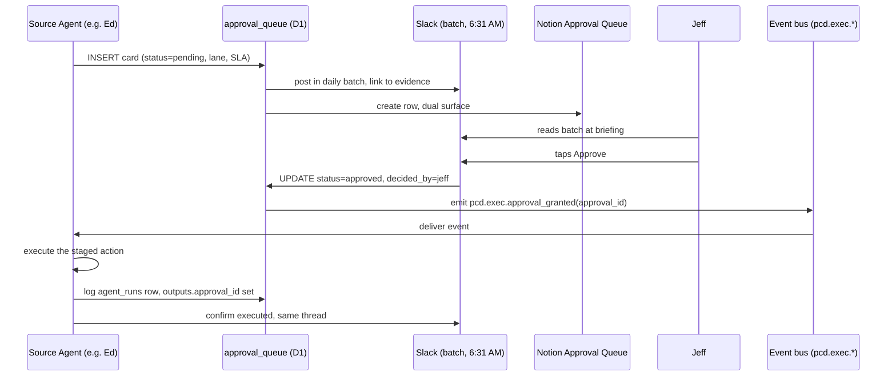

# PCD AI Operating System — 01. Executive Office

**Version:** draft 0.1, 2026-07-15
**Status:** design. Nothing in this file builds an agent, a schedule, a table, or a Slack channel. It designs where Executive Office and the shared queue infrastructure go next.
**Reads against:** `00-FOUNDATIONS.md` (canonical, binding), `PCD-AUTOMATION-AUDIT-2026-07-14.md` (current state), `PCD-OPERATING-MANUAL.md` v1.4 (how PCD runs today).
**Deliverables covered:** 1 (org chart), 2 partial (Executive Office department), 11 (Human Approval Matrix).

---

## 1. Organizational chart

Jeff is CEO of the whole company, Field & Forge Ventures, and PCD is one venture inside it. Executive Office is Jeff's direct staff: Barnabus (chief of staff) and Jarvis (portfolio orchestrator). Every one of the other sixteen departments reports to Barnabus, who carries their status up to Jeff. Jarvis does not sit in that reporting line day to day; it convenes departments on demand for a bounded question, the way `jarvis-orchestrator.md` already dispatches security, QA, billing, data-quality, and product checks for a GO/NO-GO verdict today.

Three status tags run through this whole file: **exists** (a named, specced, registered agent doing real work today), **built-paused** (built and registered but not scheduled or switched on), **design** (a department this file names but nothing runs yet). No row rounds up. Where the foundations roster says "built, paused" this file writes "built-paused" for the same fact.

```mermaid
graph TD
    Jeff["Jeff — CEO<br/>(exists)"]

    subgraph EXEC["Executive Office (exists)"]
        Barnabus["Barnabus<br/>Chief of Staff"]
        Jarvis["Jarvis<br/>Portfolio Orchestrator"]
    end

    Jeff --> Barnabus
    Jeff --> Jarvis
    Jarvis -.convenes.-> Barnabus

    Barnabus --> Iris["2. Intelligence Layer<br/>Iris (design)"]

    subgraph CONTENT["Content"]
        Ed["3. Editorial<br/>Ed (exists)"]
        Hal["4. Buying Guides & Affiliate<br/>Hal (exists)"]
        Frida["9. Newsletter<br/>Frida (exists)"]
        Remy["10. Reviews<br/>Remy (design)"]
    end

    subgraph MARKET["Market-facing"]
        Ranger["5. Camp Directory<br/>Ranger (exists)"]
        Sal["6. Sales<br/>Sal (design)"]
        Nora["7. Marketing<br/>Nora (exists)"]
        Sunny["8. Customer Success<br/>Sunny (built-paused)"]
    end

    subgraph PLATFORM["Platform"]
        Wes["11. Engineering<br/>Wes (design)"]
        Locke["12. Security<br/>Locke (design)"]
        Ana["13. Analytics<br/>Ana (design)"]
        Penny["14. Finance<br/>Penny (design)"]
        Vera["15. Legal & Compliance<br/>Vera (exists)"]
        Piper["16. Product<br/>Piper (design)"]
        Max["17. Automation<br/>Max (design)"]
    end

    Barnabus --> Ed
    Barnabus --> Hal
    Barnabus --> Frida
    Barnabus --> Remy
    Barnabus --> Ranger
    Barnabus --> Sal
    Barnabus --> Nora
    Barnabus --> Sunny
    Barnabus --> Wes
    Barnabus --> Locke
    Barnabus --> Ana
    Barnabus --> Penny
    Barnabus --> Vera
    Barnabus --> Piper
    Barnabus --> Max

    Jarvis -.convenes.-> Locke
    Jarvis -.convenes.-> Piper
    Jarvis -.convenes.-> Penny
    Jarvis -.convenes.-> Max

    classDef exists fill:#1a7f37,color:#fff,stroke:#14532d
    classDef paused fill:#9a6700,color:#fff,stroke:#7c5300
    classDef design fill:#57606a,color:#fff,stroke:#32383f
    class Jeff,Barnabus,Jarvis,Ed,Hal,Frida,Ranger,Nora,Vera exists
    class Sunny paused
    class Iris,Remy,Sal,Wes,Locke,Ana,Penny,Piper,Max design
```



The dashed lines from Jarvis are not supervision, they are today's `/site-check` and `/preflight` dispatch list read against the new department taxonomy: `security-engineer` maps to Locke, `product-manager` maps to Piper, `billing-finance` maps to Penny (and to Hal, since affiliate integrity is Hal's data today), `data-quality` maps to Max. That mapping is how the existing `.claude/agents/jarvis-orchestrator.md` grows into the portfolio orchestrator role without a rewrite: the five agents it dispatches today become five of the sixteen department leads it can convene tomorrow.

### Org chart table

| # | Department | Lead | Status | Grows from | Reports to |
|---|---|---|---|---|---|
| 1 | Executive Office | Barnabus (+ Jarvis) | exists | `barnabus-morning-briefing`, `barnabus-weekly-review`, `.claude/agents/jarvis-orchestrator.md` | Jeff |
| 2 | Intelligence Layer | Iris | design | GSC reviews, freshness audits, camp coverage analysis | Barnabus |
| 3 | Editorial | Ed | exists | rules-watcher, seasonal scheduler, freshness audit | Barnabus |
| 4 | Buying Guides & Affiliate | Hal | exists | link-health monitor, affiliate reconciler | Barnabus |
| 5 | Camp Directory | Ranger | exists | org-discovery, camps data steward, enrichment workers | Barnabus |
| 6 | Sales | Sal | design | nothing yet; gated on Open Item 7 legal terms | Barnabus |
| 7 | Marketing | Nora | exists | weekly-gsc-review, seasonal social queue | Barnabus |
| 8 | Customer Success | Sunny | built-paused | S12 inbound triage | Barnabus |
| 9 | Newsletter | Frida | exists | friday-letter-draft, Kit | Barnabus |
| 10 | Reviews | Remy | design | empty camp_reviews tables | Barnabus |
| 11 | Engineering | Wes | design | workers, deploy pipeline, site cron | Barnabus |
| 12 | Security | Locke | design | security audits, JWT gap, secrets findings | Barnabus |
| 13 | Analytics | Ana | design | GSC data, GA4 (unwired), affiliate numbers | Barnabus |
| 14 | Finance | Penny | design | affiliate reconciler outputs | Barnabus |
| 15 | Legal & Compliance | Vera | exists | pcd-deletion-monitor, DATA-MAP, Open Item 7 | Barnabus |
| 16 | Product | Piper | design | SITE_IMPROVEMENTS.md, backlog files | Barnabus |
| 17 | Automation | Max | design | the audit process itself | Barnabus |

Nine of seventeen departments are still design-only. That is not a gap in this file; it is the honest state of the company on 2026-07-15. A named lead is an accountability slot, not a build commitment, exactly as foundations section 5 says.

---

## 2. Executive Office department

### Mission

Executive Office exists to protect the one resource nothing else in this design can manufacture: Jeff's attention. Everything below is built around a single fact stated plainly in the foundations file, that PCD idles four months a year for football season and the two 2026 success metrics are the Chain Reaction manuscript and UPS football finishing 4th in conference, neither of which is a PCD task. Site work that does not fund or free time for those two things sits at the bottom of every list Executive Office keeps.

CEO role definition follows from that. Jeff signs every send, purchase, payment, deletion, and publication (the HUMAN GATE, unconditional). Jeff sets and changes the confidence thresholds any Act-class agent runs against. Jeff decides when a department moves from design to built, and when a built agent is promoted from Stage to Act or retired. Jeff owns every external relationship: legal, Cloudflare and Kit billing, affiliate networks, and any human hire. Nothing in this design asks for any of that to move off Jeff's desk. It asks to shrink how much of Jeff's day it takes to exercise it.

### Work performed

Barnabus already does two things daily and weekly: the 6:31 AM morning briefing and the Sunday 4:30 PM weekly review, both live today, both logging to `agent_runs`. This design grows both without replacing either. The morning briefing becomes the single read that answers "what happened overnight and what needs me today" across all seventeen departments once the event bus and Iris's intelligence layer exist to feed it. The weekly review becomes the seed of the Weekly Executive Audit intake described below.

Chief of Staff work performed, expanded: Barnabus aggregates `agent_runs` and `agent_registry` state, holds the Decision Queue (the backlog of open, non-recurring calls only Jeff can make, the direct descendant of this manual's Open Items list), and operates the Approval Queue's batching and aging (section 3). It watches for the failure pattern that actually hurt PCD once already: a disabled agent that nobody noticed was disabled. Vera's account guard tripped on 2026-07-14, logged `failed`, and the deletion monitor sat off with no escalation until someone went looking. That incident is why "an agent going to paused status outside a planned window" is now a same-day escalation, not a next-briefing item, everywhere in this design.

**Business Review cadence.** Three tiers, all descended from the existing Sunday review:

- **Weekly Executive Audit intake**, every Sunday, growing out of `barnabus-weekly-review`. It pulls the week's SOP outputs, S1 GSC review, S5 link health, S7 camp discovery counts, S8 data steward findings, whatever ran, into one digest instead of Jeff opening seven Slack threads. Runs year-round, report-only, low cost since it only reads what already ran.
- **Monthly Business Review**, new, first build after Analytics (Ana) and the intelligence layer exist to feed it something worth reviewing. Pauses August through November with the rest of PCD's build and marketing work, because there is nothing new to review during the football-season idle beyond what the Weekly Audit already covers.
- **Quarterly close**, new, anchored on the date already set in the operating manual: December is the first one. This is where RETIREMENT RULE gets applied, where Stage-to-Act promotions get decided, and where the whole roster gets judged against the two success metrics and against distribution, PCD's actual binding constraint.

**Morning Briefing design**, once the event bus and Iris exist: department status pulled from `agent_registry` (active, paused, last run), the Approval Queue's pending count and aging by lane, any `needs_you` item any agent raised in the last 24 hours, a one-line revenue and traffic delta from Ana's feed, any Red Wall or Family Firewall flag (routed to Jeff only, never summarized), and the current maintenance-mode state. Everything in that list already exists as a column somewhere in `agent_runs`, `agent_registry`, or a department's own output; the briefing's job is assembly, not new data.

**Decision Queue.** The backlog of one-off, non-recurring calls: promote this agent, retire that one, launch this department, change this threshold, sign this scope. It is small by design, reviewed at the Weekly Executive Audit and cleared at the Quarterly close. It is not the Approval Queue; it does not expire on an SLA clock the way an operational approval card does, because these are strategic calls, not per-run outputs.

**Human Approval Queue.** The high-frequency, per-run queue every department feeds (section 3, section 4). Barnabus operates its mechanics; Jeff is its only approver.

### SOPs required

- Morning Briefing (exists, `barnabus-morning-briefing`).
- Weekly Executive Audit intake (exists as `barnabus-weekly-review`, design to expand its intake).
- Monthly Business Review (design).
- Quarterly Close (design, first instance December 2026).
- Approval Queue triage and batching (design, section 3).
- Decision Queue escalation (design; today this is the Open Items list read by hand).
- Cross-department GO/NO-GO convening (exists as `/site-check`, `/preflight`, `/launch-check`, `/red-team`).

### Fully automated tasks

Pulling `agent_runs` and `agent_registry`, assembling the briefing and weekly review markdown, and posting to Slack are fully automated today and stay that way. Once built, the Approval Queue steward's aging calculation and lane assignment are fully automated: no judgment call, just a clock against a rule. None of this ships anything; assembly and posting are automated, decisions are not.

### AI-recommends tasks

The Weekly Executive Audit ranks findings by impact and names the single highest-priority item, the same pattern `weekly-gsc-review` already uses for SEO. The Monthly Business Review drafts promotion and retirement recommendations for the Decision Queue. Jarvis's GO/NO-GO verdict is itself a recommendation, never a shipped action. The Approval Queue steward can recommend a priority lane reassignment if a card's actual risk looks mismatched to its default lane, but the lane itself is a human-set rule, not a live judgment.

### Human-approval tasks

Every Stage-class and Act-exception card in the Approval Queue. Every Decision Queue item: agent promotion, agent retirement, new department launch, confidence threshold changes, maintenance-mode overrides. Nothing in Executive Office ships without landing in one of these two queues first.

### Success metrics

Zero Lane 1 (SLA-bound) approval cards aging past their window unescalated. Every active department represented in the daily briefing, not just the ones that happened to log a run. A disabled agent surfaced within one business day of going down, not one week, closing the gap the Vera incident exposed. Monthly Business Review produced within three business days of month close, once built. Jeff's daily batched approval time under a target he sets; this design proposes 15 to 20 minutes as a starting number, reviewed and adjusted at the first quarterly close.

### Owning agents

Barnabus (chief of staff, exists). Jarvis (portfolio orchestrator, exists in narrower form as `.claude/agents/jarvis-orchestrator.md`). Two proposed sub-agents, both design: `pcd-exec-approval-queue-steward` and `pcd-exec-business-review`. Full specs in section 5.

### Triggering events

Daily 6:31 AM cron (briefing). Sunday 4:30 PM cron (weekly review). Month-end and quarter-end calendar triggers (Business Review, Quarterly Close, once built). Any `agent_registry.status` flip to `paused` outside a scheduled maintenance-mode window. Once the event bus exists: `pcd.<dept>.stage_ready` (any department's Stage-class output lands in the Approval Queue), `pcd.exec.approval_created`, `pcd.exec.review_requested` (Jarvis convening trigger).

### Data produced

Morning briefing markdown and Slack post. Weekly review markdown. Monthly Business Review and Quarterly Close reports (design). Approval Queue rows (`approval_queue`, section 3). Decision Queue entries (today, the Open Items list; design, a Notion database mirroring it). Jarvis verdict reports.

### Data consumers

Jeff first and mostly. Department leads read their own status back through Notion once the dashboard (foundations file map, file 08 roadmap) exists. Barnabus reads its own history to frame trends in each new briefing rather than starting cold every day.

### Failure modes

A disabled Executive Office agent is the worst case in the whole company, because it is the layer that is supposed to catch every other failure. The Vera incident on 2026-07-14 is the concrete precedent: her account guard tripped correctly, logged `failed`, and then nothing escalated it because the escalation itself did not exist yet. Other failure modes: the Approval Queue's Slack and Notion surfaces drifting out of sync so a card reads approved in one place and pending in the other; a stale Jarvis convening list that still dispatches five 2026-07-14-era checks and misses the new department leads as they come online; a briefing that silently omits a department because that department's agent never wrote an `agent_runs` row, which is true of nine of PCD's ten deployed prompts today per Open Item 3.

### Failure handling

The CANARY rule (two failures in 24 hours pauses the agent and alerts Slack) already covers Barnabus's own briefing and review runs. This design adds one rule above it: Executive Office cannot fail silently the way Vera did, so a lightweight heartbeat check posts directly to Slack, outside the normal escalation chain, the moment any Executive Office agent's status flips to paused. A department agent going to paused gets one business day before Barnabus escalates it by name in the next briefing; a Lane 1 approval card gets escalated the moment it crosses 75 percent of its SLA window, not batched to the next cycle.

### Quality measurement

Briefing completeness: percent of active departments represented each morning. Approval Queue latency: time from card creation to Jeff's decision, tracked by lane. Jarvis verdict accuracy: measured after the fact, did anything a GO or CONDITIONAL GO verdict cleared later cause an incident it should have flagged. Decision Queue age: how long a strategic call sits before Jeff decides it.

### Continuous improvement

Rejection reasons captured at the Approval Queue (section 3) roll up per agent at the Monthly Business Review, so a pattern of rejected drafts from one department becomes a named prompt-revision task for that department, not a recurring annoyance nobody tracks. The Quarterly close applies the RETIREMENT RULE to any SOP or agent that has not earned its keep. Every policy change coming out of a review, a new SLA window, a new priority lane, a threshold change, gets one line in this file's review log or the Field & Forge decision journal, so the design does not drift the way the venture file already drifted once (Open Item 1).

---

## 3. Decision Queue and Approval Queue design

This is shared OS infrastructure, designed once here and consumed by all seventeen departments, per foundations section 4. Two queues, not one, because they solve different problems.

The **Decision Queue** holds strategic, one-off calls: promote an agent, retire one, launch a department, change a confidence threshold, sign a new Act-class scope. It has no SLA clock. It is reviewed at the Weekly Executive Audit and cleared at the Quarterly close. Today it is the Open Items list in the operating manual, read by hand; the design target is a Notion database with the same shape, one row per open call, owned by Barnabus.

The **Approval Queue** holds high-frequency, per-run operational cards: every Stage-class output from every department, plus any Act-class run that falls outside its pre-approved threshold. It has an SLA clock by design, because a card nobody looks at is worse than no card at all. This is the queue foundations section 4 means when it says "one queue, not seventeen."

### Approval card schema

One `approval_queue` table in the existing `forge-command` D1 database (id `747cf988-a557-48bd-9d03-bea09e184f94`), the same database `agent_runs` and `agent_registry` already live in, foreign-keyed to `agent_runs.run_id` so every card traces back to the run that produced it.

```sql
approval_queue (
  approval_id      TEXT PRIMARY KEY,
  run_id           TEXT NOT NULL,        -- fk: agent_runs.run_id
  source_agent     TEXT NOT NULL,        -- e.g. 'ed', 'ranger', 'hal'
  department       TEXT NOT NULL,        -- e.g. 'editorial', 'camp_directory'
  action_class     TEXT NOT NULL CHECK (action_class IN ('stage','act_exception')),
  risk_class       TEXT NOT NULL CHECK (risk_class IN ('R1','R2','R3')),
  title            TEXT NOT NULL,        -- one line, what this card is
  recommendation   TEXT NOT NULL,        -- what the agent thinks Jeff should do
  evidence_links   TEXT NOT NULL,        -- JSON array: source data, diffs, staged file
  confidence_score INTEGER,              -- 0-100, foundations section 6 bands
  priority_lane    TEXT NOT NULL CHECK (priority_lane IN
                     ('lane1_sla','lane2_revenue','lane3_content','lane4_other')),
  created_at       TEXT NOT NULL,
  expires_at       TEXT NOT NULL,
  status           TEXT NOT NULL DEFAULT 'pending' CHECK (status IN
                     ('pending','approved','rejected','deferred','expired')),
  decided_at       TEXT,
  decided_by       TEXT,
  reject_reason    TEXT,
  slack_ts         TEXT,                 -- Slack message timestamp, dual-surface link
  notion_page_id   TEXT                  -- Notion row id, dual-surface link
)
```

One-tap approve, reject, or defer maps to a `status` write plus, for reject, a short reason code (voice, quality, wrong-target, timing, other) captured in `reject_reason`. Defer pushes `expires_at` out by one batch window without changing the recommendation, for the case where Jeff wants it but not today.

### Slack + Notion dual surface

Today's `SLACK-STAGING.md` deliberately rejected a Notion Review Queue: one operator, one channel, one habit, no second place to check. That call was correct for seven agents and one person reading Slack by hand. It stops being correct the moment seventeen departments feed one queue, because Slack alone has no view of aging, no filter by lane, and no history once a message scrolls past. This design keeps Slack as the notification surface, exactly as it works today, one message per card with a link, and adds Notion as the queue's system of record: every card also lands as a Notion row with the same fields, filterable and sortable, so a stale card is visible without scrolling Slack history. This is a designed change from the current convention, not a built one, and it should not happen until the queue's volume actually needs it. The open channel question in `SLACK-STAGING.md`, whether staged drafts land in `#command` alongside Barnabus or a PCD channel of their own, is Jeff's call and this design assumes whichever channel he picks carries the Approval Queue posts too.

### Batching rules

Jeff's approval time is the scarcest resource in the company, so the queue is built around protecting it, not around agent convenience.

**Daily batch window.** One batch, delivered inside the existing 6:31 AM morning briefing, not a separate interruption. Everything that landed since the prior batch groups by priority lane inside that one Slack post and one Notion view.

**Priority lanes.**

- **Lane 1, SLA-bound.** Compliance, security, anything with a legal or safety clock, Red Wall or Family Firewall flags. Bypasses batching entirely and posts the moment it is created, the same exception Vera's deletion watch already runs under year-round.
- **Lane 2, revenue.** Affiliate link swaps, network applications, camp paid-listing actions once Open Item 7 closes, any Sales action once that department exists. Batched daily, SLA measured in business days because revenue decays but does not carry a legal clock.
- **Lane 3, content and publication.** Article publish approvals, newsletter sends, social posts once that channel exists. Batched daily, SLA aligned to the content's own publish cadence.
- **Lane 4, everything else.** Internal engineering changes, backlog reprioritization, data quality bulk fixes below the threshold that would make them Lane 2 or 3. Batched daily, longest SLA window, lowest interruption cost if it slips.

**Aging and escalation.** Each lane owns its own SLA window: Lane 1 measured in hours given the legal clock behind S4's precedent, Lane 2 in a handful of business days, Lane 3 tied to the content's own publish cadence, Lane 4 about a week. At 75 percent of a card's window it re-surfaces in the next morning briefing flagged aging, moved to the top of its lane. At hard expiry the card's status flips to `expired`, an event fires, and nothing ships, the safest default under the HUMAN GATE. A pattern of expired cards from the same source agent is itself a signal, reviewed at the Monthly Business Review as a sign that agent's output is not earning approval time, which is the queue's own version of the existence test in foundations section 3.

### What happens on approve, reject, and expiry

**On approve.** Jeff's tap writes `status = approved`, `decided_at`, `decided_by`. An event, `pcd.exec.approval_granted`, carries the `approval_id` back to the source agent (or, for a cross-cutting card, to Barnabus acting on its behalf). The source agent executes the staged action exactly as evidenced in the card, writes a new `agent_runs` row referencing the `approval_id` in its `outputs`, and confirms in the same Slack thread.

**On reject.** Jeff's tap or a short reason code writes `status = rejected` and `reject_reason`. The event `pcd.exec.approval_rejected` fires. The reason is not a dead end; it accumulates against that agent in the Monthly Business Review, and a repeated reason across several cards, three rejections on voice from the same agent, for instance, becomes a named prompt-revision task rather than a recurring irritation nobody tracks. This is the improvement loop foundations section 3 assumes exists; here is where it lives.

**On expiry.** `status = expired`, no action taken, `pcd.exec.approval_expired` fires, and the outcome rolls into the Weekly Executive Audit as a queue-health line. Expiry is not a failure of the agent that raised the card; it is a signal that the card's priority lane, evidence, or timing did not earn the attention it needed, and that gets read at the next review, not silently discarded.

### Sequence: one approval end to end



---

## 4. Human Approval Matrix

One table, every action type this design can currently name across all seventeen departments. Two non-negotiables anchor every row: sends, purchases, payments, deletions, and publications are always gated, no exception, no confidence band that changes that answer. Camp org-discovery enrichment at 75-plus confidence is the one live Act-class precedent, and it is data enrichment, not a send, purchase, payment, deletion, or publication, which is the only reason it clears the gate at all.

| Action | Department | Default class | Risk class | Approval required | Confidence band that changes the answer | Notes |
|---|---|---|---|---|---|---|
| Flip `draft:false`, commit, deploy | Editorial | Stage | R2 | Always | none | approve-to-publish pipeline, audit P1 build item |
| Freshness correction rewrite | Editorial | Draft | R1 | Always for publish | none | correction itself is draft-only until it publishes |
| Seasonal content plan | Editorial | Draft | R1 | Never (plan only) | none | no publish, no gate needed |
| Camp org-discovery enrichment write | Camp Directory | Act | R3 | Never at or above 75 with `needs_review=false`; Stage below that | 75 is the live floor | the one Act-class precedent; still fails the full R3 bar per operating manual 5.3 |
| Camp record delete | Camp Directory | Stage | R2 | Always | none | deletions gated; Ranger's Slack line names any delete explicitly |
| Camps data steward bulk fix | Camp Directory | Stage | R2 | Always for parent-facing bulk change | none | |
| Affiliate link swap | Buying Guides & Affiliate | Stage | R2 | Always | none | direct revenue, still gated |
| Affiliate network application submit | Buying Guides & Affiliate | Draft | R1 | Always | none | Jeff applies |
| Affiliate follow-up email send | Buying Guides & Affiliate | Draft | R1 | Always | none | send gate |
| Newsletter send (Kit) | Newsletter | Draft | R1 | Always | none | send gate; no Amazon links ever, enforced in the draft step |
| Newsletter welcome automation build | Newsletter | Stage | R2 | Always | none | one-time infra, still a change to production |
| Deletion/opt-out staging | Legal & Compliance | Stage | R2 | Always | none | 30-day SLA, Lane 1, year-round |
| Deletion/anonymize execution | Legal & Compliance | Stage | R2 | Always | none | Jeff's tap is the actual delete |
| SEO/indexing regression fix | Marketing | Analyze / Stage | R1 / R2 | Above threshold for site-wide routing changes | impact confidence sets Analyze vs Stage | 404/redirect fixer named in audit as a build item |
| Social post | Marketing | Draft / Stage | R2 | Always at launch | none yet | no channel exists; first post is always gated |
| Camp review publish | Reviews | Stage | R2 | Always | none | gated entirely on Open Item 7, tables empty today |
| Camp claim approval | Reviews | Stage | R2 | Always | none | identity verification, no shortcut |
| Paid camp listing sale ($79/yr) | Sales | Stage | R2 | Always | none | payment; department itself gated on Open Item 7 |
| Sales terms or contract send | Sales | Draft | R1 | Always | none | send gate |
| Support reply send | Customer Success | Draft | R1 | Always | none | Sunny built, paused on account-guard confirmation |
| Support inbox triage/labeling | Customer Success | Analyze / Draft | R1 | Never for labeling; always for any reply | none | |
| Site deploy | Engineering | Stage | R2 | Always | none | S2, Jeff runs the deploy command by norm |
| Security or dependency patch | Engineering | Stage | R2 | Always above a severity threshold | CVSS-style severity band | |
| Secrets rotation | Security | Stage | R2 | Always | none | hardcoded OpenAI key finding is the live precedent |
| JWT signature verification fix | Security | Stage | R2 | Always | none | named phase-2 debt in the audit |
| Active security incident response | Security | Act-exception | R3 | Always notify even if auto-contained | none | bypasses maintenance mode per foundations non-negotiables |
| Analytics report | Analytics | Analyze | R1 | Never | none | read-only |
| GA4 or instrumentation change | Analytics | Stage | R2 | Always | none | infra change |
| Affiliate revenue reconciliation report | Finance | Analyze | R1 | Never | none | feeds portfolio P&L |
| Payment or invoice action | Finance | Stage | R2 | Always | none | payments non-negotiable |
| D1 backup export run | Automation / Engineering | Stage (manual-run) | R2 | Always until manual-3x clears | none | decision-6 is actively blocking this today, Open Item 10 |
| Agent prompt (SKILL.md) change | Automation | Stage | R2 | Always | none | Jeff approves per manual Phase 4.9 |
| Agent promotion, Stage to Act | Executive Office / Automation | Decision | R3 | Always, explicit scope sign-off | see graduation path below | Decision Queue item, not a per-run card |
| Agent retirement | Executive Office / Automation | Decision | R2 | Always | none | RETIREMENT RULE, applied at quarterly close |
| Product backlog reprioritization | Product | Draft | R1 | Never, Jeff can override anytime | none | not a blocking gate |
| New department launch | Product / Executive Office | Decision | R2 | Always | none | Decision Queue item |
| Content integrity bulk fix | Automation / Editorial | Analyze / Stage | R1 / R2 | Above a record-count threshold | count threshold sets Analyze vs Stage | |
| Maintenance-mode toggle override | Executive Office | Stage | R2 | Always | none | the one global switch |

### Graduation path: Stage to Act

Three conditions, all required, none of them optional because one live agent already shows what happens when they are skipped.

1. **Decision-6 manual-3x.** The action has been performed by hand, or approved through the Stage queue, at least three times, dated and logged, not asserted from memory. Section 5.5 of the operating manual shows this done honestly for six of the seven current agents and shows `pcd-backup` still blocked on it, zero rows against a three-row requirement.
2. **R3 requirements met.** `agent_runs` logging wired and verified writing (not just present in the spec), an independent kill switch separate from the scheduled-task enable flag, a version-controlled prompt living in git rather than only under `Documents\Claude\Scheduled\`, a backup and rollback path for anything the agent writes, and a periodic human audit scheduled on the calendar, not left open-ended.
3. **Jeff signs the scope.** A written, bounded confidence threshold and action scope, the same shape as camp org-discovery's 75-confidence, `needs_review=false` floor, added to this matrix as its own dated row with a named review date at the next quarterly close.

The honest note: org-discovery is the one live Act-class agent in the company and it does not clear condition 2 today. Per operating manual section 5.3, it fails on logging, on kill switch, and on version control, and it has no backup or rollback for what it writes. It earns its place on revenue and asset grounds, and it stays under the strictest watch this design names, a capped daily batch, the confidence floor, the never-store-PII guardrail, a post-write count check, and Open Item 4's required periodic audit, until those three conditions actually close. No other agent should reach Act status by a shorter path than the one this design is retrofitting under org-discovery right now.

---

## 5. AI agent specs, Executive Office

Twelve fields per foundations section 7. Barnabus and Jarvis get the full field-by-field treatment; the two proposed sub-agents are specced in a compact table.

### Barnabus, Chief of Staff (exists, expanded)

1. **Purpose.** Serve as Jeff's chief of staff for the whole Field & Forge portfolio, PCD included. Aggregate every department's status into one daily briefing and one weekly review, and operate the Decision Queue and the Approval Queue's day-to-day mechanics.
2. **Responsibilities.** Pull `agent_runs` and `agent_registry` state; assemble the morning briefing and weekly review; batch and surface approval cards by priority lane; watch for a disabled agent going unescalated, the failure the Vera incident exposed; hold the Decision Queue backlog; convene Jarvis ahead of a major change.
3. **Triggers.** Daily 6:31 AM cron (briefing). Sunday 4:30 PM cron (weekly review). Month-end and quarter-end calendar triggers once the Business Review and Quarterly Close are built. Any `agent_registry.status` flip to `paused` outside a scheduled maintenance-mode window. Once the event bus exists, `pcd.exec.approval_created`.
4. **Inputs.** `agent_runs`, `agent_registry`, `approval_queue` (proposed), the Notion Command Center, Slack history in the approval channel, the Open Items list, the `PCD_MAINTENANCE_MODE` toggle state.
5. **Outputs, with action class.** Draft: morning briefing, weekly review, Monthly Business Review, Quarterly Close report (the last two, once built). Stage: a maintenance-mode override recommendation. Barnabus never executes a Stage or Act item itself; it recommends and routes.
6. **Human approval gates.** Any maintenance-mode override. Any agent promotion or retirement recommendation. Any new SOP or department launch recommendation. The briefing and review themselves need no gate; they are read-only reports.
7. **Escalation rules.** Any agent going to `paused` outside a planned window escalates same day, not at the next scheduled briefing. Any Lane 1 approval card past 75 percent of its SLA window escalates immediately. Any Red Wall or Family Firewall flag from any department routes to Jeff only, bypassing the queue's normal batching entirely.
8. **Failure recovery.** A failed briefing or review run logs `failed` to `agent_runs`; CANARY pauses Barnabus after two failures in 24 hours, same as any other agent. Because Barnabus is the layer meant to catch every other agent's silent failure, a paused Barnabus triggers a separate heartbeat post straight to Slack, outside the normal escalation chain, so Executive Office cannot repeat the Vera pattern at the top of the org.
9. **Confidence thresholds.** Not applicable to producing the briefing or review, which are assembly, not judgment. The proposed Approval Queue steward inherits each department's own confidence bands (foundations section 6) when it ranks urgency, never when it decides an action.
10. **Logging contract.** One `agent_runs` row per briefing run and per weekly review run, already wired and confirmed working, per operating manual section 4.1. New rows for Monthly Business Review and Quarterly Close once those are built.
11. **Success metrics.** Every active department represented in the daily briefing. Zero Lane 1 cards aging past SLA unescalated. A paused agent surfaced within one business day, not one week.
12. **Risk class.** R1. Barnabus drafts and recommends. It never ships a send, purchase, payment, deletion, or publication itself.

### Jarvis, Portfolio Orchestrator (exists, narrow scope today)

1. **Purpose.** Run cross-department GO/NO-GO verdicts before a major deploy, launch, or quarterly review. Today this is `.claude/agents/jarvis-orchestrator.md` dispatching five checks; the design grows its scope to any cross-department convening question, not only pre-deploy.
2. **Responsibilities.** Dispatch the relevant department checks in parallel for a bounded question. Synthesize one verdict. Never resolve a finding itself; every finding routes to the Decision Queue or the Approval Queue.
3. **Triggers.** `/site-check`, `/preflight`, `/launch-check`, `/red-team`, `/security-check`, `/billing-check`, `/human-test`, `/content-audit`, `/data-import-check`. Once the event bus exists, `pcd.exec.review_requested`, emitted by Barnabus ahead of a quarterly close or a Stage-to-Act promotion request.
4. **Inputs.** Live findings from each dispatched check (`security-engineer`, `qa-human-tester`, `billing-finance`, `data-quality`, `product-manager` today, mapped to Locke, Piper, Penny, Hal, and Max as those departments stand up). The current Human Approval Matrix. `agent_registry` state.
5. **Outputs, with action class.** Analyze. The verdict, GO, NO-GO, or CONDITIONAL GO, is a report. Any blocker it names becomes a Decision Queue or Approval Queue item; Jarvis never auto-resolves anything.
6. **Human approval gates.** The verdict never authorizes a deploy or a launch on its own. Jeff still runs the S2 deploy command or signs the launch. A CONDITIONAL GO lists exactly what Jeff has to decide before it can read GO.
7. **Escalation rules.** Any Critical security finding, any broken affiliate tag, any mobile happy-path failure blocks the verdict outright, no batching, no deferral. Any finding on minor data, legal language, pricing, or content accuracy always escalates to Jeff and is never auto-resolved, unchanged from the existing hard rule.
8. **Failure recovery.** If a dispatched check fails to report, that pillar reads UNKNOWN in the verdict rather than being assumed to pass. A verdict carrying any UNKNOWN pillar cannot read GO.
9. **Confidence thresholds.** Findings are binary today, blocker or not, so no confidence band applies yet. The design proposes Jarvis adopt the same 0-to-90-plus bands as everything else once Iris's intelligence layer starts emitting scored signals.
10. **Logging contract.** Not wired today; Jarvis runs as a `.claude/agents` definition outside the scheduled-task and `agent_runs` pattern. The design closes this by giving Jarvis a `run_id` and an `agent_runs` row per verdict the day it moves off the ad hoc command path.
11. **Success metrics.** Zero shipped blockers a GO verdict missed, checked after the fact against real incidents. Turnaround time from command to synthesized verdict.
12. **Risk class.** R1. It produces a verdict only; it never ships anything itself.

### Proposed sub-agents, compact spec

| Field | pcd-exec-approval-queue-steward (design) | pcd-exec-business-review (design) |
|---|---|---|
| Purpose | Own the mechanics of the Approval Queue: batching, aging, escalation, dual-surface sync | Assemble the Monthly Business Review and Quarterly Close once Analytics and the intelligence layer exist to feed them |
| Responsibilities | Assign priority lane on card creation; compute aging against each lane's SLA; post the daily batch alongside the briefing; keep Slack and Notion in sync; auto-expire per policy | Pull each department's success metrics against target; pull revenue and traffic deltas; pull decision-6 and RETIREMENT RULE status per agent; draft the review for Barnabus and Jeff |
| Triggers | `pcd.<dept>.stage_ready` event; `pcd.exec.approval_created`; nightly aging sweep | Monthly calendar, day after close; quarterly calendar, aligned to the December first-close pattern |
| Inputs | `approval_queue`, `agent_runs`, Notion Approval Queue database | `agent_registry`, `agent_runs`, Ana's Analytics feed (once built), `approval_queue` history, the Open Items list |
| Outputs, with action class | Draft: the daily batch digest, a summary of other agents' Stage-class cards, not a new gated action of its own | Draft: the review document; any promotion or retirement recommendation flags into the Decision Queue, never auto-applied |
| Human approval gates | None of its own; it manages cards other agents created | Any promotion, retirement, or department launch it recommends requires Jeff's sign-off before it moves |
| Escalation rules | Lane 1 cards bypass batching, post immediately; any card past 75 percent of its SLA escalates flagged "aging" | Any department with zero logged runs in the period escalates as a possible silent failure, the same lesson as Vera |
| Failure recovery | A failed Slack-Notion sync logs `failed`, retries once, then flags Barnabus; CANARY at two failures in 24 hours | Missing data for a department is reported as a named gap, never silently omitted from the review |
| Confidence thresholds | Not applicable; it manages queue mechanics, it does not judge content | Not applicable; it aggregates, it does not judge |
| Logging contract | One `agent_runs` row per sweep | One `agent_runs` row per review produced |
| Success metrics | Zero cards where Slack and Notion disagree on status; zero unescalated Lane 1 aging past SLA | Review produced within three business days of month or quarter close; zero departments silently omitted |
| Risk class | R1 | R1 |

---

**Word count target:** 4,000 to 6,000, per the assignment. This file runs to roughly 5,600 words. Every design decision above is grounded in a real table, worker, task, or incident named in the foundations file, the automation audit, or the operating manual: nothing here invents a system PCD does not already have a seed of.
