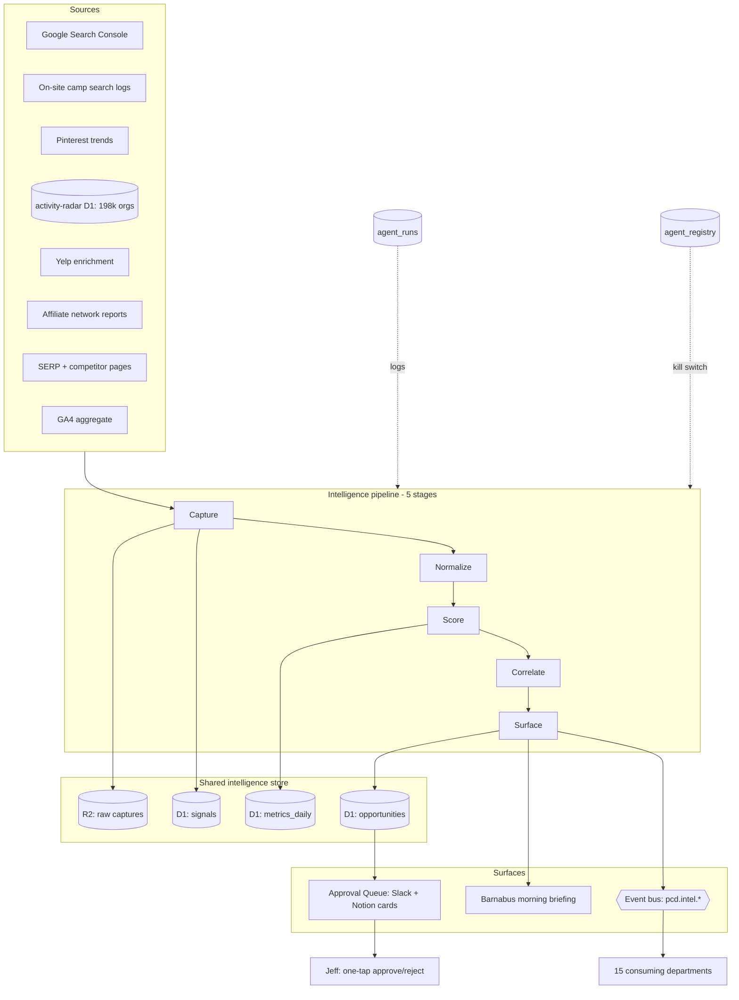

# PCD AI Operating System — Intelligence Architecture

**Version:** draft 0.1, 2026-07-15
**Department:** Intelligence Layer (department 2). Lead: **Iris** (new, design-only).
**Reads first:** 00-FOUNDATIONS.md, which is canonical. Where this file conflicts with foundations, foundations wins.
**Status honesty:** Nothing in this file is built or running. Every function below is tagged `designed`, and the three seeds it grows from (GSC reviews, freshness audits, camp coverage analysis) are tagged `running` where they run. Do not read a spec here as a shipped system.

---

## 1. The thesis: PCD out-learns what it cannot out-write or out-spend

A one-founder site does not beat a funded competitor on output. Bigger sites publish more articles, buy more links, and run larger ad budgets. PCD has one part-time founder who disappears four months a year for football season, and that is not going to change.

So the bet is not more output. The bet is a proprietary picture of youth-sports supply and demand that nobody else is assembling, and that gets sharper every week whether Jeff is at his desk or on a sideline. Content and links are consumed the day they ship; data compounds.

PCD already sits on three inputs no competitor holds together in one place. The first is a 198,287-org camp and activity database (per the 2026-07-14 audit: 3,287 with websites, 2,411 programs, growing nightly through the autonomous discovery agent). The second is parent search behavior, which will arrive as Google Search Console query data and on-site camp-search logs the moment distribution works. The third is camp market signals: enrichment rates, price points, session dates, capacity, and Yelp presence flowing through the enrichment workers.

Held apart, each of those is a commodity. A directory is a directory, GSC is free, and Yelp data is scrapeable. Held together and scored over time, they become a map of where parents are looking, what supply exists to meet that demand, and where the gap between the two is widest. That gap is where PCD publishes, where it ranks, and where it earns.

The moat is not the database. It is the accumulating record of demand-versus-supply-versus-price across PNW youth sports, keyed to geography and season, that only PCD has been watching. A competitor can copy an article in an afternoon. They cannot copy two years of scored signals about which lacrosse market in the Puget Sound is underserved every March. That is the strategic asset this file designs, and it is why Jeff calls the Intelligence Layer the moat.

One honest caveat sits on top of the thesis. Intelligence compounds only if it feeds decisions, and PCD's binding constraint is distribution, not knowledge. An intelligence platform that produces beautiful dashboards nobody acts on is worse than nothing, because it burns the scarcest resource in the company, which is Jeff's attention. So this design earns its place only where it moves traffic, links, subscribers, or revenue, and the build order in section 5 holds it to that.

---

## 2. Platform architecture: one shared intelligence store on the existing stack

The Intelligence Layer adds no new vendor. It runs on the four primitives foundations already names: Cloudflare D1 for structured signals and metrics, R2 for raw captures, Cloudflare Queues for the event bus, and Notion for the dashboards Jeff reads. It reuses `agent_runs`, `agent_registry`, and the single Approval Queue that every department shares.

### 2.1 The store, in four layers

**Structured signals and metrics live in D1.** Two new tables in the `forge-command` D1 (the same database that holds `agent_runs`), plus one for scored opportunities. Keeping them next to the run log means a signal, the run that produced it, and the opportunity it became are all one join away.

**Raw captures live in R2.** A GSC export, a SERP snapshot, an on-site search log dump, a Pinterest trends pull, a competitor page capture. These are large, append-only, and rarely re-read, which is exactly what R2 is for. Signals reference their raw capture by key, so every derived number can be traced back to the bytes it came from (the SOURCE RULE, made physical).

**Events move on Cloudflare Queues** under the `pcd.intel.*` namespace, the same event bus foundations specifies. An intelligence agent that detects something emits an event; departments subscribe to the events they care about. No agent calls another agent directly.

**Surfaced intelligence lives in Notion,** as three things and only three: an opportunity card in the shared Approval Queue, an item in Barnabus's morning briefing, or a department event another agent consumes. Jeff never reads the `signals` table. He reads a ranked list of scored opportunity cards, and that is the whole point.

### 2.2 Data model sketch

Three tables carry the layer. Field lists are indicative, not a migration.

**`signals`** — one row per observation, the atomic unit.

| Field | Type | Notes |
|---|---|---|
| `signal_id` | text PK | ULID |
| `captured_at` | timestamp | when observed, not when a report ran |
| `function` | text | one of the 17 (e.g. `demand`, `seo`, `supply`) |
| `source` | text | `gsc`, `site_search`, `pinterest`, `org_db`, `yelp`, `affiliate_net`, `serp`, `ga4` |
| `entity_type` | text | `query`, `url`, `org`, `program`, `metro`, `sport`, `pick`, `competitor` |
| `entity_id` | text | the keyed thing (query string hash, org id, metro slug) |
| `metric_key` | text | `impressions`, `position`, `enrichment_rate`, `session_price`, `ctr` |
| `metric_value` | real | |
| `unit` | text | `count`, `usd`, `rank`, `pct` |
| `geo` | text | metro slug, PNW default, null if national |
| `sport` | text | from the SPORTS array, null if cross-sport |
| `season_tag` | text | `tryouts`, `registration`, `summer`, `offseason` |
| `baseline` | real | expected value at capture (28-day or seasonal) |
| `deviation` | real | signed z-score against baseline |
| `confidence` | int | 0–100, the foundations bands |
| `status` | text | `new` → `scored` → `correlated` → `surfaced` → `actioned` → `expired` |
| `raw_ref` | text | R2 key of the capture this came from |
| `run_id` | text | FK to `agent_runs` |

**`metrics_daily`** — one row per metric per day per slice, the aggregate layer that raw signals roll up into. This is what dashboards and trend detection read, so nothing has to scan the raw `signals` table.

| Field | Type | Notes |
|---|---|---|
| `date` | date | |
| `function` | text | |
| `metric_key` | text | |
| `geo` | text | |
| `sport` | text | |
| `value` | real | the day's aggregate |
| `baseline_28d` | real | trailing 28-day mean |
| `baseline_365d` | real | same-week-last-year, for seasonal comparison |
| `seasonal_index` | real | this week's expected share of annual volume |
| `source` | text | |
| `run_id` | text | |

**`opportunities`** — one row per scored opportunity card, the only table Jeff's decisions touch. Every card carries its evidence and, later, its scored outcome. This is the hit-rate ledger.

| Field | Type | Notes |
|---|---|---|
| `opp_id` | text PK | |
| `created_at` | timestamp | |
| `function` | text | which intelligence function raised it |
| `title` | text | query-shaped, plain |
| `hypothesis` | text | what we think is true and why |
| `expected_impact` | text | `traffic` / `revenue` / `risk`, with a number |
| `impact_value` | real | predicted clicks/month or dollars/month |
| `effort` | text | `S` / `M` / `L`, Jeff-hours or agent-hours |
| `score` | real | impact ÷ effort, decay-weighted |
| `confidence` | int | 0–100 |
| `action_class` | text | Analyze / Draft / Stage / Act |
| `recommended_action` | text | the exact next move |
| `evidence_json` | text | signal ids + raw_refs + source links |
| `consumer_dept` | text | which department acts on it |
| `status` | text | `queued` → `approved`/`rejected` → `acted` → `scored` |
| `predicted_value` | real | the claim to grade later |
| `actual_value` | real | measured after the fact |
| `outcome_hit` | int | 1/0/null, feeds the hit-rate metric |

### 2.3 How signals flow: capture → normalize → score → correlate → surface

Five stages, each a distinct agent step, each logging one `agent_runs` row.

1. **Capture.** A collector pulls from a source (GSC API, site-search logs, org DB query, Yelp table, affiliate report, SERP fetch) and writes the raw bytes to R2 plus one `signals` row per observation at `status=new`. Capture never interprets.
2. **Normalize.** Units, geo slugs, sport tags, and season tags are standardized so a lacrosse query from GSC and a lacrosse listing from the org DB key on the same `sport` value. Duplicates collapse.
3. **Score.** Each signal gets a baseline and a signed deviation (section 4.4), and a confidence. Signals under 50 confidence log and stop. This is where noise dies.
4. **Correlate.** Scored signals join across functions. A demand spike (GSC) plus a supply gap (org DB) plus a price point (enrichment) in the same metro and sport is one correlated finding, not three loose numbers. Correlation is where the moat lives.
5. **Surface.** A correlated finding above threshold becomes an `opportunities` row (Stage/Act) or a briefing line (Analyze) or a `pcd.intel.*` event another department subscribes to. Below threshold it waits in `metrics_daily` for trend detection to catch it if it recurs.

### 2.4 Architecture diagram

The pipeline is one direction: sources in, opportunity cards out. Jeff sits at the far right and touches only the Approval Queue and the briefing. Everything to his left runs unattended and logs every step.

---

## 3. The seventeen intelligence functions

Each function uses the same compact format: Inputs, Outputs, Storage, Reports, Dashboards, Agents, Automation, Business value. Agent names follow the `pcd-intel-<function>` convention. Every function is `designed`; the seeds it grows from are tagged where they already run.

A note on honesty before the list. Most of these are years away. Three get built first (section 5), several are useful in year one, and a handful stay on the future-menu until PCD has customers, revenue, or paid listings that do not exist today. Each function states which it is.

### 3.1 Demand Intelligence
- **Inputs:** GSC queries, impressions, positions for sc-domain:parentcoachdesk.com; on-site camp-search logs (what parents type into the directory); Pinterest trends for youth-sports and camp terms; seasonal calendar (tryouts, registration, tournament windows).
- **Outputs:** Ranked demand signals by query cluster, sport, metro, and season; rising-query alerts; demand-versus-content-coverage gaps.
- **Storage:** `signals` (source `gsc`, `site_search`, `pinterest`), rolled to `metrics_daily` keyed by query cluster and metro.
- **Reports:** Weekly demand brief (top rising clusters, new zero-result site searches). Monthly seasonal demand forecast.
- **Dashboards:** Notion "Demand" board: rising queries, zero-result searches, demand-coverage gap list.
- **Agents:** `pcd-intel-demand` (collector + scorer).
- **Automation:** Zero-result site searches auto-open a content-gap opportunity card. Rising GSC clusters at a rank where a small on-page fix could move them auto-stage an SEO card.
- **Business value:** Tells Editorial and Marketing what to write and fix next, ranked by real parent demand, not guesses. This is a first-build function because demand routing is the front half of the distribution problem. Grows from `weekly-gsc-review` (running).

### 3.2 Supply Intelligence
- **Inputs:** The `activity-radar` org database (198,287 orgs, 3,287 with websites, 2,411 programs); nightly discovery-agent enrichment output; Yelp enrichment worker; session dates, capacity, and format where enriched.
- **Outputs:** Enrichment-rate trend; supply density by sport and metro; new-org detection; stale-listing detection; supply that has no matching content or affiliate coverage.
- **Storage:** `signals` (source `org_db`, `yelp`), `metrics_daily` keyed by metro and sport.
- **Reports:** Weekly supply-coverage report (enriched vs stub, by metro). Monthly new-supply digest.
- **Dashboards:** Notion "Supply" board: enrichment funnel, supply density heat list, stale/expired listings.
- **Agents:** `pcd-intel-supply`.
- **Automation:** Feeds the discovery agent's work queue with the metros where demand is high and enrichment is low. Auto-flags listings that went stale for the data steward.
- **Business value:** Turns 195,000 hidden IRS stubs into a prioritized enrichment plan aimed at where parents are actually searching. Grows from `pcd-camps-data-steward` and `org-discovery-daily-worklist` (running).

### 3.3 Market Intelligence
- **Inputs:** Combined demand and supply signals; camp session pricing from enrichment; registration-window timing; national youth-sports participation trends (public sources, cited).
- **Outputs:** Demand/supply/price balance per market (sport × metro × season); underserved-market list; oversupplied-market list; market-timing calendar.
- **Storage:** `signals` (function `market`), `metrics_daily` market-balance index.
- **Reports:** Quarterly PNW youth-sports market map. Pre-season market-timing brief.
- **Dashboards:** Notion "Market Map" board: the demand-vs-supply-vs-price grid, the moat view.
- **Agents:** `pcd-intel-market` (correlator, reads demand + supply outputs).
- **Automation:** Auto-raises an opportunity card when a market shows high demand, low supply, and no PCD content. Ranks the whole content and enrichment backlog by market opportunity.
- **Business value:** The proprietary picture from the thesis, made operational. This is the correlation layer that no competitor has. Future-menu until demand and supply intel both run, then it is the crown.

### 3.4 Competitor Intelligence
- **Inputs:** SERP captures for target query clusters (who ranks where); competitor site captures (what they cover, how fresh); their affiliate presence; their camp-directory coverage.
- **Outputs:** SERP-position map per cluster; competitor content-gap list (what they cover that PCD does not, and the reverse); freshness comparison.
- **Storage:** `signals` (source `serp`, entity_type `competitor`), R2 for page captures.
- **Reports:** Monthly SERP-landscape report for the top 30 clusters.
- **Dashboards:** Notion "Competitors" board: cluster-by-cluster rank ladder.
- **Agents:** `pcd-intel-competitor`.
- **Automation:** Auto-alerts when a competitor newly outranks PCD on a page that was earning, or when PCD holds a gap no competitor has filled (a land-grab card).
- **Business value:** Tells PCD where a small push wins a ranking and where a market is uncontested. Future-menu until PCD earns clicks worth defending; premature while organic clicks are zero.

### 3.5 SEO Intelligence
- **Inputs:** GSC (queries, positions, CTR, indexed-vs-crawled counts, 404 trend); on-page hygiene state; JSON-LD/schema status; internal-link graph; OG-image coverage.
- **Outputs:** Highest-impact-fix ranking; indexing-stall diagnosis; 404-to-redirect candidates; internal-link opportunities; striking-distance queries (rank 8–20 where a nudge earns clicks).
- **Storage:** `signals` (function `seo`, source `gsc`, `serp`), `metrics_daily` for position and CTR curves.
- **Reports:** Weekly SEO brief (the one highest-impact fix, already the shape of `weekly-gsc-review`).
- **Dashboards:** Notion "SEO" board: indexing funnel, striking-distance list, 404 trend, link-gap list.
- **Agents:** `pcd-intel-seo`.
- **Automation:** 404s auto-stage a redirect rule for approval. Striking-distance queries auto-open a fix card. Missing JSON-LD or OG image auto-opens a build card that the imagegen skill can service.
- **Business value:** Directly attacks the binding constraint. This is the single most valuable function in the layer today, because zero organic clicks is the number that matters most. First build. Grows from `weekly-gsc-review` (running).

### 3.6 Affiliate Intelligence
- **Inputs:** Affiliate network reports (Amazon Associates, CJ, SoccerGarage, Bookshop); the 135 live picks and their placements; `/go/` click data; link-health results; price and availability of linked products.
- **Outputs:** Revenue-per-pick and revenue-per-article ranking; dead or out-of-stock pick alerts; high-traffic-low-monetization pages; missing-pick opportunities on earning content.
- **Storage:** `signals` (source `affiliate_net`, entity_type `pick`), `metrics_daily` for revenue and click curves.
- **Reports:** Monthly affiliate performance report (grows from `pcd-affiliate-reconciler`).
- **Dashboards:** Notion "Affiliate" board: earnings by pick, tag-integrity status, EPC by network.
- **Agents:** `pcd-intel-affiliate`.
- **Automation:** Out-of-stock or dead picks auto-stage a swap. High-traffic pages with no pick auto-open a monetization card. Tag-integrity breaks (a missing `?tag=parentcoachpl-20`) auto-open a compliance card.
- **Business value:** Protects and grows the one live revenue mechanism. Useful early because it defends money already on the table, but thin until traffic exists to monetize. Grows from `pcd-link-health-monitor` and `pcd-affiliate-reconciler` (running).

### 3.7 Pricing Intelligence
- **Inputs:** Camp session prices from enrichment; competitor and directory list prices; the planned $79/yr paid-listing price; affiliate product price movement.
- **Outputs:** Price distribution by sport and metro; price-band content angles ("cheap vs premium camps"); paid-listing price sensitivity signals.
- **Storage:** `signals` (function `pricing`, metric `session_price`, `list_price`).
- **Reports:** Quarterly price-landscape report.
- **Dashboards:** Notion "Pricing" board: price bands by market.
- **Agents:** `pcd-intel-pricing`.
- **Automation:** Feeds price-band filters and "camps under $X" content angles to Editorial.
- **Business value:** Informs the $79/yr listing price and price-shaped content. Future-menu until paid listings clear Open Item 7 legal terms; premature to model a price for a product that cannot launch.

### 3.8 Customer Intelligence
- **Inputs:** Newsletter engagement (Kit opens, clicks, list growth); inbound email themes from triage (aggregate, never individual); on-site behavior in aggregate (GA4); repeat-visit patterns.
- **Outputs:** Subscriber-interest clusters; content that converts to subscribers; churn/disengagement signals; audience-question themes.
- **Storage:** `signals` (function `customer`, source `kit`, `ga4`), aggregate only.
- **Reports:** Monthly audience report.
- **Dashboards:** Notion "Audience" board: list growth, engagement, top interest clusters.
- **Agents:** `pcd-intel-customer`.
- **Automation:** Feeds newsletter segmentation and lead-magnet topic choice to Frida. Flags disengaging cohorts.
- **Business value:** Turns readers into a returning audience. Future-menu until the newsletter actually sends (the audit found zero issues ever sent) and there is engagement data to read. Hard privacy line: aggregate only, no individual tracking (section 4).

### 3.9 Geographic Intelligence
- **Inputs:** Demand by metro (GSC + site search geo); supply density by metro (org DB); PNW metro coverage vs national; enrichment rates by metro.
- **Outputs:** PNW coverage-vs-demand map; underserved-metro list; expansion-candidate metros; geo-targeted content and enrichment priorities.
- **Storage:** `signals` (geo-keyed across functions), `metrics_daily` by metro.
- **Reports:** Quarterly geographic coverage report.
- **Dashboards:** Notion "Geography" board: PNW metro grid, demand vs supply vs coverage per metro.
- **Agents:** `pcd-intel-geo`.
- **Automation:** Auto-ranks enrichment and content backlog by metro opportunity (high demand, low coverage). Flags a metro where demand appears but PCD has no supply enriched.
- **Business value:** PCD is a PNW-first directory. Knowing which Puget Sound metro is underserved every season is directly actionable for both content and enrichment. Useful in year one once demand geo-data flows.

### 3.10 Content Intelligence
- **Inputs:** The 805-article corpus with metadata; per-article GSC performance; freshness-audit output; internal-link graph; demand-coverage gaps; `bluf` and voice compliance.
- **Outputs:** Content-performance ranking; decay detection (articles losing position); refresh-priority list; net-new content briefs shaped by demand; cannibalization detection (two pages competing for one query).
- **Storage:** `signals` (function `content`, entity_type `url`), `metrics_daily` per URL.
- **Reports:** Weekly content-performance brief. Quarterly refresh plan (grows from `pcd-freshness-audit`).
- **Dashboards:** Notion "Content" board: winners, decayers, refresh queue, gap-driven brief backlog.
- **Agents:** `pcd-intel-content`.
- **Automation:** Decaying earning pages auto-open a refresh card. Demand gaps auto-generate a content brief (title, `bluf`, target cluster, anchor text) staged for Ed. Cannibalization auto-opens a consolidation card.
- **Business value:** Points the editorial pipeline at what will rank and earn, and stops it wasting output on things nobody searches. First build, because content direction is the back half of the distribution problem. Grows from `pcd-freshness-audit` (running).

### 3.11 Product Intelligence
- **Inputs:** SITE_IMPROVEMENTS.md backlog; feature-usage signals (camp search, filters, submissions); admin approve/reject patterns; site-search zero-results as feature-gap signals; submission drop-off.
- **Outputs:** Backlog re-ranking by evidence; feature-gap detection; friction points in the camp-search and submission flows.
- **Storage:** `signals` (function `product`, source `site_search`, `ga4`).
- **Reports:** Monthly product-signal report feeding the backlog.
- **Dashboards:** Notion "Product" board: feature usage, friction points, evidence-ranked backlog.
- **Agents:** `pcd-intel-product`.
- **Automation:** Recurrent zero-result searches auto-open a feature or content card. Submission drop-off auto-opens a UX card.
- **Business value:** Grounds the roadmap in what parents actually do on the site. Future-menu until there is enough traffic for behavior data to mean anything. Grows from SITE_IMPROVEMENTS.md and Piper's department.

### 3.12 Operational Intelligence
- **Inputs:** `agent_runs` log; scheduled-task success/failure; CANARY pauses; worker cron health; enrichment throughput; deploy events; the five audit leaks and their status.
- **Outputs:** Agent health map; silent-failure detection; throughput trends; leak-recurrence alerts.
- **Storage:** `signals` (function `operational`, source `agent_runs`), `metrics_daily` for run health.
- **Reports:** Weekly operations health report (feeds Barnabus).
- **Dashboards:** Notion "Ops" board: agent health, failure trend, throughput, maintenance-mode state.
- **Agents:** `pcd-intel-ops`.
- **Automation:** A disabled compliance agent (Vera) auto-escalates, per the foundations rule that a disabled compliance agent is itself an incident. A dormant cron (the audit's frozen sweep) auto-flags. Two failures in 24 hours triggers CANARY.
- **Business value:** Keeps the machine honest, especially during the Aug–Nov idle when Jeff is not watching. This is the function that would have caught the deletion-monitor going dark. Useful early, because the audit proved the leaks are real. Grows from the `agent_runs` endpoint (running as of 2026-07-15).

### 3.13 Founder Intelligence
- **Inputs:** Jeff's calendar (football season Aug–Nov, game days, recruiting windows); the maintenance-mode toggle; Approval Queue depth and his response latency; the two 2026 success metrics (Chain Reaction manuscript, UPS football 4th in conference); energy proxies (time-of-day approval patterns).
- **Outputs:** Founder-capacity signal (how much approval throughput exists this week); season-aware surfacing (hold non-urgent cards during the idle); queue-load alerts; a "what to skip" recommendation when capacity is low.
- **Storage:** `signals` (function `founder`, source `calendar`, `approval_queue`), aggregate about Jeff only, never about anyone else.
- **Reports:** Weekly capacity note in the briefing.
- **Dashboards:** Notion "Founder Capacity" board: queue depth, response latency, season state, success-metric proximity.
- **Agents:** `pcd-intel-founder`.
- **Automation:** During football season, auto-degrades every non-bypass surfacing to report-only and holds opportunity cards (the maintenance-mode rule, enforced by data rather than memory). When queue depth exceeds Jeff's recent throughput, auto-suppresses low-score cards so the high-score ones are not buried.
- **Business value:** Jeff's approval throughput is the scarcest resource in the company, and his four-month absence is a hard constraint. This function makes the whole layer season-aware and protects the two success metrics from being crowded out by site work. Useful early, low cost, high leverage. It reads Jeff's own calendar and queue only, and touches no family or player data (Red Wall).

### 3.14 Gap Detection
- **Inputs:** Every function's outputs, cross-joined. Demand with no content (content gap); demand with no supply (supply gap); traffic with no monetization (revenue gap); supply with no coverage (enrichment gap); competitor coverage PCD lacks (SERP gap).
- **Outputs:** A unified, ranked gap list across all five gap types.
- **Storage:** `signals` (function `gap`), correlated across functions.
- **Reports:** Weekly top-gaps brief.
- **Dashboards:** Notion "Gaps" board: the master ranked gap list.
- **Agents:** `pcd-intel-gaps` (pure correlator).
- **Automation:** Each gap type maps to a card type and a consuming department. A content gap opens an Ed brief; a revenue gap opens a Hal monetization card; a supply gap opens a Ranger enrichment card.
- **Business value:** This is where correlation becomes action. It is the single most useful cross-function output, because gaps are exactly the underserved-market openings the thesis is about. Useful once two or more functions run; the content-gap slice ships with the first build.

### 3.15 Trend Detection
- **Inputs:** `metrics_daily` for every function; the seasonal calendar; 365-day baselines.
- **Outputs:** Rising and falling trends per metric, separated from seasonal noise; early-signal alerts (a sport gaining demand before its season); regime changes (a sustained shift, not a spike).
- **Storage:** `signals` (function `trend`), reads `metrics_daily`.
- **Reports:** Weekly trend brief.
- **Dashboards:** Notion "Trends" board: rising, falling, seasonal-adjusted movers.
- **Agents:** `pcd-intel-trend`.
- **Automation:** A confirmed rising trend above threshold auto-opens a card for the relevant department. A falling earning trend auto-opens a defense card.
- **Business value:** Youth sports is brutally seasonal, so raw movement is mostly noise. Real trend detection (section 4.4) is what separates a signal from the calendar. Useful once there is enough history to build baselines, which means it earns its place in year two, not day one.

### 3.16 Predictive Intelligence
- **Inputs:** Historical `metrics_daily`; seasonal decomposition; demand-supply-price correlations.
- **Outputs:** Season-ahead demand forecasts by sport and metro; enrichment-timing recommendations (enrich lacrosse in January before the March demand); traffic and revenue projections with stated confidence.
- **Storage:** `signals` (function `predictive`), forecast rows in `metrics_daily`.
- **Reports:** Pre-season forecast brief.
- **Dashboards:** Notion "Forecast" board: next-season demand curve per market.
- **Agents:** `pcd-intel-predict`.
- **Automation:** Forecasts auto-schedule enrichment and content ahead of demand, staged for approval.
- **Business value:** Getting content and supply ready before the search happens is how a small site wins a seasonal query. Genuinely valuable, and genuinely far off. Future-menu until at least a full year of clean history exists, honestly two-plus years out. Anything sooner is a guess dressed as a model, which the honesty rule forbids.

### 3.17 Recommendation Engine
- **Inputs:** Every scored signal, gap, and trend; the `opportunities` scoring model; Founder Intelligence capacity; the hit-rate ledger.
- **Outputs:** The single ranked list of opportunity cards Jeff sees, scored by expected impact ÷ effort, capacity-filtered, evidence-attached.
- **Storage:** `opportunities` table; reads all functions.
- **Reports:** The morning briefing's opportunity section and the Approval Queue itself.
- **Dashboards:** Notion "Approval Queue" (shared): ranked cards, one-tap approve/reject.
- **Agents:** `pcd-intel-recommend` (Iris runs this directly).
- **Automation:** Assembles, dedupes, ranks, and capacity-filters every card. Learns from the hit-rate ledger which functions and card types actually produce predicted outcomes, and down-weights the ones that do not.
- **Business value:** This is the output the whole layer exists to produce: not dashboards, one ranked list of what to do next, with evidence and a graded track record. It is the anti-dote to "intelligence nobody reads." Ships with the first build in minimal form (rank the cards the first three functions raise) and gets smarter as the hit-rate ledger fills.

---

## 4. Data governance

Jeff asked these questions directly. Answers are binding for the layer.

### 4.1 What data should be captured

Capture only what feeds a decision, and only in the form the decision needs. Concretely: GSC query and page metrics; on-site camp-search terms (the query string and result count, not who searched); Pinterest and public trend data; the org database's own fields and enrichment rates; Yelp business data already in the pipeline; affiliate network revenue and click aggregates; SERP positions and competitor page content; GA4 aggregate metrics; the `agent_runs` health log; and Jeff's own calendar and queue state for Founder Intelligence.

Every captured field must trace to a function that acts on it. If no function consumes a field, it is not captured. This is the existence test applied to data.

### 4.2 What must NOT be captured — the hard line

This is a bright line, not a judgment call. The following never enter R2, `signals`, `metrics_daily`, `opportunities`, any dashboard, any briefing, or any log:

- **Child PII.** Names, ages, DOB, photos, rosters, or any identifier of a minor. The org database guardrail already forbids storing rosters, DOB, medical, or student emails; the intelligence layer inherits it without exception.
- **Family and household data.** Anything about a specific parent, family, or household. This is the FAMILY FIREWALL.
- **Health data.** Injury, medical, or condition information about any individual.
- **Anything Red Wall.** Recruits, players, prospects, and their families route to Jeff only and enter no intelligence store, ever.
- **Individual user tracking.** No cross-session identification of individual site visitors, no fingerprinting, no per-person behavior profiles. Site-search logs are captured as anonymized aggregates (query + count), never joined to an identity. GA4 is read at the aggregate level only.
- **Anything that creates COPPA or privacy exposure.** PCD serves parents of minors. Any capture that could be read as tracking a child, or profiling a family, is out, even if technically available. When in doubt, do not capture.

The rule of thumb: intelligence is about markets, not people. It answers "is lacrosse demand rising in Tacoma," never "who searched for it."

### 4.3 Retention windows

Three data types, three windows.

| Data type | Retention | Why |
|---|---|---|
| Raw captures (R2: GSC exports, SERP snapshots, search-log dumps, page captures) | 90 days | Long enough to re-derive a signal or audit a number, short enough to limit exposure. Purged on a schedule. |
| Derived signals (`signals` table) | 13 months | Covers a full seasonal cycle plus a month, so year-over-year comparison works. Individual signals expire; their aggregate survives. |
| Aggregates (`metrics_daily`, `opportunities`) | Indefinite | This is the compounding asset. Daily aggregates carry no PII by construction and are the multi-year record the moat depends on. |

Anonymized site-search aggregates follow the derived-signal window. Anything that even smells like it could re-identify a person is purged at the raw window and never aggregated at the individual grain.

### 4.4 How trends are identified

Baseline plus deviation, with seasonal decomposition, because youth sports is hard-seasonal and raw movement lies.

Each metric carries two baselines in `metrics_daily`: a trailing 28-day mean (`baseline_28d`) for short-term movement, and a same-week-last-year value (`baseline_365d`) for seasonal comparison. A `seasonal_index` estimates what share of annual volume this week normally carries. A signal's `deviation` is a signed z-score against the seasonally-adjusted baseline, not the raw mean.

So a March spike in lacrosse-camp searches is not a trend; it is the season, and the seasonal index absorbs it. A March spike that is 40% above last March, after seasonal adjustment, is a real trend and surfaces. A rising signal has to clear both a magnitude threshold and a persistence threshold (it recurs across multiple captures) before trend detection promotes it, which kills one-off noise. Regime changes (a sustained level shift) are separated from spikes by the persistence test.

### 4.5 How opportunities are surfaced

Scored opportunity cards, ranked, into the shared Approval Queue and the morning briefing. Never a raw signal, never a dashboard Jeff has to interpret.

Every card carries: a title (query-shaped, plain), a hypothesis with evidence links, an expected impact (traffic or revenue or risk, with a number), an effort estimate, a score (impact ÷ effort, decayed for time-sensitivity), a confidence (0–100), an action class, the exact recommended action, and the consuming department. The Recommendation Engine ranks the full list, dedupes overlapping cards, and applies the Founder-Intelligence capacity filter so a low-capacity week surfaces only the top cards.

Confidence sets the posture, per the foundations bands. A card at 90-plus inside a pre-approved scope can be Act-class (rare, e.g. a dead-link swap). 70–89 stages the full change set. 50–69 drafts with flagged uncertainty. Under 50 logs and waits for trend detection to confirm it on recurrence. Ranking is by expected impact against effort, so a high-effort low-return "opportunity" sinks below a small fix that earns clicks Monday morning.

### 4.6 How intelligence flows between departments: the consumer matrix

Departments subscribe to `pcd.intel.*` events. Each function's output has named consumers. Rows are the 17 intelligence functions; the columns are the departments that consume them (foundations department numbers in parentheses). A dot means that department subscribes to that function's events and cards.

| Intel function | Editorial (3) | Affiliate (4) | Camp Dir (5) | Sales (6) | Marketing (7) | CustSuccess (8) | Newsletter (9) | Reviews (10) | Eng (11) | Security (12) | Analytics (13) | Finance (14) | Legal (15) | Product (16) | Automation (17) | Exec (1) |
|---|---|---|---|---|---|---|---|---|---|---|---|---|---|---|---|---|
| Demand | • | | • | | • | | • | | | | • | | | • | | • |
| Supply | | | • | • | | | | • | | | • | | | • | | |
| Market | • | • | • | • | • | | | | | | • | | | • | | • |
| Competitor | • | • | | | • | | | | | | • | | | • | | |
| SEO | • | | | | • | | | | • | | • | | | • | | • |
| Affiliate | | • | | | • | | | | | | • | • | • | | | |
| Pricing | • | | • | • | | | | | | | • | • | • | • | | |
| Customer | • | | | | • | • | • | | | | • | | | • | | |
| Geographic | • | | • | • | • | | | • | | | • | | | • | | |
| Content | • | • | | | • | | • | | | | • | | | • | | |
| Product | | | • | | | • | | • | • | | • | | | • | • | |
| Operational | | | | | | | | | • | • | • | | • | | • | • |
| Founder | • | • | • | • | • | • | • | • | • | • | • | • | • | • | • | • |
| Gap Detection | • | • | • | • | • | | • | • | | | • | • | | • | | • |
| Trend | • | • | • | • | • | • | • | • | | | • | • | | • | | • |
| Predictive | • | | • | • | • | | | | | | • | • | | • | | • |
| Recommendation | • | • | • | • | • | • | • | • | • | • | • | • | • | • | • | • |

Founder Intelligence and the Recommendation Engine reach every department, because capacity and ranking bind everyone. Everything else is targeted, so a department gets only the events it acts on and the queue stays legible.

### 4.7 Six concrete loops: how intelligence improves each function

One loop each, the way it would actually run.

- **SEO.** GSC shows a cluster stuck at rank 11 with rising impressions. `pcd-intel-seo` scores it striking-distance, stages a card with the exact on-page fix and internal links to add. Jeff approves; the fix ships; the card's `actual_value` (clicks gained) is measured against `predicted_value` two weeks later. Hit or miss goes to the ledger.
- **Content.** A demand cluster ("youth flag football rules 2026") has high impressions and no PCD page. Gap Detection raises a content-gap card; `pcd-intel-content` attaches a brief with title, `bluf`, target cluster, and query-shaped anchor text. Ed drafts it; Jeff publishes; the new page's ranking is tracked back to the card.
- **Sales.** Market Intelligence finds a metro with high camp demand, dense supply, and many unclaimed listings. When paid listings launch (post Open Item 7), that metro's camp operators become the Sales lead list, ranked by the demand their listing would capture.
- **Newsletter.** Customer Intelligence clusters subscriber clicks by sport. Frida's next lead-magnet topic and the Friday Letter's resurfaced archive piece are chosen from the top cluster, not a guess. Open rate on the segmented send grades the choice.
- **Affiliate revenue.** Affiliate Intelligence finds a high-traffic gear article with a dead pick and a better in-stock alternative at a higher EPC. It stages a swap with the tag intact; Jeff approves; revenue-per-page is re-measured against the prediction.
- **Product roadmap.** Product Intelligence sees "indoor soccer near me" as a recurring zero-result site search. It raises a card; Piper's backlog gets an evidence-ranked feature (a geo filter) or content brief above the speculative items. Usage after launch grades it.

### 4.8 How it compounds into a five-year advantage

Year one, the layer is thin: three functions, a few hundred signals, no history to speak of. The value is modest and mostly defensive (find the leaks, route content, fix SEO).

Year two, baselines exist. Trend Detection starts separating real movement from season, and the market map begins to hold a shape. The hit-rate ledger has enough rows to tell Jeff which recommendations to trust.

By year five, PCD holds a multi-year, seasonally-decomposed record of demand, supply, and price across PNW youth sports, keyed to geography and sport, with a graded track record of which opportunities paid off. A competitor entering then starts at zero history against PCD's five years. They can copy today's articles; they cannot copy the accumulated judgment about which Tacoma lacrosse market is underserved every March and what it is worth. The database was always copyable. The scored history of what the database meant, and what acting on it produced, is not. That is the durable advantage, and it grows on a schedule whether Jeff is at his desk or coaching.

---

## 5. Iris and the sub-agents

### 5.1 Iris — full twelve-field spec

Iris leads the Intelligence Layer. She does not collect signals herself; she runs the Recommendation Engine, produces the weekly intelligence brief, and owns the opportunity ranking. Supervisor is Barnabus; human owner is Jeff.

| Field | Iris |
|---|---|
| **Purpose** | Turn the seventeen functions' outputs into one ranked, evidence-backed list of what PCD should do next, and a weekly brief Jeff actually reads. |
| **Responsibilities** | Run the Recommendation Engine; assemble, dedupe, rank, and capacity-filter opportunity cards; write the weekly intelligence brief; maintain the hit-rate ledger; supervise the `pcd-intel-*` sub-agents; enforce the SOURCE RULE on every card. |
| **Triggers** | Weekly (brief + full ranking); daily (queue refresh into the morning briefing); on any Stage/Act-class card raised by a sub-agent; on a CANARY pause in the layer. |
| **Inputs** | `signals`, `metrics_daily`, `opportunities`, `agent_runs`, Founder-Intelligence capacity, the hit-rate ledger, the seasonal calendar. |
| **Outputs (action class)** | The ranked Approval Queue (Stage); the weekly intelligence brief (Draft/Analyze); the daily opportunity section of the briefing (Analyze); rare pre-approved-scope Act cards (Act). |
| **Human approval gates** | Every card that changes anything customer-facing, money-touching, or published waits for Jeff. Iris ranks and stages; she does not ship. |
| **Escalation rules** | A Red Wall or family-adjacent signal that somehow reached the store is dropped and flagged as a governance incident, not surfaced. A disabled compliance agent auto-escalates. Low founder capacity holds non-urgent cards. |
| **Failure recovery** | If a sub-agent's signals are stale (past their freshness window), Iris marks dependent cards low-confidence and does not surface them as fresh. On her own failure, one `agent_runs` row logs it; the queue simply does not refresh, which is safe. |
| **Confidence thresholds** | Foundations bands. Iris never promotes a card above the confidence of its weakest supporting signal. |
| **Logging contract** | One `agent_runs` row per run, even on failure. Every card carries its `evidence_json` and, once acted on, its scored outcome. |
| **Success metrics** | Recommendation hit rate (acted-on cards that produced the predicted result); Jeff's approval throughput on intel cards; share of shipped content/SEO/affiliate work that traces to an intel card; zero governance incidents. |
| **Risk class** | R1 by default (drafts and reports). R2 for Stage cards. Any Act scope is pre-approved and narrow, treated as R3 with the full logging, kill-switch, and audit requirements. |

### 5.2 Sub-agent compact specs

All `designed`, none built. Compact table using the twelve-field columns condensed.

| Agent | Purpose | Triggers | Output (class) | Approval gate | Confidence | Risk | Logs |
|---|---|---|---|---|---|---|---|
| `pcd-intel-seo` | Score GSC into ranked SEO fixes | Weekly, on GSC pull | Fix cards (Stage), brief (Analyze) | Jeff on any live change | Bands | R2 | `agent_runs` |
| `pcd-intel-demand` | Rank demand by cluster/metro/season | Weekly | Demand brief (Analyze), gap cards (Draft) | Report-only | Bands | R1 | `agent_runs` |
| `pcd-intel-content` | Route editorial by demand + decay | Weekly, on freshness audit | Briefs + refresh cards (Draft/Stage) | Jeff publishes | Bands | R1 | `agent_runs` |
| `pcd-intel-supply` | Enrichment-rate + supply density | Weekly | Supply report (Analyze), enrich cards (Stage) | Data-steward review | Bands | R1 | `agent_runs` |
| `pcd-intel-affiliate` | Revenue-per-pick, dead-pick swaps | Monthly, on link-health | Swap cards (Stage) | Jeff on swaps | Bands | R2 | `agent_runs` |
| `pcd-intel-market` | Correlate demand+supply+price | Quarterly | Market map (Analyze), opportunity cards | Report + Jeff | Bands | R1 | `agent_runs` |
| `pcd-intel-geo` | PNW coverage vs demand | Quarterly | Geo report (Analyze), priority cards | Report-only | Bands | R1 | `agent_runs` |
| `pcd-intel-gaps` | Cross-function gap ranking | Weekly | Ranked gap list + typed cards | Per card type | Bands | R1 | `agent_runs` |
| `pcd-intel-trend` | Seasonal-adjusted trend detection | Weekly | Trend brief (Analyze), trend cards | Report-only | Bands | R1 | `agent_runs` |
| `pcd-intel-ops` | Agent + cron health, leak watch | Daily | Health report, escalations | Auto-escalate only | Bands | R1 | `agent_runs` |
| `pcd-intel-founder` | Capacity + season awareness | Daily | Capacity note, queue filter | None (advisory) | Bands | R1 | `agent_runs` |
| `pcd-intel-competitor` | SERP + competitor coverage | Monthly | SERP report, land-grab cards | Report-only | Bands | R1 | `agent_runs` |
| `pcd-intel-customer` | Aggregate audience clusters | Monthly | Audience report | Report-only | Bands | R1 | `agent_runs` |
| `pcd-intel-pricing` | Price bands by market | Quarterly | Price report | Report-only | Bands | R1 | `agent_runs` |
| `pcd-intel-product` | Behavior + backlog evidence | Monthly | Product report, feature cards | Report + Piper | Bands | R1 | `agent_runs` |
| `pcd-intel-predict` | Season-ahead forecasts | Pre-season | Forecast brief | Report + Jeff | Bands | R1 | `agent_runs` |
| `pcd-intel-recommend` | Rank all cards (Iris runs this) | Daily/weekly | The Approval Queue (Stage) | Jeff per card | Bands | R2 | `agent_runs` |

### 5.3 Build order: honest sequencing

The binding constraint is distribution, so the first three functions attack distribution and nothing else.

**Build first (year one, distribution-facing):**
1. **SEO Intelligence** — zero organic clicks is the number that matters most. This grows straight out of the running `weekly-gsc-review` and produces staged fixes, not just a report. Highest value in the layer today.
2. **Demand Intelligence** — tells Editorial and Marketing what to write and fix, ranked by real parent search. The front half of routing traffic.
3. **Content Intelligence** — points the editorial pipeline at what will rank and stops wasted output. Grows from the running `pcd-freshness-audit`. The back half of routing traffic.

These three plus a minimal Recommendation Engine (rank the cards they raise) and the Gap Detection content-gap slice are the whole first build. Founder Intelligence and Operational Intelligence ride along as cheap, high-leverage guards, because Founder makes the layer season-aware and Ops would have caught the audit's leaks.

**Build second (year two, once history and traffic exist):** Affiliate Intelligence at depth, Geographic Intelligence, Market Intelligence, Trend Detection. These need either a full seasonal baseline or real traffic to monetize, neither of which exists in year one.

**Future-menu for years:** Pricing (gated on the $79/yr listing clearing Open Item 7 legal terms), Customer (gated on the newsletter actually sending), Sales-facing Market outputs (gated on paid listings existing), Product (gated on enough traffic for behavior to mean anything), Competitor (premature while clicks are zero), and Predictive (needs two-plus years of clean history; anything sooner is a guess, and the honesty rule forbids dressing a guess as a model).

The temptation with an intelligence platform is to build all seventeen because the architecture supports them. The existence test forbids it. A function that has no data to read, or whose output no department can act on this year, does not get built this year no matter how good the spec looks.

---

## 6. Department template compliance

The Intelligence Layer answered as a department against foundations section 7's fourteen questions.

**Mission.** Give PCD a proprietary, compounding picture of youth-sports demand, supply, and price, and turn it into one ranked list of evidence-backed actions that move traffic, links, subscribers, or revenue.

**Work performed.** Capture signals from GSC, site search, the org database, Yelp, affiliate networks, SERPs, GA4, and the run log; normalize, score, correlate, and surface them; produce the weekly intelligence brief; maintain the ranked Approval Queue; keep the hit-rate ledger.

**SOPs required.** A capture SOP per source; a scoring SOP (baseline + deviation + seasonal decomposition); an opportunity-card SOP (score, evidence, action class, consumer); a weekly-brief SOP; a hit-rate scoring SOP (grade acted-on cards against their prediction); a governance-drop SOP (Red Wall / family / PII signals dropped and flagged, never surfaced).

**Fully automated tasks.** Capture, normalize, score, and roll-up to `metrics_daily`. These are inert and read-only, so they run unattended and log every run.

**AI-recommends tasks.** Correlation, gap detection, trend detection, and card ranking. The layer proposes; a department or Jeff disposes.

**Human-approval tasks.** Every card that changes anything customer-facing, money-touching, published, or deleted. Iris stages; Jeff ships. The rare Act-class card runs only inside a pre-approved narrow scope.

**Success metrics.** Recommendation hit rate (the headline); share of shipped work traceable to an intel card; organic-click and revenue movement on acted-on cards; Jeff's approval throughput on intel cards; zero governance incidents; zero stale-as-fresh surfacings.

**Owning agents.** Iris (lead, Recommendation Engine + brief) and the seventeen `pcd-intel-*` sub-agents. Supervisor Barnabus; human owner Jeff.

**Triggering events.** Scheduled pulls (weekly SEO/demand/content, monthly affiliate/competitor/customer, quarterly market/geo/pricing, daily ops/founder); a sub-agent raising a Stage/Act card; a CANARY pause; a governance-drop trigger.

**Data produced.** `signals`, `metrics_daily`, `opportunities`, R2 raw captures, `pcd.intel.*` events, the weekly brief, the ranked queue, the hit-rate ledger.

**Data consumers.** All fifteen operating departments per the section 4.6 matrix, plus the Executive Office. Founder and Recommendation outputs reach everyone; the rest are targeted.

**Failure modes.** Hallucinated trends (a pattern asserted from noise or too little data). Stale signals treated as fresh (a past-window signal surfaced as current). Correlation-as-causation (a card that claims a lever will work because two metrics moved together). Intelligence nobody reads (dashboards and briefs that produce no action). PII or Red Wall leakage into the store. CANARY-triggering silent failure in a collector.

**Failure handling.** Hallucinated trends are blocked by the persistence + magnitude thresholds and the seasonal baseline; a trend that clears neither logs and waits. Stale signals carry a freshness window and Iris marks dependent cards low-confidence rather than surfacing them fresh. Correlation-as-causation is contained by requiring every recommendation to state its causal hypothesis explicitly and carry its evidence links (SOURCE RULE), and by the hit-rate ledger, which grades whether the claimed lever actually produced the predicted result. Intelligence-nobody-reads is attacked at the root: the only output that reaches Jeff is a ranked, capacity-filtered card list, and the traceability metric (share of shipped work from a card) measures whether the layer is actually consumed. PII/Red Wall leakage is dropped-and-flagged by the governance-drop SOP and is treated as an incident, not a bug. Silent failure triggers CANARY on two failures in 24 hours.

**Quality measurement.** Two rules. First, the SOURCE RULE: every recommendation carries evidence links (signal ids, R2 raw refs, source URLs) so Jeff approves against evidence, not a summary. Second, the outcome rule: every acted-on card is scored later. Did the recommendation, when acted on, produce the predicted result? That hit rate is the layer's primary quality metric, tracked per function and per card type, so a function that keeps missing gets down-weighted or retired.

**Continuous improvement.** The hit-rate ledger is the improvement engine. Functions and card types that consistently produce their predicted outcomes get more weight in ranking; those that miss get less, then get retired under the RETIREMENT RULE. The quarterly close (foundations Phase 10 pattern) reviews each function against its hit rate and its consumption, promotes what earned it, and prunes what did not. No intelligence function survives two quarters of low hit rate and low consumption.

---

*End of 02-intelligence-architecture.md. This file is design, not build. It graduates into the operating manual one function at a time, through the same gates everything else clears, starting with SEO Intelligence off the running GSC review.*
