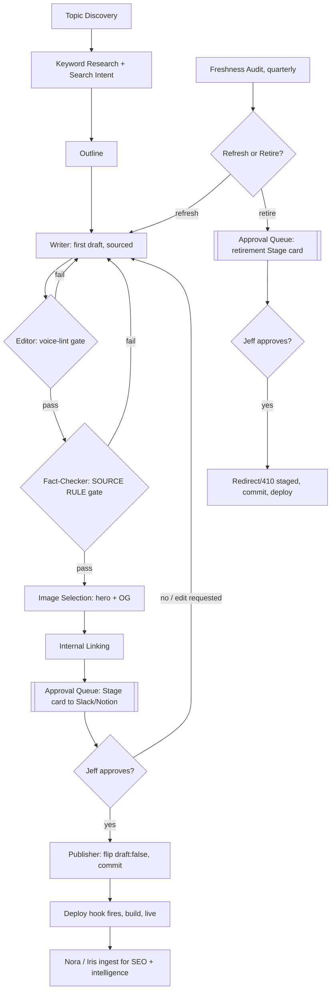
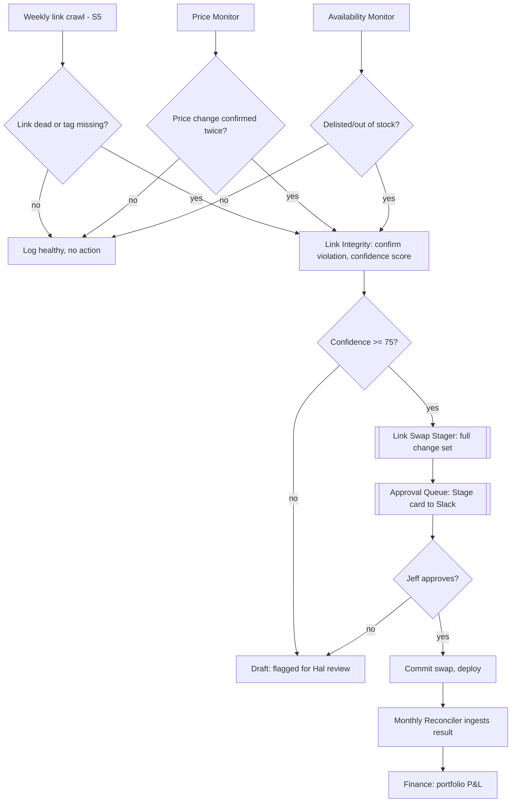
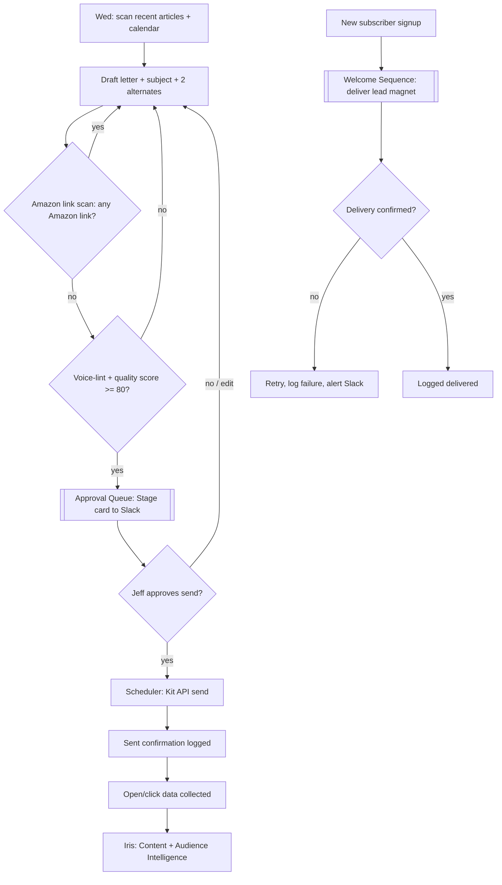
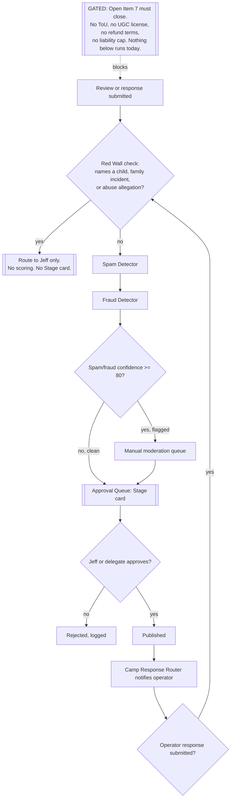

# PCD AI Operating System — Content Departments

**Version:** draft 0.1, 2026-07-15
**Status:** Design only. Nothing in this file builds an agent, a schedule, or a queue. It specifies four departments against the fourteen-question template in `00-FOUNDATIONS.md` section 7.
**Covers:** Editorial (#3, lead Ed), Buying Guides & Affiliate (#4, lead Hal), Newsletter (#9, lead Frida), Reviews (#10, lead Remy). Numbering matches the roster table in `00-FOUNDATIONS.md` section 5.

Editorial, Buying Guides, and Newsletter grow from live, named agents and real scheduled tasks. Reviews is a full department design with nothing built and nothing running, gated on a legal Open Item. Each section says which of those three states applies to which piece, per the honesty rule in section 8 of foundations: designed, built, and running are different words for different things, and this file does not round up.

Intelligence function names below are working names for capabilities this file needs from Iris, the Intelligence Layer (department #2). File `02-intelligence-architecture.md` is the canonical spec for those functions; where it has not been written yet, this file states what each department needs and leaves the full spec to that file.

---

## 3. Editorial — Lead: Ed (exists)

Grows from: `pcd-rules-watcher` (S9, weekly rules watch), `pcd-seasonal-content-scheduler` (S9, monthly plan), `pcd-freshness-audit` (S11, quarterly). Content collections `src/content/articles/`, `src/content/coaching-tips/`, `src/content/gear/`. The Worker's editorial approve route, which already writes markdown to GitHub, is the seed of the publish pipeline below.

**Mission.** Get parent-useful, sourced, voice-correct youth-sports content published and kept current, at the pace the site can sustain, without Jeff writing or shipping every word himself.

**Work performed.** Topic discovery, keyword research, search-intent classification, outlining, drafting, editing against the voice rule, fact checking against the SOURCE RULE, image selection, internal linking, publishing, refreshing what already exists, retiring what no longer earns its place, and periodic quality audits across all of it. Ed today covers seasonal planning, rule-change drafting, and freshness scanning. Everything else on this list is future-menu.

**SOPs required.** S9 (editorial content pipeline, running) and S11 (freshness audit, running) already exist and this department keeps them. Five new SOPs are needed: keyword-and-intent research, the full draft-through-publish sequence, internal linking, content retirement, and a quarterly editorial quality audit that checks voice compliance across the live article base, not just staleness.

**Fully automated tasks.** None. Every output in this department is Draft, Stage, or Analyze. Confidence-scoring and voice-linting can run unattended, but nothing in Editorial reaches Act class; publication is a HUMAN GATE item by principle 1, full stop.

**AI-recommends tasks.** Topic discovery (what to write next, ranked by opportunity), keyword research and search-intent tagging, outline generation, first-draft writing, fact-check source attachment, image and OG-image selection, internal-link suggestions, refresh-candidate ranking, retirement-candidate ranking. All of these are Draft or Stage class: a human decides whether to act on them.

**Human-approval tasks.** Publishing (the draft:false flip), any rewrite that changes a claim or a recommendation, retirement (redirect or 410 an existing URL), and any override of a banned-word or bluf-field failure. Jeff is the approver for all of them today; nothing in Editorial has a second approver.

**Success metrics.** Zero articles published without a `bluf` field or a passing voice-lint. Zero organic clicks is today's real number (2026-07-14 audit); the near-term target is any non-zero click number two GSC cycles running, since indexing and traffic are the binding constraint, not draft volume. Refresh backlog age: no flagged stale article sits unaddressed past one quarter. Time from finished draft to published: currently unmeasured because nothing publishes; target under 48 hours once the pipeline below ships.

**Owning agents.** Ed (lead). Sub-agents: `pcd-editorial-topic-discovery`, `pcd-editorial-keyword-research`, `pcd-editorial-search-intent`, `pcd-editorial-outline`, `pcd-editorial-writer`, `pcd-editorial-editor`, `pcd-editorial-fact-checker`, `pcd-editorial-image-selector`, `pcd-editorial-internal-linker`, `pcd-editorial-publisher`, `pcd-editorial-refresher`, `pcd-editorial-retirement`, `pcd-editorial-quality-auditor`. Only the rules-watcher, seasonal-scheduler, and freshness-audit functions are live; the rest are design.

**Triggering events.** Calendar dates (tryouts, registration windows, tournaments, back-to-school) fire topic discovery. A detected youth-sports rule or equipment change fires the rules-watcher draft path. A finished draft fires the editor and fact-checker in sequence. A passing fact-check fires image selection and internal linking. A complete, linted, imaged, linked draft fires a Stage card to the Approval Queue. Jeff's approval fires the publisher. The freshness audit firing quarterly, or an article's traffic decaying past a threshold, fires the refresher.

**Data produced.** Draft markdown files with frontmatter (`bluf`, draft flag, dates), keyword and intent tags, source citations per claim, image and OG-image assignments, internal-link maps, publish and retirement events, freshness and quality-audit reports.

**Data consumers.** Nora (Marketing/SEO) reads published URLs and keyword tags for the GSC review. Hal reads internal links into gear guides for affiliate attribution. Frida reads the published-article list to source the Friday Letter's "new this week" section. Iris ingests topic-performance and freshness signals for the intelligence store. Barnabus reads publish and audit events into the daily briefing.

**Failure modes.** A draft ships with a banned word or a missing `bluf` field because the lint step was skipped or misfired. Fact-check misses a stale statistic and it ships anyway. The deploy hook fires but the Cloudflare Pages build fails silently, leaving `draft: false` committed but not live. Two sub-agents write to the same file in the same run and create a merge conflict. An OG image gets assigned to the wrong article.

**Failure handling.** The editor and fact-checker are hard gates, not advisory: a draft that fails either one cannot generate an Approval Queue card, it returns to the writer sub-agent with the specific failure attached. The publisher confirms a live 200 on the published URL after the deploy hook fires and reopens the Stage card with a build-failure flag if it does not get one within a set window. File writes are one sub-agent at a time per article, enforced by a simple per-article lock so no two agents touch the same file in the same run.

**Quality measurement.** Voice-lint pass rate (banned words, sentence-length, em dash count) tracked per draft and per quarter. SOURCE RULE compliance: percentage of claims with an attached source link. `bluf` field presence, 100% required, zero tolerance. Freshness-audit findings closed within one quarter versus carried over.

**Continuous improvement.** The quarterly quality audit (grown from S11) adds a voice-compliance pass to its existing staleness pass, so one report covers both. Any recurring lint failure (the same banned word slipping through repeatedly, for instance) becomes a prompt fix for the writer sub-agent, not a one-off correction. Retirement candidates that get refreshed instead, and refresh candidates that get retired instead, are logged as a signal the ranking function is miscalibrated.

### Intelligence layer interface

**Consumes from Iris:** Keyword & Search-Intent Intelligence (query volume, difficulty, intent classification), Content Decay Detection (traffic and freshness decay per article), Topic Gap Analysis (what the site should cover and does not), Internal Link Graph Analysis (orphaned pages, over-linked pages), SERP Competitive Intelligence (what is ranking above PCD and why).

**Emits:** `pcd.editorial.topic_identified`, `pcd.editorial.outline_ready`, `pcd.editorial.draft_ready`, `pcd.editorial.fact_check_failed`, `pcd.editorial.fact_check_passed`, `pcd.editorial.image_assigned`, `pcd.editorial.publish_staged`, `pcd.editorial.published`, `pcd.editorial.refresh_flagged`, `pcd.editorial.retired`, `pcd.editorial.quality_audit_failed`.

### Agent spec — Ed (lead)

| Field | Spec |
|---|---|
| Purpose | Run the editorial pipeline from topic discovery through publish, refresh, and retirement, producing sourced, voice-correct content at a pace the site can sustain, without publishing anything Jeff has not approved. |
| Responsibilities | Own S9 and S11. Supervise the thirteen editorial sub-agents. Enforce the voice rule, the SOURCE RULE, and the `bluf`-field requirement as hard gates, not suggestions. Assemble the Approval Queue card for every publish and retirement candidate. |
| Triggers | Calendar-driven (seasonal scheduler, monthly), rule-change detection (rules-watcher, weekly), freshness audit (quarterly), and ad hoc when Jeff requests a specific topic. |
| Inputs | Content calendar, `src/data/site.ts` SPORTS array, existing article base, GSC keyword data (via Nora/Iris), youth-sports rule and equipment sources, `AFFILIATE_MASTER_LIST` for gear-guide cross-references. |
| Outputs (action class) | Topic and keyword recommendations (Draft). Outlines and first drafts (Draft). Publish-ready change sets (Stage). Retirement recommendations (Stage). Quality and freshness reports (Analyze). |
| Human approval gates | Every publish. Every retirement (redirect or 410). Any claim-changing rewrite. Any override of a failed voice-lint or missing-source gate. |
| Escalation rules | Any draft touching a named child, a specific family, or a specific injury routes to Jeff before it enters the pipeline at all (Red Wall, Family Firewall). Two consecutive fact-check failures on the same topic escalate to a Jeff review of the source itself, not just the draft. |
| Failure recovery | Failed lint or fact-check returns the draft to the writer sub-agent with the specific failure attached, capped at three automatic retries before it surfaces to Jeff as a stuck draft. A failed deploy hook reopens the Stage card rather than silently closing it. |
| Confidence thresholds | Publish-readiness score ≥ 85 required before a Stage card is generated (voice-lint pass + source-attachment rate + internal-link count combined). 60–84 returns to the writer for another pass without surfacing to Jeff. Below 60 stays in the draft backlog, unsurfaced, until re-run. |
| Logging contract | One `agent_runs` row per sub-agent invocation, one per pipeline stage, so a stuck draft is traceable to the exact stage that stopped it. |
| Success metrics | Zero unsourced claims shipped. Zero missing `bluf` fields shipped. Published-article count per month against calendar plan. Time from Stage card to Jeff decision. |
| Risk class | R1 for research, drafting, and analysis stages. R2 for the publish and retirement Stage outputs, since a human commits every one. |

### Sub-agents (compact)

| Sub-agent | Purpose | Trigger | Output class | Status |
|---|---|---|---|---|
| `pcd-editorial-topic-discovery` | Rank next topics by opportunity | Monthly, seasonal calendar | Draft | grows from seasonal-scheduler |
| `pcd-editorial-keyword-research` | Query volume, difficulty, intent tags | Per topic | Draft | design |
| `pcd-editorial-search-intent` | Classify informational/commercial/navigational | Per topic | Draft | design |
| `pcd-editorial-outline` | Structure draft against Three Drives framework | Per approved topic | Draft | design |
| `pcd-editorial-writer` | Produce first draft, sourced | Per outline | Draft | grows from rules-watcher |
| `pcd-editorial-editor` | Voice-lint: banned words, sentence length, `bluf` | Per draft | Analyze (gate) | design |
| `pcd-editorial-fact-checker` | SOURCE RULE: every claim linked | Per draft | Analyze (gate) | design |
| `pcd-editorial-image-selector` | Hero + per-article OG image via imagegen skill | Per passed draft | Stage | design, closes known OG gap |
| `pcd-editorial-internal-linker` | Query-shaped anchor text, gear-guide links | Per passed draft | Stage | design |
| `pcd-editorial-publisher` | Approve-to-publish: flip `draft:false`, commit, fire deploy hook | On Jeff approval | Stage → executes on approval | design, audit #7 |
| `pcd-editorial-refresher` | Rank and draft refresh candidates | Quarterly + decay signal | Draft/Stage | grows from freshness-audit |
| `pcd-editorial-retirement` | Recommend redirect/410 for dead-weight articles | Quarterly | Stage | design |
| `pcd-editorial-quality-auditor` | Voice + staleness sweep across live base | Quarterly | Analyze | grows from freshness-audit |

### Workflow: Editorial pipeline with approval gates

---

## 4. Buying Guides & Affiliate — Lead: Hal (exists)

Grows from: `pcd-link-health-monitor` (S5, weekly), `pcd-affiliate-reconciler` (S6, monthly). `src/data/affiliates.json`, the `/go/` redirect layer, `AFFILIATE_MASTER_LIST`. This is the only workstream with any live revenue mechanism on the site, and the only one where the 2026-07-14 audit found active operational damage: `/what-to-buy/` is deployed on a stale Astro v4.16.19 build while the rest of the site runs v5.18.2, so the money section is running old nav, old footer, and an unverified redirect chain. That redeploy is a P0 item ahead of anything designed here, not a replacement for it.

**Mission.** Keep every affiliate recommendation on the site accurate, current, correctly tagged, and pointed at a live product, so the revenue PCD has projected but never recorded has a working mechanism to actually earn.

**Work performed.** Product discovery, research, comparison-table construction, affiliate link creation and tag-integrity enforcement, availability monitoring, price monitoring, review monitoring (of the products, not PCD's own reviews), outdated-product detection, and a monthly refresh pass across the 135 live picks.

**SOPs required.** S5 (link health, running) and S6 (revenue reconcile, running) stay. Four new SOPs: product discovery and research, comparison-table maintenance, price and availability monitoring, and a monthly refresh that consolidates all of it into one pass instead of scattered checks.

**Fully automated tasks.** Link crawling and dead-link detection already run unattended weekly (S5). Price and availability polling can run unattended once built. None of these write anything; they only detect and report.

**AI-recommends tasks.** Product discovery (new gear worth a guide), comparison-table drafts, price-change flags, review-sentiment flags on tracked products, outdated-product flags (superseded model, discontinued SKU), and the monthly refresh summary. All Draft or Stage.

**Human-approval tasks.** Any link swap (new URL, new product, new price display). Any new affiliate program application. Any change to the Amazon tag string. Payout and reconciliation figures feeding Finance. The stale-build redeploy itself, since it touches the live revenue section.

**Success metrics.** Zero raw Amazon URLs in markdown, checked every build. Zero `amzn.to` links, checked every build. 100% of `/go/` redirects resolve to a live product with the tag intact, checked weekly. Recorded revenue: currently zero; target is any non-zero month once the redeploy and tag-verification land, since the audit could not confirm a single `/go/` link lands on Amazon with the tag intact.

**Owning agents.** Hal (lead). Sub-agents: `pcd-buying-product-discovery`, `pcd-buying-research`, `pcd-buying-comparison-builder`, `pcd-buying-link-integrity`, `pcd-buying-availability-monitor`, `pcd-buying-price-monitor`, `pcd-buying-review-monitor`, `pcd-buying-outdated-detector`, `pcd-buying-monthly-refresh`, `pcd-buying-link-swap-stager`. Only link-health and the reconciler are live.

**Triggering events.** Weekly link crawl (existing). Monthly reconciliation (existing). A price-monitor poll detecting a change past a threshold. An availability check finding a product out of stock or delisted. A new-product signal from Iris' product-intelligence function. Monthly refresh firing the full sweep.

**Data produced.** Link-health reports, price-history records, availability status per product, review-sentiment scores per tracked product, outdated-product flags, staged link-swap change sets, monthly reconciliation summaries.

**Data consumers.** Finance (portfolio) reads reconciliation summaries for the P&L. Editorial reads outdated-product flags to know which gear guides need a refresh. Nora reads product-page performance for SEO. Iris ingests price and availability history as revenue-relevant signal.

**Failure modes.** A link swap ships without the `?tag=parentcoachpl-20` parameter, silently losing commission on every click. A price monitor false-positives on a currency-format change and stages an unnecessary swap. An availability check misses a delisted product because the retailer's page still returns 200. The stale-build problem recurs: a future deploy of `/what-to-buy/` regresses to an old build because the deploy target was never fixed at the source.

**Failure handling.** `pcd-buying-link-integrity` runs as a build-time gate, not just a weekly crawl: no deploy ships with a raw Amazon URL, a missing tag, or an `amzn.to` link, full stop, mirroring the CLAUDE.md affiliate rules directly. Price-change flags require two consecutive polls agreeing before they stage a swap, cutting single-poll false positives. The stale-build root cause (wrong Astro version, wrong deploy target) is a Site Ops / Engineering fix, logged here as a dependency, not solved by this department.

**Quality measurement.** Link-health pass rate (percentage of `/go/` links resolving correctly with tag intact) tracked weekly. Tag-integrity violations, target zero, tracked every build. Time from a detected dead link to a staged swap. Time from a staged swap to Jeff's approval.

**Continuous improvement.** Every approved link swap and every rejected swap recommendation feeds back into the confidence scoring for `pcd-buying-link-swap-stager`, the same way org-discovery's confidence floor was set from lived experience. A pattern of rejected swaps on one retailer (say, a CJ merchant with unreliable inventory data) downgrades that source's trust score rather than being handled swap by swap.

### Intelligence layer interface

**Consumes from Iris:** Price & Availability Intelligence, Product Category Trend Intelligence (what gear parents are searching for), Link Health Intelligence, Revenue Attribution Intelligence (which articles and which products actually convert, once GA4 is wired).

**Emits:** `pcd.affiliate.product_discovered`, `pcd.affiliate.link_checked`, `pcd.affiliate.link_dead`, `pcd.affiliate.tag_violation_detected`, `pcd.affiliate.price_changed`, `pcd.affiliate.availability_changed`, `pcd.affiliate.product_outdated`, `pcd.affiliate.swap_staged`, `pcd.affiliate.swap_approved`, `pcd.affiliate.reconciled`.

### Agent spec — Hal (lead)

| Field | Spec |
|---|---|
| Purpose | Keep every affiliate link on the site live, correctly tagged, and pointed at a current product, and turn dead or stale links into staged one-tap fixes instead of standing reports Jeff has to act on by hand. |
| Responsibilities | Own S5 and S6. Supervise the ten buying-guide sub-agents. Enforce tag integrity (`parentcoachpl-20`, `/go/` only, no `amzn.to`) as a build-time gate. Feed Finance the monthly reconciliation. |
| Triggers | Weekly link crawl, monthly reconciliation, price/availability polling once built, ad hoc when a new product category is proposed. |
| Inputs | `affiliates.json`, `AFFILIATE_MASTER_LIST`, live retailer pages (Amazon, CJ, SoccerGarage, Bookshop), the 8 pending network applications' status, GSC and (once wired) GA4 product-page data. |
| Outputs (action class) | Link-health reports (Analyze). Product discovery and comparison-table drafts (Draft). Link swaps and price-display updates (Stage). Reconciliation summaries (Analyze). |
| Human approval gates | Every link swap. Every new affiliate network application submission. Every tag-string change. Every comparison-table publish (routes through Editorial's publish gate, since it lives in a content collection). |
| Escalation rules | Two consecutive weeks of a link-health failure rate above 5% escalates to Jeff as a systemic problem, not a per-link fix. A tag-integrity violation caught at build time blocks that deploy and pages Jeff directly, since it is silent revenue loss. |
| Failure recovery | A failed price poll retries once before flagging low-confidence rather than staging a swap on bad data. A failed swap application (broken commit, bad merge) reopens the Stage card instead of dropping it. |
| Confidence thresholds | Link-swap Stage threshold ≥ 75, mirroring the org-discovery precedent as the one other agent staging changes to a live parent-facing surface. 50–74 stays Draft, flagged for Hal's own review before Jeff sees it. Below 50, logged only. |
| Logging contract | One `agent_runs` row per crawl, per poll, and per swap, so a silent revenue leak (a dead link nobody caught) is traceable to exactly which run should have caught it. |
| Success metrics | Zero raw Amazon URLs or `amzn.to` links shipped. Link-health pass rate. Recorded revenue, currently zero. Time from dead-link detection to live fix. |
| Risk class | R1 for discovery, research, and monitoring. R2 for the swap Stage output, since a human commits every one. |

### Sub-agents (compact)

| Sub-agent | Purpose | Trigger | Output class | Status |
|---|---|---|---|---|
| `pcd-buying-product-discovery` | Find new gear worth a guide | Monthly | Draft | design |
| `pcd-buying-research` | Specs, pricing, source comparison | Per product | Draft | design |
| `pcd-buying-comparison-builder` | Build comparison tables | Per guide | Draft | design |
| `pcd-buying-link-integrity` | Tag + `/go/` + no-`amzn.to` gate | Every build | Analyze (gate) | design, mirrors CLAUDE.md rule |
| `pcd-buying-availability-monitor` | Detect out-of-stock/delisted | Weekly | Analyze | design |
| `pcd-buying-price-monitor` | Detect price changes | Weekly | Analyze | design |
| `pcd-buying-review-monitor` | Track external product review sentiment | Monthly | Analyze | design |
| `pcd-buying-outdated-detector` | Flag superseded/discontinued products | Monthly | Draft | design |
| `pcd-buying-monthly-refresh` | Consolidate all checks into one pass | Monthly | Analyze/Stage | grows from reconciler |
| `pcd-buying-link-swap-stager` | Stage the actual URL/product swap | On dead link or price/availability change | Stage | design, the key upgrade over report-only |

### Workflow: Buying Guides monitoring pipeline with approval gates

---

## 9. Newsletter — Lead: Frida (exists)

Grows from: `pcd-friday-letter-draft` (S10, weekly draft, Wed 8:03). Kit (ConvertKit) free tier, one signup form, one lead magnet promised (a 28-page guide), zero issues ever sent. This is the sharpest gap in the whole content estate: a live, receiving list getting nothing it was promised.

**Mission.** Turn PCD's article output and camp-season timing into a newsletter parents actually open, starting with getting the Friday Letter sent at all, then building the automation and segmentation that make each future send worth more than the last.

**Work performed.** The Parent Newsletter (Friday Letter): weekly draft, subject line testing, and (designed here) a Kit-API send-with-approval path. Camp Newsletter and Editorial Newsletter as future segments once there is enough distinct content to justify splitting the list. Welcome-sequence automation delivering the promised lead magnet. Personalization, segmentation, scheduling, open-rate optimization, and subject-line testing as the list grows past a single undifferentiated send.

**SOPs required.** S10 (Friday Letter, running as draft-only) stays and gets a second stage appended: send-with-approval. Three new SOPs: welcome-sequence delivery, segmentation and list management, and open-rate/subject-line testing.

**Fully automated tasks.** None, by hard rule. An agent never sends without approval, full stop, regardless of how mature the pipeline gets. Draft generation, subject-line variant generation, and open-rate data pulls can run unattended; sending never does.

**AI-recommends tasks.** Weekly draft with subject line and alternates (existing). Welcome-sequence draft. Segment definitions (camp-interested vs. editorial-interested subscribers, once there is data to segment on). Send-time recommendations based on open-rate history. Subject-line A/B variant proposals.

**Human-approval tasks.** Every send, no exception. The welcome sequence's first live version. Any segmentation rule that changes who receives what. Any subject-line test that goes out to the full list rather than a sample.

**Success metrics.** Issue #1 sent: currently zero issues sent ever, this is the first real target, ahead of anything else in this department. Welcome-sequence delivery rate to new subscribers: currently zero, since no sequence exists and the lead magnet is undelivered. Open rate and click rate, once sends exist to measure. List growth rate.

**Owning agents.** Frida (lead). Sub-agents: `pcd-newsletter-friday-letter` (exists), `pcd-newsletter-welcome-sequence`, `pcd-newsletter-camp-segment`, `pcd-newsletter-editorial-segment`, `pcd-newsletter-personalization`, `pcd-newsletter-segmentation`, `pcd-newsletter-scheduler`, `pcd-newsletter-open-rate-optimizer`, `pcd-newsletter-subject-line-tester`.

**Triggering events.** Wednesday draft cycle (existing). A finished, linted draft firing an Approval Queue card. Jeff's approval firing the scheduler's Kit-API call. A new subscriber signup firing the welcome sequence, once built. An open-rate data pull firing the optimizer's weekly read.

**Data produced.** Draft letters with subject-line variants, send confirmations, open and click rates per issue, subscriber segment assignments, welcome-sequence delivery status.

**Data consumers.** Editorial reads open-rate and click data to see which articles resurface well. Iris ingests subscriber and engagement data for the intelligence store. Barnabus reads send events into the briefing. Finance eventually reads newsletter-driven affiliate clicks, if any non-Amazon `/go/` link in a letter converts.

**Failure modes.** An Amazon link slips into a draft and nobody catches it before send (hard rule violation, contractually risky). A send fires without Jeff's tap because of an integration bug in the scheduler. The welcome sequence fails silently and new subscribers keep getting nothing. Kit API auth expires and sends silently fail to queue.

**Failure handling.** `pcd-newsletter-friday-letter` runs an Amazon-link scan as a hard gate before a draft can generate an Approval Queue card at all, the same pattern as Editorial's voice-lint gate. The scheduler requires an explicit Jeff approval token per send; a missing or expired token is a hard stop, not a default-allow. The welcome sequence logs every delivery attempt to `agent_runs`, so a silent failure shows up in the log even if nobody notices the missing email. A Kit API auth failure CANARY-pauses the scheduler and alerts Slack rather than retrying blind.

**Quality measurement.** Amazon-link violations in drafts, target zero, checked every draft. Time from draft to Jeff's send decision. Welcome-sequence delivery success rate once built. Open rate trend once there is more than one data point.

**Continuous improvement.** Once three or more issues have actually sent, subject-line performance data starts training the variant generator instead of guessing. Segmentation only gets built once there is a real behavioral split to segment on (camp-season clickers vs. gear-guide clickers), not before, per the existence test in foundations principle 5.

### Intelligence layer interface

**Consumes from Iris:** Content Performance Intelligence (which published articles resurface well), Audience/Subscriber Intelligence (growth, engagement history), Send-Time & Open-Rate Intelligence, Segmentation Intelligence (once behavioral data exists).

**Emits:** `pcd.newsletter.draft_ready`, `pcd.newsletter.amazon_link_flagged`, `pcd.newsletter.staged_for_send`, `pcd.newsletter.send_approved`, `pcd.newsletter.sent`, `pcd.newsletter.welcome_triggered`, `pcd.newsletter.welcome_delivered`, `pcd.newsletter.open_rate_recorded`, `pcd.newsletter.subject_test_started`, `pcd.newsletter.segment_created`.

### Agent spec — Frida (lead)

| Field | Spec |
|---|---|
| Purpose | Get the Friday Letter drafted, approved, and actually sent, deliver the lead magnet subscribers were promised, and grow into segmentation and optimization only once real send data exists to justify it. |
| Responsibilities | Own S10 end to end, including the send step this file adds. Own the welcome-sequence build. Enforce the no-Amazon-links-in-email rule as a hard gate on every draft. Never send without a per-issue Jeff approval. |
| Triggers | Weekly draft cycle (Wed 8:03). New-subscriber signup (welcome sequence, once built). Ad hoc when Jeff requests a special send. |
| Inputs | Recent published articles (from Editorial), the seasonal calendar, prior newsletter archive, Kit subscriber list and (once wired) open/click history. |
| Outputs (action class) | Draft letters with subject line and alternates (Draft). Welcome-sequence draft (Draft). Send-ready change sets (Stage). Sent confirmations and open-rate reports (Analyze). |
| Human approval gates | Every send, permanently, per principle 1. The first live welcome-sequence version. Any segmentation rule change. |
| Escalation rules | Any draft mentioning a specific child, family, or injury routes to Jeff before drafting continues (Red Wall, Family Firewall). A detected Amazon link in a draft blocks the Approval Queue card entirely until removed. |
| Failure recovery | A Kit API failure at send time CANARY-pauses the scheduler, alerts Slack, and does not retry blind. A welcome-sequence delivery failure logs to `agent_runs` and does not silently drop the subscriber. |
| Confidence thresholds | Content-quality score ≥ 80 (voice-lint plus Amazon-link scan plus subject-line completeness) required before a Stage card generates. Below that, Frida flags for a rewrite pass rather than surfacing an unfinished draft to Jeff. Sends carry no confidence threshold for bypassing approval; that gate never lifts. |
| Logging contract | One `agent_runs` row per draft cycle, per send attempt, and per welcome-sequence delivery, so an unsent list or an undelivered lead magnet is traceable to the exact run that should have caught it. |
| Success metrics | Issues sent (target: greater than zero). Welcome-sequence delivery rate. Open and click rate once measurable. Zero Amazon-link violations. |
| Risk class | R1 for drafting and analysis. R2 for the send Stage output, since a human approves every one and it never graduates past that. |

### Sub-agents (compact)

| Sub-agent | Purpose | Trigger | Output class | Status |
|---|---|---|---|---|
| `pcd-newsletter-friday-letter` | Draft weekly letter, subject + alternates | Wed 8:03 | Draft | exists (draft only) |
| `pcd-newsletter-welcome-sequence` | Deliver lead magnet to new subscribers | New signup | Stage | design, P1 gap |
| `pcd-newsletter-camp-segment` | Camp-season-interested segment | Future | Draft | future-menu |
| `pcd-newsletter-editorial-segment` | Gear/editorial-interested segment | Future | Draft | future-menu |
| `pcd-newsletter-personalization` | Per-subscriber content selection | Future | Draft | future-menu |
| `pcd-newsletter-segmentation` | List segmentation rules | Future | Stage | future-menu |
| `pcd-newsletter-scheduler` | Kit-API send-with-approval | On Jeff approval | Stage → executes on approval | design |
| `pcd-newsletter-open-rate-optimizer` | Send-time recommendations | Weekly, once data exists | Analyze | future-menu |
| `pcd-newsletter-subject-line-tester` | A/B subject variants | Per issue, once data exists | Draft | future-menu |

### Workflow: Newsletter draft-to-send pipeline with approval gates

---

## 10. Reviews — Lead: Remy (new, design only)

Grows from: nothing built. The `camp_reviews` tables exist in the `activity-radar` D1 and are empty. Remy is a proposed lead with no live task, no scheduled job, and no code behind it. This entire department is designed here as a future-menu with a named activation trigger, per foundations section 5's instruction that a named lead is an accountability slot, not a build commitment.

**The gate, stated plainly.** Open Item 7 blocks this department completely: no terms of use for the camps directory's paid listings, no UGC license covering what parents submit as reviews, no refund terms, no liability cap. The manual is explicit that the $79/yr paid-listing feature stays unlaunched until a lawyer closes this. Reviews cannot launch before paid listings do, because the same legal gap covers both: PCD cannot host user-submitted content about a children's program without a UGC license, full stop. Nothing below this line runs until that closes.

**Activation trigger.** This department moves from design to build only when both of the following are true: (1) Open Item 7 closes with a lawyer-reviewed ToU, UGC license, refund terms, and liability cap in place, and (2) Jeff makes an explicit decision to launch reviews, separate from and after the paid-listings decision, since reviews carry Red Wall exposure that paid listings alone do not. Until then this file is the whole department: no agent runs, no task is scheduled, no table is written to.

**Mission (as designed).** Let parents leave honest, useful reviews of camps and programs, let camp operators respond, and keep the whole surface safe for the kids the reviews are about, without a single piece of content about a specific child or family incident ever reaching a public page unreviewed by Jeff.

**Work performed (as designed).** Parent review intake, camp operator response routing, moderation, spam detection, fraud detection, AI-generated review summaries per camp, and a review-appeals process for camps disputing a published review.

**SOPs required (as designed).** Five new SOPs, none written yet beyond this outline: review intake and moderation, camp-response routing, spam and fraud detection, AI summary generation, and appeals handling. None of these get a full SOP write-up until the activation trigger fires; writing detailed procedure against a legal framework that does not exist yet would be design work that has to be redone.

**Fully automated tasks.** None, and none are proposed to ever exist here. Moderation involving user-generated content about a children's program never reaches Act class under this design, regardless of confidence score, because the cost of a wrong autonomous call is a public page naming a child or a family incident.

**AI-recommends tasks (as designed).** Spam and fraud scoring per submitted review. AI-generated per-camp summaries pooling multiple reviews. Moderation recommendations (approve, reject, escalate). All Draft or Stage, never Act.

**Human-approval tasks (as designed).** Every review published. Every camp response published. Every appeal resolution. Any review the Red Wall flags routes to Jeff only and is not shown to any other moderator, staged or otherwise.

**Success metrics (as designed, not measurable until built).** Zero Red-Wall-flagged reviews published without Jeff's review. Moderation turnaround time once live. Spam/fraud false-positive rate.

**Owning agents.** Remy (lead, proposed, unbuilt). Sub-agents, all design: `pcd-reviews-intake`, `pcd-reviews-moderation`, `pcd-reviews-spam-detector`, `pcd-reviews-fraud-detector`, `pcd-reviews-camp-response-router`, `pcd-reviews-ai-summarizer`, `pcd-reviews-appeals-handler`.

**Triggering events (as designed).** A review submission. A camp operator response submission. An appeal filed against a published review. A moderation queue threshold (volume-based escalation once the queue is real).

**Data produced (as designed).** Review records, moderation decisions, spam/fraud scores, AI summaries per camp, appeal records. None of this exists today; the tables are empty.

**Data consumers (as designed).** Camp Directory (Ranger) would read published review data as a camp-quality signal. Iris would ingest sentiment and volume data. Marketing (Nora) would read AI summaries for camp-page SEO value.

**Failure modes (as designed).** A review naming a specific child, a specific coach by name in an accusatory context, or a specific family incident publishes without routing to Jeff first. Fraudulent reviews (a competitor camp astroturfing, or a camp gaming its own rating) inflate or deflate a camp's public standing. Spam floods the moderation queue and buries real reviews. A camp disputes a review with no clear appeals path and escalates to a legal complaint instead.

**Failure handling (as designed).** The Red Wall check runs first, before spam or fraud scoring, on every single submission: any review or response mentioning a minor by name, a specific injury, or a specific family incident is pulled out of the automated path entirely and routed to Jeff only, with no confidence score, no Stage card, no exceptions. Fraud detection uses cross-signal checks (submission timing clusters, IP/device overlap with the camp operator, review-text similarity across submissions) before anything reaches a moderation queue a person has to read. Appeals get a named path from day one: a camp can flag a published review for re-review, which reopens it to Jeff, not to an automated re-score.

**Quality measurement (as designed).** Red Wall catch rate: percentage of flaggable content correctly routed to Jeff before publication, target 100%, measured by periodic audit once live, the same audit pattern used for org-discovery's guardrail compliance. Spam/fraud false-positive and false-negative rates.

**Continuous improvement (as designed).** None proposed until the department is live; there is no data to improve against yet. Once live, this department follows the same manual-3x posture as every other PCD workstream: Jeff or a delegate moderates reviews by hand for a real stretch before any moderation function is trusted to Stage a decision unattended, and moderation involving a Red-Wall flag never reaches unattended status at all, regardless of how long the manual period runs.

### Intelligence layer interface

**Consumes from Iris (once built):** Trust & Safety Intelligence (spam/fraud pattern detection), Sentiment Intelligence (review-text sentiment aggregation), Camp Quality Intelligence (review signal feeding back into Camp Directory's own quality scoring).

**Emits (once built, none live today):** `pcd.reviews.submitted`, `pcd.reviews.red_wall_triggered`, `pcd.reviews.spam_detected`, `pcd.reviews.fraud_suspected`, `pcd.reviews.moderation_flagged`, `pcd.reviews.published`, `pcd.reviews.rejected`, `pcd.reviews.camp_response_drafted`, `pcd.reviews.summary_generated`, `pcd.reviews.appeal_filed`.

### Agent spec — Remy (lead, designed, not built)

| Field | Spec |
|---|---|
| Purpose | Once Open Item 7 closes and Jeff activates the department: run parent review intake, camp response routing, moderation, and fraud/spam detection for the camps directory, with any content naming a child or family incident routed to Jeff before it ever reaches a public page. |
| Responsibilities | Own review and response intake. Run Red Wall screening as the first step on every submission, before any other processing. Supervise spam, fraud, summarization, and appeals sub-agents. Never publish anything without Jeff's approval. |
| Triggers | A review or response submission. An appeal filed. None of these fire today; the intake form does not exist. |
| Inputs | Submitted review text, camp record from `activity-radar`, prior review history for the same camp or submitter (fraud signal), camp operator account status. |
| Outputs (action class) | Red Wall screening result (Analyze, gate). Spam/fraud scores (Analyze). Moderation recommendation (Draft/Stage). AI camp summary (Draft). Appeal resolution recommendation (Draft). |
| Human approval gates | Every published review. Every published camp response. Every appeal resolution. Every Red-Wall-flagged item, which skips staging entirely and goes straight to Jeff. |
| Escalation rules | Any mention of a minor by name, a specific injury, abuse, or a named family incident routes to Jeff only, immediately, with no automated scoring applied and no Stage card generated. This is absolute and does not soften with volume, confidence, or moderator fatigue. |
| Failure recovery | A failed Red Wall screen (the check itself erroring, not finding nothing) blocks publication by default rather than defaulting to allow. A spam/fraud scoring failure routes the item to manual moderation rather than auto-approving it. |
| Confidence thresholds | Spam/fraud Stage threshold, once built, proposed at ≥ 80, higher than the org-discovery and link-swap precedents, because the cost of a wrong call here is reputational and child-safety-adjacent, not just a bad link. Nothing in this department reaches Act class at any confidence level. |
| Logging contract | One `agent_runs` row per submission, per Red Wall trigger, per moderation decision, once built. A Red Wall trigger logs even though it takes no automated action, since a missed trigger is the department's worst failure mode. |
| Success metrics | Red Wall catch rate, target 100%, audited periodically. Moderation turnaround. Spam/fraud accuracy. None measurable until the department is live. |
| Risk class | R2 for moderation and fraud-scoring outputs, once built, since a human commits every publish decision. The Red Wall screen itself is treated as R1-critical: its only job is to stop, not to act, so its failure mode is under-flagging, not over-acting. |

### Sub-agents (compact, all design)

| Sub-agent | Purpose | Trigger | Output class | Status |
|---|---|---|---|---|
| `pcd-reviews-intake` | Accept and structure review submissions | Submission | Analyze | design |
| `pcd-reviews-moderation` | Red Wall screen first, then moderation recommendation | Every submission | Analyze/Stage | design |
| `pcd-reviews-spam-detector` | Cross-signal spam scoring | Every submission | Analyze | design |
| `pcd-reviews-fraud-detector` | Astroturf/gaming detection | Every submission | Analyze | design |
| `pcd-reviews-camp-response-router` | Route reviews to camp operators for response | On published review | Draft | design |
| `pcd-reviews-ai-summarizer` | Per-camp AI summary from review pool | Periodic, once volume exists | Draft | design |
| `pcd-reviews-appeals-handler` | Structure camp disputes for Jeff's review | On appeal filed | Draft | design |

### Workflow: Reviews moderation pipeline with approval gates (designed, inactive until Open Item 7 closes)

---

## Cross-department notes

Editorial, Buying Guides, and Newsletter share the same Approval Queue described in `00-FOUNDATIONS.md` section 4: one queue, not three, so Jeff's approval throughput stays the scarce resource the design is built around, not something split across department-specific inboxes. Reviews will join that same queue on activation, not get its own.

All four departments inherit the maintenance-mode toggle. August through November, every Stage-class output in these departments degrades to report-only: drafts still generate, nothing auto-populates an Approval Queue card expecting a same-week response. The one standing exception across all of PCD, the S4 deletion watch, does not touch any of these four departments.

Every event namespace above (`pcd.editorial.*`, `pcd.affiliate.*`, `pcd.newsletter.*`, `pcd.reviews.*`) writes to the shared `events` table specified in foundations section 4 and is available to Iris and to every other department without a direct integration. No department in this file talks to another department's agent directly; they talk through events and the intelligence store.
