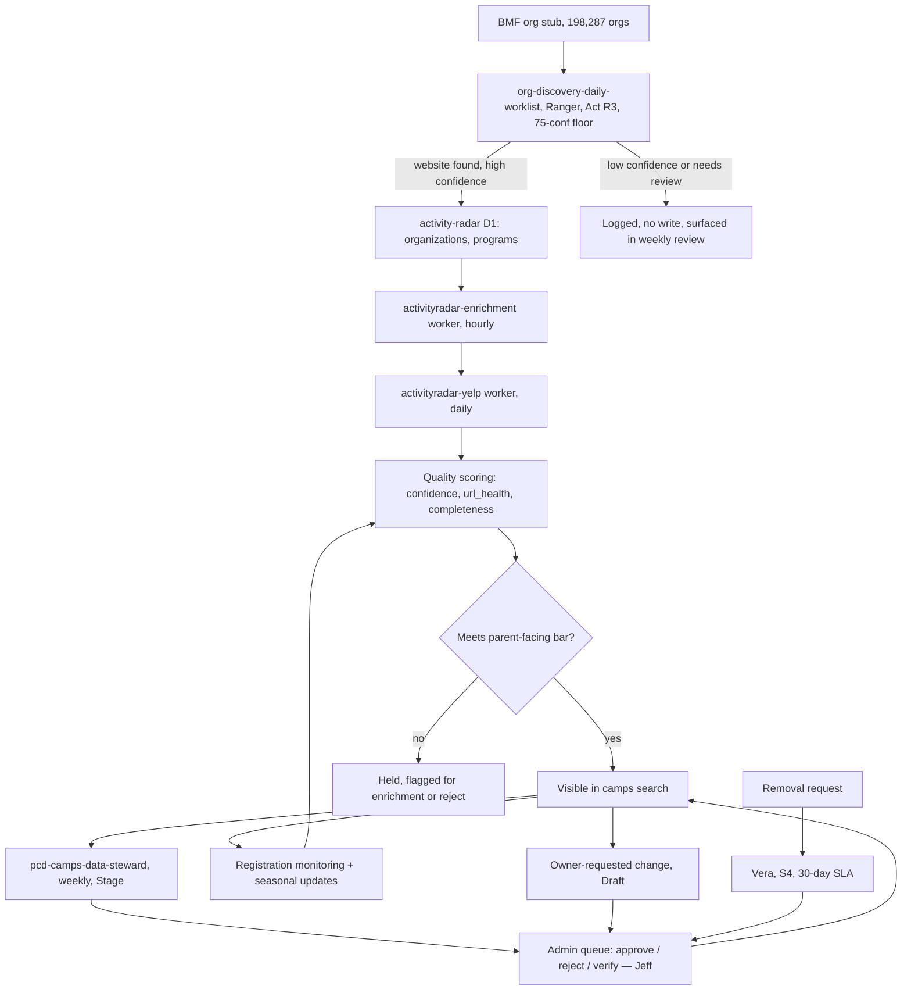
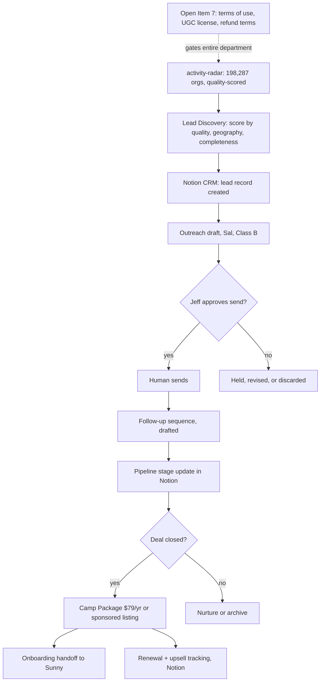
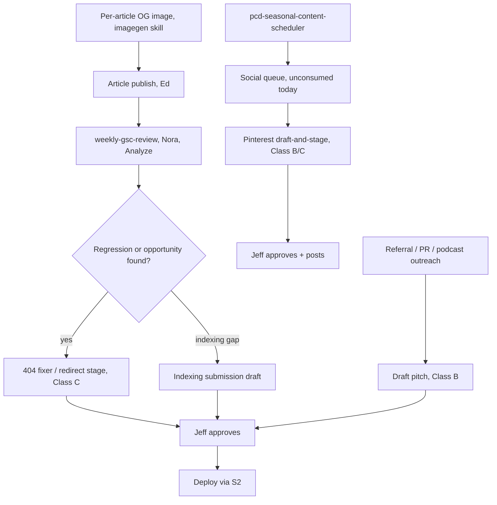
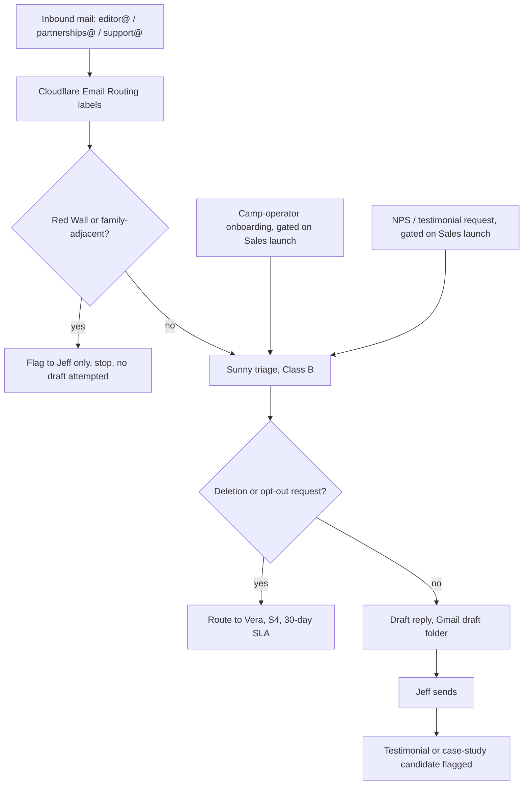

# PCD AI Operating System — Market-Facing Departments

**File:** 04-market-departments.md
**Status:** design only. Nothing in this file builds an agent, a schedule, or a queue.
**Reads against:** 00-FOUNDATIONS.md (canonical), PCD-AUTOMATION-AUDIT-2026-07-14.md (current state), PCD-OPERATING-MANUAL.md (how PCD runs today).
**Covers:** Camp Directory (Ranger), Sales (Sal), Marketing (Nora), Customer Success (Sunny). Each department answers the fourteen template questions from foundations section 7, states which intelligence functions it consumes and which `pcd.<domain>.<event>` events it emits, carries a lead agent spec on the twelve-field template, a compact sub-agent table, and one Mermaid workflow diagram.

These four departments touch parents and camp operators directly. Camp Directory is the asset. Marketing is how anyone finds it. Sales is how the asset turns into revenue once the legal gate clears. Customer Success is what keeps the first three from burning trust. Read together, they are the front of the house; the platform departments in file 05 are the kitchen.

---

## 1. Camp Directory

**Lead:** Ranger. **Status:** exists, live, the roster's one Act-class R3 agent.

### Mission

Turn the 198,287-organization ActivityRadar database into a directory a parent can trust, one enriched, verified, deduplicated, and correctly scored record at a time. Today about 3,000 of those 198,287 orgs are enriched enough to show a parent a real camp. The mission is not to add more raw rows; it is to grow the enriched, trustworthy slice faster than it decays.

### Work performed

Ranger runs two live SOPs today. S7 (`org-discovery-daily-worklist`, daily 9:02 PM) is the enrichment engine: it takes a batch of unverified IRS Business Master File stubs, searches each org's website, scores confidence, and writes accepted rows (75 confidence or higher, no needs-review flag) straight to `activity-radar` as an organization website update plus a camp-scan queue insert. S8 (`pcd-camps-data-steward`, weekly Thursday) is the housekeeping pass: stale listings, expired sessions that should redirect instead of 404, duplicate records, orphaned queue rows.

Two Cloudflare Workers do the low-level work S7 feeds. `activityradar-enrichment` runs hourly against the scan queue S7 fills. `activityradar-yelp` runs daily and layers Yelp data onto records that already have a website. Everything downstream of discovery, quality scoring, coverage analysis, owner-requested changes, removal requests, is designed in this file and not yet built as a named workflow, even where a table for it already exists.

### SOPs required

| SOP | Function | Status |
|---|---|---|
| S7 | Camp discovery and enrichment | Running, Act-class, daily |
| S8 | Camps directory data quality | Running, Stage-class, weekly |
| S13 (new, designed) | Duplicate detection as its own pass, not a side effect of S8 | Designed |
| S14 (new, designed) | Closed camp detection (registration page gone, phone disconnected, season passed with no renewal) | Designed |
| S15 (new, designed) | Registration monitoring (open/closed status, price changes) | Designed |
| S16 (new, designed) | Seasonal updates (summer camp dates roll to next year) | Designed |
| S17 (new, designed) | Owner requested changes (a camp operator asks to correct their own listing) | Designed |
| S18 (new, designed) | Removal requests, ties to Vera's S4 30-day deletion SLA | Designed |
| S19 (new, designed) | Quality scoring as a standing pass, not a one-time gate at submission | Designed |
| S20 (new, designed) | Coverage analysis (which sports, states, and age bands are thin) | Designed |

### Fully automated tasks

S7's enrichment write is the one fully automated, no-per-run-approval task on the entire PCD roster. Inside the 75-confidence, needs-review-false threshold, Ranger writes the website and queues the scan without asking. The hourly enrichment worker and the daily Yelp worker also run unattended, because they only add data to records already in the pipeline, never publish a new listing on their own.

### AI-recommends tasks

S8's weekly data-quality pass, duplicate detection, closed-camp detection, and coverage analysis are all AI-recommends: Ranger finds the issue, writes the exact fix, and stages it. Quality scoring itself is AI-recommends in its scoring logic but Act-class in its gate: the score is computed automatically, and only records above the visibility bar reach parent-facing search without a human ever seeing the individual record.

### Human-approval tasks

Every delete, at any confidence level, forever. Every bulk fix to parent-facing records. Every admin-queue approve or reject. Owner-requested changes route through the admin queue the same as a fresh submission, because an operator's own claim about their program is not automatically true. Removal requests are Vera's SLA to execute, not Ranger's; Ranger's job stops at locating and flagging the record.

### Success metrics

The enrichment funnel's core number: enriched, parent-visible orgs as a share of the 198,287-org base, tracked weekly rather than reported once. A secondary pair from the S7 spec: accepted-row count and confident-website rate per run, tracked over time instead of vanishing after each run's own summary. Quality: `domain_quality` approval rate above 70% median, dead-URL share under 5% of approved records, both borrowed from the existing (legacy-schema) quality framework and due for a port to `activity-radar`.

### Owning agents

Ranger owns the department. No sub-agents are separately named agents today; every sub-function below runs inside Ranger's scope or is designed as a future extension of it.

### Triggering events

S7 fires on a clock (daily 9:02 PM). S8 fires on a clock (weekly). Duplicate detection and closed-camp detection are designed to fire on the same S8 clock rather than as separate schedules, because they read the same table pass. Owner-requested changes and removal requests are designed to fire on inbound events (`pcd.support.message_triaged` routing a camp-related email to Ranger's queue) once Sunny is live and Sal exists to receive operator contact.

### Data produced

Enriched `organizations` and `programs` rows in `activity-radar`. A camp-scan queue that feeds the enrichment worker. A weekly `CAMPS_REVIEW_YYYY-MM-DD.md` report. A `domain_quality` table (currently specced against the legacy schema, needs porting) ranking source domains by approval rate. Coverage-gap reports naming thin sports, states, and age bands once S20 is built.

### Data consumers

Marketing consumes coverage gaps to prioritize which camp categories need content or Pinterest boards. Sales consumes quality-scored, enriched orgs as the literal lead list once Open Item 7 clears. Customer Success consumes owner-contact events to route camp-operator questions back to Ranger's queue. The Intelligence Layer consumes S7's accept rate and S8's issue counts as inputs to the portfolio's weekly review.

### Failure modes

The org-discovery write has no independent kill switch today, only the scheduled task's own enable flag, and no `agent_runs` logging, so a silent failure is caught only by its own post-write count query. Placeholder data ("ages 0-99," missing coordinates) ships to parents when enrichment is incomplete but the confidence score still clears 75. Duplicate records slip through when a camp lists under two slightly different names or domains, and the fuzzy-match logic that exists today is specced against the legacy schema, not `activity-radar`. No confirmation email means a camp operator who submits a correction has no idea whether it landed.

### Failure handling

Every S7 write is idempotent: `results.jsonl` skips completed orgs, ids recompute from name, city, and state so a re-run does not double-write, and orphaned queue rows unstick each run. The 75-confidence floor and the never-store-PII guardrail are the control on bad writes, backstopped by a required periodic human audit (Open Item 4) that samples 20 accepted records against their real websites and checks the false-accept rate. Deletes are never autonomous, at any confidence, which caps the worst-case damage of any single bad accept at "wrong until the next weekly review," not "gone."

### Quality measurement

Quality scoring, once ported to `activity-radar`, gates what a parent sees: a record below the visibility bar stays in the pipeline instead of reaching `/camps/`. The three headline numbers from the existing quality framework carry forward as the target: median domain approval rate above 70%, low-confidence share under 15% of submitted volume, dead-URL share under 5% of approved camps at any moment.

### Continuous improvement

The quarterly Open Item 4 audit is the improvement loop: sample the accept rate, find the false-accept share, and move the 75-confidence threshold up or down as evidence warrants, always as Jeff's written call, never Ranger's own tuning. Coverage analysis feeds a second loop once built, pointing next month's discovery batches at the categories the audit shows are thinnest instead of running the queue in whatever order the stubs happen to sit.

### Intelligence functions consumed and events emitted

Camp Directory consumes coverage-gap analysis and confidence-scoring intelligence (specified in file 02) to decide which org batches to prioritize and where the quality bar sits. It emits `pcd.camps.org_enriched`, `pcd.camps.record_flagged` (duplicate, closed, or expired), `pcd.camps.quality_scored`, `pcd.camps.coverage_gap_found`, and `pcd.camps.removal_requested` (consumed by Vera). Sales and Marketing both subscribe to `pcd.camps.coverage_gap_found`; Sales for lead prioritization, Marketing for content and board planning.

### The enrichment funnel, the department's core asset

The funnel is the whole department in one shape: 198,287 raw stubs in, roughly 3,000 enriched and visible out today. Every sub-function above is a stage in that funnel, not a separate program. Discovery finds a website. Enrichment and Yelp add detail. Quality scoring decides whether the record clears the bar a parent should see. Duplicate and closed-camp detection remove what should never have been counted as inventory in the first place. The department's real job is widening the funnel's exit without widening its entrance faster than quality can keep up, because a directory with 198,287 unreliable rows is worse than one with 3,000 trustworthy ones.

### Agent spec: Ranger (lead, twelve-field template)

1. **Purpose.** Turn unverified organization stubs into parent-usable camp listings, keep the live directory clean of duplicates and dead records, and grow the enriched share of the 198,287-org base without lowering the quality bar.
2. **Responsibilities.** Discovery and enrichment (S7); data quality, duplicate detection, closed-camp detection (S8 and its designed extensions); quality scoring as a standing gate; coverage analysis; routing owner-requested changes and removal requests to the right human queue.
3. **Triggers.** S7 daily 9:02 PM. S8 weekly Thursday 4:07 AM. Designed extensions (S13-S20) fire on the same clocks they extend, except owner-requested changes and removal requests, which are designed to fire on inbound events once Sunny and Sal exist to generate them.
4. **Inputs.** `activity-radar` D1 (`organizations`, `programs`, camp-scan queue). `CAMPS_QUALITY_FRAMEWORK.md` (built against the legacy schema, port to `activity-radar` is open work). The 75-confidence gate. Prior weekly reports. The live site and each listing's real website.
5. **Outputs, with action class.** Class D (Act): S7 enrichment writes inside the 75-confidence, needs-review-false threshold, the roster's only Class D. Class C (Stage): every S8 fix, duplicate merge, closed-camp flag, owner-requested change. Class A (Analyze): the weekly report, the coverage-gap analysis, the quality-score trend.
6. **Human approval gates.** Every delete, at any confidence. Every bulk fix to parent-facing records. Every admin-queue decision. Any change to the 75-confidence threshold itself.
7. **Escalation rules.** Any accept rate that moves sharply against the prior run. Any guardrail near-miss (PII detected in a scraped field). A backup gap over 7 days. A queue row stuck across two runs. All escalate to `needs_you` in the run log and the Slack staging post.
8. **Failure recovery.** Idempotent by design: re-runs skip completed orgs, recompute ids rather than trust stored ones, and unstick orphaned queue rows. No autonomous write beyond the named S7 scope until three clean backup runs are logged in `scripts/BACKUP-PROVING-LOG.md` (today: zero).
9. **Confidence thresholds.** 75, set by Jeff, named in `APPROVAL-MATRIX.md`. Below 75 or any needs-review flag: log the signal, no write, weekly-review visibility only, per the foundations confidence bands.
10. **Logging contract.** One `agent_runs` row per run through `POST /api/agent-runs`: run id, status, a no-PII summary, `needs_you` items, output paths, real error text on failure. This closes one of the three section-7 gaps (logging, kill switch, version control) the operating manual documents as still open.
11. **Success metrics.** Enriched share of the 198,287-org base, tracked weekly. Accept rate and confident-website rate per S7 run, tracked over time. Domain approval rate, low-confidence share, dead-URL share, per the quality framework's quarterly targets.
12. **Risk class.** R3 for S7 (the roster's only production write with no per-run gate). R2 for S8 and its extensions (a human commits every staged change). R1 for the reporting and coverage-analysis output.

### Sub-agent table

| Function | Purpose | Trigger | Output class | Approval gate | Confidence threshold | Status |
|---|---|---|---|---|---|---|
| Camp Discovery | Find and attach a website to a stub org | Daily | D (Act) | None, inside threshold | 75, needs-review-false | Running |
| Camp Verification | Confirm a discovered site is the real org, not a lookalike | Daily, same pass | D (within S7) | None, inside threshold | 75 | Running |
| Data Enrichment | Add program details, ages, dates, pricing | Hourly | D (within S7) | None | Same as S7 | Running |
| Duplicate Detection | Fuzzy-match name, city, address, domain | Weekly | C (Stage) | Jeff merges | n/a | Designed, logic exists in legacy schema |
| Closed Camp Detection | Dead site, disconnected registration, lapsed season with no renewal | Weekly | C (Stage) | Jeff flags/removes | n/a | Designed |
| Registration Monitoring | Open/closed status, price changes | Weekly | A (Analyze), escalates to C if stale over one cycle | Jeff reviews | n/a | Designed |
| Seasonal Updates | Roll summer camp dates to next year | Annual, spring | C (Stage) | Jeff approves batch | n/a | Designed |
| Owner Requested Changes | Operator asks to correct their own listing | Event (inbound mail) | B (Draft) then C | Admin queue, same as fresh submission | n/a | Designed, needs Sunny/Sal live |
| Removal Requests | Ties to Vera's S4 30-day deletion SLA | Event (inbound mail) | B (Draft), handoff to Vera | Vera executes, Jeff approves | n/a | Designed |
| Quality Scoring | Gate what parents see | Continuous | D for the gate itself, A for the score report | Score below bar holds silently | ported target: 70%+ approval rate | Designed, needs port to activity-radar |
| Coverage Analysis | Find thin sports/states/age bands | Monthly | A (Analyze) | Report only | n/a | Designed |

---

## 2. Sales

**Lead:** Sal (new, design only). **Status:** entire department is future-menu. **Activation trigger:** Open Item 7 closes, meaning a lawyer pass produces terms of use, a UGC license, and refund terms for the camps directory's $79/yr listing. Nothing in this department launches before that.

### Mission

Turn the camp directory's own database into revenue: camp operators pay for a verified, well-presented listing, a sponsored placement, or an advertising slot, and PCD earns money from the supply side of the marketplace it already built. The mission only starts once the legal floor exists to stand on; until then this is a fully designed department sitting on the shelf.

### Work performed

Nothing today. Sal has never run, because the $79/yr Camp Package product cannot legally launch without terms of use, a UGC license (camp operators submit photos, descriptions, claims about their own program), and stated refund terms. Once those exist, Sal's designed work is lead discovery, CRM upkeep, outreach, follow-up, pipeline management, renewals, upsells, advertising sales, and sponsored listings, all against the same 198,287-org database Ranger already maintains.

### SOPs required

| SOP | Function | Status |
|---|---|---|
| S21 (new) | Lead discovery from the camp directory | Designed |
| S22 (new) | CRM upkeep in Notion | Designed |
| S23 (new) | Outreach draft and send-approval | Designed |
| S24 (new) | Follow-up sequencing | Designed |
| S25 (new) | Pipeline stage tracking | Designed |
| S26 (new) | Renewals | Designed |
| S27 (new) | Upsells (sponsored placement, advertising) | Designed |
| S28 (new) | Camp Package fulfillment ($79/yr listing) | Designed |

### Fully automated tasks

None, by design, and none planned. The hard rule for this department is stricter than the general HUMAN GATE: outreach emails are always Draft or Stage, a human sends or approves every send, and there is no cold-email automation of any kind, because burning the domain's sender reputation would damage every other PCD email workflow at once, including Frida's newsletter and Sunny's support replies.

### AI-recommends tasks

Lead discovery: scoring which of the enriched, quality-passed orgs in `activity-radar` are worth a sales conversation, based on completeness, traffic-relevant category, and geography. Outreach drafting: a first-touch message per lead, written to sound like Jeff, not a template. Follow-up drafting: the second and third touch, timed off the pipeline stage. Pipeline hygiene: flagging stale deals, suggesting the next action, never taking it.

### Human-approval tasks

Every send, without exception, per the hard rule above. Every price quote. Every deal marked closed. Every refund. Every renewal ask and every upsell pitch. CRM record creation can be automated once the department is live; CRM record deletion cannot.

### Success metrics

Once live: number of Camp Packages sold against the enriched-org base (the addressable market is the roughly 3,000 currently enriched orgs, growing as Ranger's funnel widens). Pipeline conversion rate from lead to paid listing. Renewal rate at the 12-month mark. Time from Open Item 7 closing to first paid listing, as a measure of how ready this design actually was when the gate opened.

### Owning agents

Sal owns the department, designed, not built. No sub-agents exist as separate named agents; the sub-agent table below states what each function would do once built.

### Triggering events

`pcd.legal.terms_published` is the department's activation event; nothing else in this file fires before it. Once live: `pcd.camps.quality_scored` and `pcd.camps.coverage_gap_found` (from Camp Directory) trigger lead scoring. A calendar trigger (annual, 30 days before a listing's renewal date) triggers the renewal SOP.

### Data produced

Once live: a Notion CRM with one row per lead and per active listing. Drafted outreach and follow-up copy, staged for Jeff. A pipeline report by stage. A renewal and upsell forecast.

### Data consumers

Customer Success consumes `pcd.sales.package_sold` to trigger operator onboarding. Camp Directory consumes `pcd.sales.package_sold` to flag the record as a paying listing, which likely changes its display treatment (verified badge, priority placement) once that product decision is made. Finance (file 05) consumes closed-deal data for the portfolio P&L.

### Failure modes

The single largest failure mode is launching before Open Item 7 actually closes, selling a product with no stated refund terms or UGC license, which is a legal and reputational risk far larger than any operational one this department could otherwise create. A second failure mode, specific to this department's hard rule: any drift toward automated sending, even a "just this once" exception, risks the shared sending domain across every PCD email workflow. A third: CRM drift, where Notion and `activity-radar` disagree about which orgs are already paying customers.

### Failure handling

The activation trigger itself is the primary control: this department does not get a schedule, a task, or a send capability until Open Item 7 is marked closed in writing, by Jeff, referencing the lawyer's actual terms document. The no-automated-sending rule has no exception path in this design; any future session proposing one routes back to this file and to Jeff, not to a workaround. CRM-to-database reconciliation is a designed weekly check once live, comparing Notion's "active listing" rows against `activity-radar`'s paid-flag rows.

### Quality measurement

Lead-to-conversion rate, once live, measured against the AI-recommends lead score to check whether the scoring logic is actually predictive. Outreach quality measured the same way Frida's drafts are measured today: does Jeff edit heavily or send close to as-drafted. Renewal rate as the ultimate quality signal, since a $79/yr product that does not renew is a product that oversold itself at the first touch.

### Continuous improvement

Once live, a quarterly pass on lead-scoring accuracy: did the highest-scored leads actually convert at a higher rate than the median. A quarterly pass on outreach templates, retiring the ones with the lowest reply rate. The renewal and upsell functions do not get built at all until the base Camp Package product has run one full 12-month cycle, because renewals cannot be designed responsibly from zero data.

### Intelligence functions consumed and events emitted

Sales consumes camp coverage-gap and quality-scoring intelligence to prioritize which orgs to approach first, and would consume affiliate/revenue intelligence (file 05) to model pricing once real conversion data exists. It emits `pcd.sales.lead_identified`, `pcd.sales.outreach_drafted`, `pcd.sales.deal_staged`, `pcd.sales.package_sold`, and `pcd.sales.renewal_due`. Every emitted event before Open Item 7 closes is hypothetical; none of them fire in a system that does not exist yet.

### Agent spec: Sal (lead, twelve-field template)

1. **Purpose.** Convert the camp directory's own enriched, quality-passed inventory into paying camp-operator customers, without ever sending an email or closing a deal without Jeff.
2. **Responsibilities.** Lead discovery from `activity-radar`; CRM upkeep in Notion; outreach and follow-up drafting; pipeline tracking; renewals and upsells once a base of paying customers exists; advertising and sponsored-listing sales.
3. **Triggers.** Department-wide: `pcd.legal.terms_published`, which does not exist yet. Once live: new quality-scored orgs (lead discovery), pipeline stage changes (follow-up), renewal date minus 30 days (renewal SOP).
4. **Inputs.** `activity-radar` quality-scored organization records. The Notion CRM. The eventual terms of use, UGC license, and refund policy document from the lawyer pass. `About Me/About Me.txt` and the anti-AI writing guide, so outreach reads like Jeff, not a template.
5. **Outputs, with action class.** Class B (Draft): every outreach and follow-up message. Class C (Stage): every pipeline stage change that implies a commitment (a quote, a close). Class A (Analyze): lead scoring reports, pipeline reports. No Class D exists or is proposed for this department.
6. **Human approval gates.** Every send. Every price. Every closed deal. Every refund. Every renewal ask. Every upsell pitch. This department has no autonomous-action carve-out anywhere.
7. **Escalation rules.** Any lead that requests a refund or disputes a charge routes to Jeff immediately, not through the ordinary pipeline report. Any operator communication that reads as a complaint about listing accuracy routes to Ranger's queue in parallel, because a sales conversation is the wrong place to fix a data problem.
8. **Failure recovery.** No autonomous writes exist to recover from; the department's risk surface is entirely in draft quality and CRM accuracy, both human-checked before anything external happens.
9. **Confidence thresholds.** Not applicable in the R3 sense; lead scoring uses a designed confidence band (high/medium/low fit) that determines outreach priority order, not autonomous action.
10. **Logging contract.** One `agent_runs` row per run once built: run id, status, summary, `needs_you` items (every drafted send, every stale pipeline stage), output paths.
11. **Success metrics.** Camp Packages sold against addressable enriched-org base. Pipeline conversion rate. 12-month renewal rate. Time-to-first-sale from Open Item 7 closing.
12. **Risk class.** R1 across the entire department. Nothing here writes to production or sends without Jeff, and nothing is proposed that would change that.

### Sub-agent table

| Function | Purpose | Trigger | Output class | Approval gate | Status |
|---|---|---|---|---|---|
| Lead Discovery | Score enriched orgs as sales prospects | Weekly, once live | A → B | Report, then draft approved by Jeff | Designed |
| CRM (Notion) | One row per lead and active listing | Continuous | B (record proposals) | Jeff confirms new records | Designed |
| Outreach | First-touch message per lead | Per new lead | B | Human sends | Designed |
| Follow-up | Second/third touch on stalled leads | Pipeline-stage timer | B | Human sends | Designed |
| Pipeline | Stage tracking, stale-deal flags | Continuous | A | Report only | Designed |
| Renewals | 12-month renewal ask | Renewal date minus 30 days | B | Human sends | Designed, not built until year one closes |
| Upsells | Sponsored placement, advertising | Post-sale | B | Human sends | Designed |
| Advertising Sales | Site-wide ad inventory | Quarterly review | A | Human negotiates | Designed |
| Sponsored Listings | Featured placement product | Once Camp Package proves out | A/B | Jeff prices | Designed |
| Camp Packages | $79/yr listing, the core product | Point of sale | C | Jeff confirms payment | Designed, gated on Open Item 7 |

---

## 3. Marketing

**Lead:** Nora. **Status:** exists for SEO (S1, `weekly-gsc-review`); scope grows in this design from SEO alone to every distribution channel. **This department gets the most build priority in the whole AI OS**, because distribution is the binding constraint named in foundations section 1 and confirmed twice over in the audit and the operating manual.

### Mission

Move traffic, links, subscribers, and social reach, because the product is roughly 90% built and distribution is roughly 10% built. Nora's job stops being "watch Search Console" and becomes "own every channel that could bring a parent to the site," with SEO recovery as the still-largest single lever and one social channel as the second.

### Work performed

Today: `weekly-gsc-review` pulls live Search Console data, tracks clicks, impressions, indexed-versus-crawled counts, 404 trend, and new backlinks, and names one highest-impact fix. Nothing closes the loop after that; every fix ships by hand. `pcd-seasonal-content-scheduler` already produces a social queue every month, and nothing consumes it, which is the single clearest gap in the department and the reason social gets named as priority two below.

The designed work this file adds: a 404/redirect fixer that stages GSC-flagged redirects for approval instead of reporting them and stopping; per-article OG image generation using the imagegen skill that already exists on the system; Pinterest as the first social channel, using the prep work already written in `strategy/PINTEREST-LAUNCH-KIT.md`; Facebook, Instagram, referral programs, PR, podcast outreach, and partnerships as designed, lower-priority extensions; and growth experiments as a standing, small-bet testing function once the two priority channels are running.

### SOPs required

| SOP | Function | Status |
|---|---|---|
| S1 | Weekly SEO and GSC review | Running |
| S29 (new) | 404/redirect fixer, staged | Designed |
| S30 (new) | Per-article OG image generation | Designed, tool exists (imagegen skill) |
| S31 (new) | Pinterest posting, draft-and-stage | Designed, prep exists (launch kit) |
| S32 (new) | Facebook posting | Designed, no accounts exist |
| S33 (new) | Instagram posting | Designed, no accounts exist |
| S34 (new) | Referral programs | Designed |
| S35 (new) | Email marketing coordination with Frida | Designed |
| S36 (new) | Public relations outreach | Designed |
| S37 (new) | Podcast outreach | Designed |
| S38 (new) | Partnerships | Designed |
| S39 (new) | Growth experiments | Designed |

### Fully automated tasks

None today beyond the read-only GSC pull itself, which is Analyze-class and produces no write. No task in this department is proposed as Act-class; every channel touches something customer-facing (a public post, a redirect, a pitch email), which the HUMAN GATE covers by definition.

### AI-recommends tasks

The 404 fixer identifying and staging redirect rules. Per-article OG image generation, proposed per new or refreshed article. Pinterest pin drafts against the existing launch kit's five boards. PR pitch drafts once a newsworthy site milestone exists (traffic threshold, press-worthy article). Growth-experiment proposals, each one a small, named, time-boxed test with a stated success metric before it starts.

### Human-approval tasks

Every social post, on every channel, before it goes live, the same draft-and-stage pattern the Friday Letter already uses. Every redirect rule, before it deploys. Every PR pitch, before it sends. Every partnership conversation, before any commitment. Account creation itself, for Pinterest, Facebook, or Instagram, is Jeff's action; no agent creates an account.

### Success metrics

Organic clicks, the number currently at zero two weeks running, tracked weekly and expected to move only after the July distribution sessions land (mojibake fix, www-to-bare redirect, dead-brand link purge, author reveal, first outreach push, per the operating manual's maturity roadmap). Indexed-page count against the current 288-of-1,206 ratio. Pinterest saves and outbound clicks once the account launches, as the first real social distribution number PCD has ever had.

### Owning agents

Nora owns the department. No new named lead is proposed; the scope grows under her existing registration rather than spawning a second lead, because SEO and social distribution are the same job (get a parent to the site) executed on different channels, not two different jobs.

### Triggering events

Weekly clock for the GSC review. Deploy-triggered for the 404 fixer (any deploy that changes routing). Article-publish-triggered for OG image generation. Monthly clock (existing seasonal scheduler) for the social queue, now with a real consumer in the Pinterest SOP. Ad hoc for PR and partnerships, triggered by a named milestone (a traffic threshold, a press mention, an inbound partnership inquiry via Sunny's triage).

### Data produced

Weekly GSC reports. Staged redirect rules. Per-article OG images written to the article's frontmatter. Drafted, staged social posts per channel. A referral-program design once built. PR pitch drafts and a media-contact list.

### Data consumers

Editorial (file 03) consumes coverage-gap and freshness signals to prioritize what gets written next. Camp Directory consumes coverage-gap findings to know which camp categories need a content or Pinterest push. Sales, once live, consumes traffic and channel-performance data to know which camp categories are getting enough eyeballs to be worth a sales conversation.

### Failure modes

The seasonal scheduler already fails silently in the sense that it produces a social queue nobody reads; a queue with no consumer is not automation, it is a to-do list nobody owns. A launched social account with no posting cadence looks worse than no account at all, because an abandoned Pinterest board reads as a dead business to a parent who finds it. A 404 fixer that stages the wrong redirect (sending a parent to an unrelated page) is a worse outcome than the current unfixed 404, because it looks intentional.

### Failure handling

Pinterest and every other channel launches only with a committed minimum cadence stated in writing before the account exists, so "we have an account and nothing on it" is not an allowed state. The 404 fixer's staged redirects get a spot-check against the actual destination before Jeff approves, the same discipline S3's standard audit pass already requires elsewhere. Any channel that misses its committed cadence for one full cycle gets flagged in the weekly review rather than quietly continuing to exist unattended.

### Quality measurement

SEO: click and impression trend against the prior week, indexed-count trend, 404 count trend, all pulled live, never estimated, per the SOURCE RULE. Social: saves, clicks, and follower growth once an account exists, none of which exist to measure today. Content-to-traffic quality: which articles the 404 fixer and OG image work actually move, checked at the next GSC cycle after each change ships.

### Continuous improvement

Growth experiments are the department's standing improvement mechanism once the two priority channels are stable: one small, named, time-boxed test at a time, each with a stated hypothesis and success metric, never a batch of simultaneous changes that make it impossible to know which one worked. The quarterly freshness audit (Ed's, file 03) and the weekly GSC review together tell Nora which existing content is worth amplifying on the newly live social channel instead of writing something new.

### Which two channels to own first, and why

**SEO recovery first.** It is already instrumented, already running, and the audit's own numbers make the case without argument: zero organic clicks two weeks running against 1,206 crawled-not-indexed pages is the largest single gap on the site, and every fix (mojibake, the www redirect, the dead-brand purge, the 404 fixer, per-article OG images) is cheap relative to its payoff. This is not a new channel, it is finishing one that is 90% built and stalled on the last mile.

**Pinterest second.** Three reasons, stated plainly rather than as a triplet of vague virtues. The prep work already exists and is unusually complete: five boards, thirty pins, real destination URLs checked against live content, a brand system pulled from the site's own tokens. The content fit is strong: PCD's evergreen, visual, how-to-shaped articles (gear guides, cost breakdowns, camp-vetting checklists) are exactly the content type that performs on Pinterest, unlike Instagram or Facebook, which reward real-time engagement PCD has no standing capacity to sustain. And it is the lowest-effort channel to start, because the seasonal scheduler's existing, unconsumed social queue can feed it directly once someone claims the account and sets a cadence.

### Agent spec: Nora (lead, twelve-field template)

1. **Purpose.** Own every channel that moves a parent toward the site: SEO first, because it is stalled and cheap to fix, then Pinterest as the first real social channel, then the remaining channels as each earns a build slot.
2. **Responsibilities.** Weekly GSC review; 404/redirect staging; per-article OG image triggering; Pinterest, and eventually Facebook and Instagram, posting cadence; referral-program design; PR and podcast outreach; partnership scouting; growth experiments.
3. **Triggers.** Weekly clock (GSC review), deploy events (404 fixer), article-publish events (OG images), monthly clock (social queue), ad hoc milestone events (PR, partnerships).
4. **Inputs.** Live Google Search Console data (never estimated, per the SOURCE RULE). The site's deployed routes. `strategy/PINTEREST-LAUNCH-KIT.md`. The seasonal scheduler's social queue. The site's brand tokens (`src/styles/pcd-tokens.mjs`) for any generated visual asset.
5. **Outputs, with action class.** Class A (Analyze): the weekly GSC report, growth-experiment result reports. Class B (Draft): PR pitches, partnership outreach, initial pin/post copy. Class C (Stage): 404 redirects, OG images once verified, scheduled social posts ready to publish.
6. **Human approval gates.** Every social post before it publishes. Every redirect before it deploys. Every PR pitch before it sends. Every new account creation (Jeff's own action, not delegated).
7. **Escalation rules.** Any week with a click or impression drop over 20% against the prior week. Any redirect that would 404 or loop. Any channel that misses its committed posting cadence for a full cycle.
8. **Failure recovery.** Redirect rules are spot-checked against real destinations before approval. A missed social post is logged and surfaced in the weekly review, not silently skipped and forgotten.
9. **Confidence thresholds.** Not an Act-class department; no autonomous production write exists or is proposed. Growth experiments carry a stated pre-registered success metric instead of a confidence score, so a result is judged against its own stated bar, not a generic threshold.
10. **Logging contract.** One `agent_runs` row per run: run id, status, summary, `needs_you` items (every staged redirect, every drafted post, every missed cadence), output paths.
11. **Success metrics.** Organic clicks and indexed-page share, weekly. Pinterest saves, clicks, and follower growth, once live. Referral and PR pipeline count, once those SOPs run.
12. **Risk class.** R1 across the department. Every output is a report, a draft, or a staged change; nothing ships without Jeff.

### Sub-agent table

| Function | Purpose | Trigger | Output class | Approval gate | Status |
|---|---|---|---|---|---|
| SEO | GSC review, 404 fix, indexing, OG images | Weekly / deploy / publish | A / C | Jeff approves fixes | Running (review), designed (fix, OG) |
| Pinterest | Boards, pins, posting cadence | Monthly queue + weekly posting | B / C | Jeff approves each pin | Designed, prep complete |
| Facebook | Page posting | Weekly, once launched | B / C | Jeff approves each post | Designed, no account |
| Instagram | Feed/story posting | Weekly, once launched | B / C | Jeff approves each post | Designed, no account |
| Referral Programs | Reader-refers-reader mechanic | Design phase | A | Jeff scopes | Designed |
| Email Marketing | Coordinate distribution with Frida's content, not duplicate it | Weekly | A | Frida owns drafting; Nora owns distribution timing | Designed |
| Public Relations | Press pitch on real milestones | Ad hoc | B | Jeff approves pitch | Designed |
| Podcast Outreach | Guest-pitch drafts | Ad hoc | B | Jeff approves pitch | Designed |
| Partnerships | Scout and draft partner outreach | Ad hoc | B | Jeff approves outreach | Designed |
| Growth Experiments | One small, time-boxed test at a time | Ad hoc, after priority channels stabilize | A | Jeff approves the test design | Designed |

---

## 4. Customer Success

**Lead:** Sunny. **Status:** built, registered, paused. No schedule fires it yet, because the account guard has to be confirmed against the live connected inbox before an agent starts reading mail on Jeff's behalf.

### Mission

Answer the mail PCD already gets, without ever letting a message about a real child reach a draft, a log, or a report. Grow from that single job into onboarding, renewals, and testimonial collection only as the products that create those needs (Sales' Camp Packages) actually launch.

### Work performed

Today: nothing scheduled. Jeff reads `editor@`, `partnerships@`, and `support@parentcoachdesk.com` by hand, all three forwarding to one inbox, every day since the aliases went live 2026-07-12. Sunny's built spec triages that mail, drafts a reply where one is warranted, and stops cold on anything Red Wall or family-adjacent.

The designed extensions in this file: a knowledge base and FAQ once there are enough repeat questions to justify one; camp-operator onboarding once Sales sells a first Camp Package; renewal-risk monitoring (distinct from Sales' renewal ask: Customer Success watches for satisfaction signals, Sales executes the transaction); NPS collection; testimonials and case studies, both gated on having actual paying customers to ask.

### SOPs required

| SOP | Function | Status |
|---|---|---|
| S12 | Inbound triage | Built, paused |
| S40 (new) | Knowledge base | Designed |
| S41 (new) | FAQ | Designed |
| S42 (new) | Camp-operator onboarding | Designed, gated on Sales launch |
| S43 (new) | Renewal-risk monitoring | Designed, gated on Sales launch |
| S44 (new) | NPS collection | Designed, gated on Sales launch |
| S45 (new) | Testimonials | Designed, gated on Sales launch |
| S46 (new) | Case studies | Designed, gated on Sales launch |

### Fully automated tasks

None, and none proposed. Every output in this department is Class B (Draft): a triage decision plus a drafted reply where warranted. The account guard, once confirmed, runs unattended in the sense that Sunny reads and labels mail without asking permission per message, but every reply still sits in the Gmail draft folder until Jeff sends it.

### AI-recommends tasks

Triage classification (which alias, which category, does it warrant a reply). Reply drafting for ordinary questions (a content question, a partnership inquiry, a general camp-directory question). Once the gated extensions launch: onboarding-sequence drafts for new camp-operator customers, NPS survey timing, testimonial-request drafts after a positive signal.

### Human-approval tasks

Every reply, every time, sent by Jeff. Every Red Wall or family-adjacent flag stops at Jeff with no draft attempted at all, not a careful draft, a stop. Every deletion or opt-out request routes to Vera, not handled here. Every commitment (price, timeline, approval of a listing) is explicitly forbidden to Sunny's own drafting per her built spec, and stays that way in this design's extensions.

### Success metrics

Every message to the three aliases carries a triage decision and, where warranted, a draft reply within one business day of arrival. Zero Red Wall or family-adjacent messages ever handled as ordinary support mail, a target that is permanently zero, not a percentage to optimize. Once Sales launches: onboarding completion rate for new camp-operator customers, NPS score trend, testimonial volume as a share of paying customers.

### Owning agents

Sunny owns the department. No sub-agents are separately named; onboarding, NPS, testimonials, and case studies are designed extensions of Sunny's existing triage-and-draft scope, not new agents, because they are the same skill (read a message, understand intent, draft a human-sounding reply) applied to a new message type.

### Triggering events

Daily inbound mail arrival, once scheduled. `pcd.sales.package_sold` triggers onboarding, once Sales exists. A calendar trigger (90 days post-sale) would trigger NPS collection, once that SOP is built. `pcd.support.redwall_flagged` is the one event this department treats as terminal: nothing downstream consumes it except Jeff's own inbox.

### Data produced

A daily triage log, no PII, in `reports/support/`. Drafted replies sitting in Gmail's draft folder. Once the gated extensions launch: an onboarding checklist per new customer, an NPS score log, a testimonial and case-study candidate list.

### Data consumers

Ranger consumes owner-contact routing (a camp-operator question about their listing gets handed to his queue). Vera consumes deletion and opt-out requests Sunny correctly declines to handle herself. Sales, once live, consumes onboarding-completion and NPS data as renewal-risk signals, distinct from the renewal transaction itself, which stays Sales' job to execute.

### Failure modes

The account guard tripping and the escalation for that trip not existing is the exact incident that already happened once, on 2026-07-14, when Vera's guard tripped, logged `failed` with `needs_you` unset, and nothing said a word until someone happened to notice. The same failure mode is live risk for Sunny the moment she is scheduled: a tripped guard with no escalation is silence, not safety. A second failure mode: a Red Wall message misclassified as ordinary support mail, which the built spec treats as the department's one permanently-zero-tolerance target rather than an acceptable error rate.

### Failure handling

Every guard trip logs as a `failed` run with `needs_you` explicitly set, per the fix already written into Vera's skill and the same discipline carried into Sunny's spec. The Red Wall rule has no confidence threshold and no partial case: any message naming a child, a recruit, a prospect, or a family stops at flag-and-notify, full stop, regardless of how routine the rest of the message reads. CANARY auto-pause applies normally here (two failures in 24 hours), because a paused Sunny just means Jeff reads his own mail for a few days, which is what happens today anyway.

### Quality measurement

Draft-acceptance rate: does Jeff send drafts close to as-written or rewrite them heavily, the same measure Frida's newsletter drafts are held to. One-business-day response coverage, tracked weekly. Zero Red Wall misclassifications, checked every run, not sampled.

### Continuous improvement

A monthly read of which questions repeat, feeding the knowledge base and FAQ once enough volume exists to justify writing one. A quarterly review of draft-acceptance rate to catch drift in voice or accuracy before it becomes a pattern. The onboarding, NPS, testimonial, and case-study functions do not get built at all until Sales produces a first paying customer, because designing a renewal-risk model from zero customers would be exactly the kind of speculative batching the foundations rule out.

### Intelligence functions consumed and events emitted

Customer Success consumes triage/classification intelligence and sentiment signals (specified in file 02) to route messages and flag satisfaction risk once onboarding exists. It emits `pcd.support.message_triaged`, `pcd.support.redwall_flagged` (terminal, Jeff-only), `pcd.support.reply_drafted`, and, once the gated extensions launch, `pcd.support.onboarding_completed` and `pcd.support.nps_collected`.

### Agent spec: Sunny (lead, twelve-field template)

1. **Purpose.** Triage the mail arriving at PCD's three public aliases, draft a reply where one is warranted, and flag anything Red Wall or family-adjacent to Jeff without touching it.
2. **Responsibilities.** Inbound triage across `editor@`, `partnerships@`, `support@`; reply drafting; deletion-request handoff to Vera; once Sales launches, onboarding, NPS, testimonial, and case-study support.
3. **Triggers.** Daily, once scheduled, landing after Vera's 7:04 AM run so a deletion request is claimed by the agent whose SLA it is. Currently unscheduled pending the account-guard confirmation.
4. **Inputs.** The portfolio inbox `jeff@coachjeffthomas.com`, labeled by Cloudflare Email Routing. `PCD-OPERATING-MANUAL.md` SOP S12. `About Me/About Me.txt` and `About Me/Anti AI Writing.txt`, read before drafting a word. Vera's workflow, so deletion requests are correctly handed off, not triaged as ordinary mail.
5. **Outputs, with action class.** Class B (Draft) only. A daily triage log plus a Gmail draft per message warranting a reply. No Class A, C, or D exists on this agent.
6. **Human approval gates.** Every send. Every flag resolution. Every commitment of price, timeline, or listing approval, none of which Sunny is permitted to make in a draft.
7. **Escalation rules.** Any Red Wall or family-adjacent message: stop, flag, no draft attempted. Any account-guard trip: `failed` status, `needs_you` explicitly set, never a quiet skip.
8. **Failure recovery.** A guard trip pauses the daily run and surfaces in the run log with `needs_you` set; recovery is Jeff re-enabling after checking how long the SLA-adjacent mail has gone unread.
9. **Confidence thresholds.** Not applicable; this is a Draft-only, R1 agent with no autonomous-action threshold to tune.
10. **Logging contract.** One `agent_runs` row per run: run id, status, a no-PII summary, `needs_you` items, draft count, real error text on failure, an account-guard trip logged as `failed` explicitly.
11. **Success metrics.** One-business-day triage-and-draft coverage on every inbound message. Zero Red Wall or family-adjacent messages ever handled as ordinary support mail.
12. **Risk class.** R1. Drafts only; the worst case is a document Jeff discards at the gate.

### Sub-agent table

| Function | Purpose | Trigger | Output class | Approval gate | Status |
|---|---|---|---|---|---|
| Support | Inbound triage, editor@/partnerships@/support@ | Daily | B | Jeff sends | Built, paused |
| Knowledge Base | Answer repeat questions from a written source | Monthly review of triage volume | A | Jeff approves KB content | Designed |
| FAQ | Public-facing FAQ page content | Quarterly | B | Jeff approves and publishes | Designed |
| Onboarding | Camp-operator welcome sequence | `pcd.sales.package_sold` | B | Jeff sends | Designed, gated on Sales |
| Renewals (risk signal only) | Watch satisfaction, flag renewal risk to Sales | Continuous, gated on Sales | A | Sales executes the actual renewal | Designed, gated on Sales |
| NPS | Post-sale satisfaction survey | 90 days post-sale | B | Jeff sends survey | Designed, gated on Sales |
| Testimonials | Request and collect quotes | Post-positive-signal | B | Jeff approves ask and use | Designed, gated on Sales |
| Case Studies | Longer-form customer story | Ad hoc, strong testimonial | B | Jeff approves ask and use | Designed, gated on Sales |

---

## Cross-department notes

The four departments in this file form one loop, not four silos. Camp Directory produces the inventory. Marketing produces the traffic. Sales, once legal clears, produces the revenue. Customer Success protects the relationship that makes revenue repeat. Each department's emitted events are named so a later file (07-sops-events-agents.md) can wire the full trigger map without re-deriving it.

The honesty rule applies across all four sections above exactly as foundations section 8 requires. Camp Directory is mostly running, with real gaps named plainly (no logging, no kill switch, no backup on the one Act-class agent). Marketing is running for SEO review only, with everything past that Analyze-class report still designed. Sales is entirely designed and entirely gated. Customer Success is built and paused, one confirmation away from its first scheduled run. None of that is rounded up.
