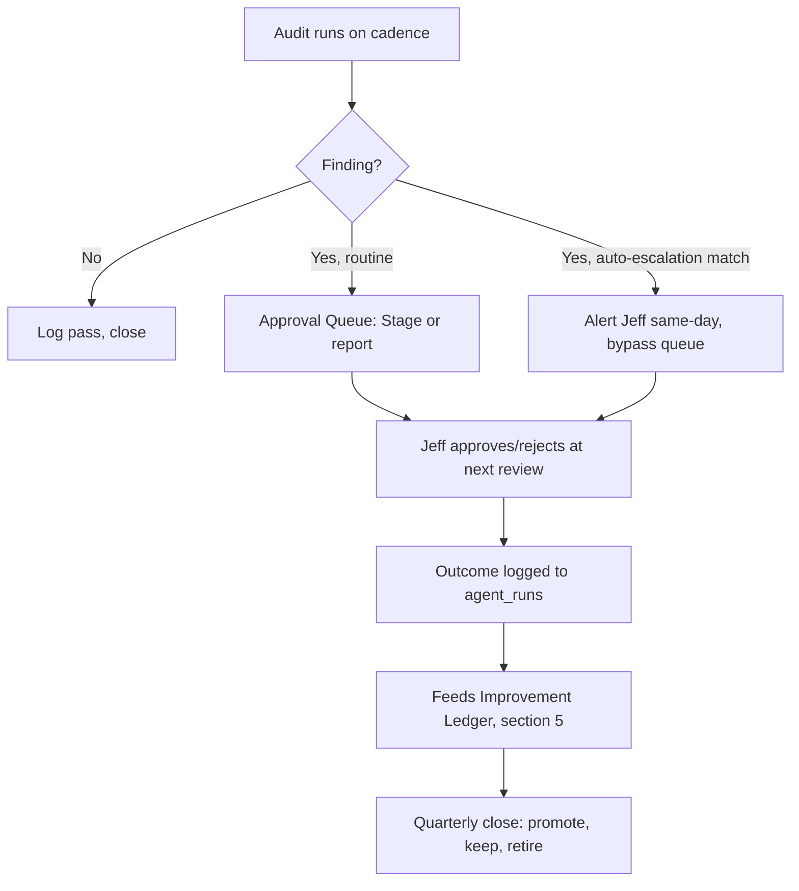
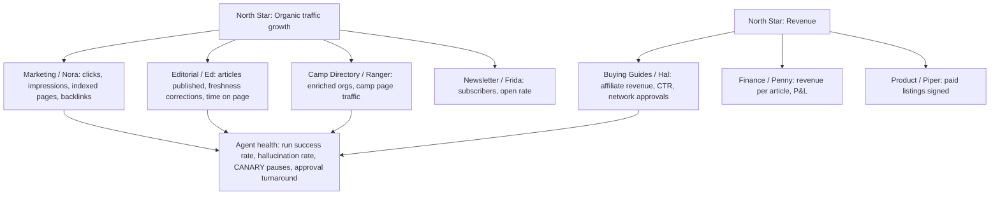
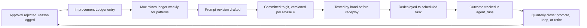

# 06 — Quality, Audits, KPIs, Risk, and Continuous Improvement

**Version:** draft 0.1, 2026-07-15
**Status:** Design only. No audit runs, no dashboard exists, no risk register is tracked anywhere but this file today.
**Reads:** 00-FOUNDATIONS.md (binding), PCD-AUTOMATION-AUDIT-2026-07-14.md (the audit format this design formalizes), PCD-OPERATING-MANUAL.md v1.4 (how PCD runs today).
**Deliverables covered:** 9 (company-wide audit system), 10 (KPI dashboard), 12 (risk register), 13 (continuous improvement system).

This file answers one question for each of its four parts: what would we actually do Monday morning. It does not invent seventeen new checklists. It takes the audit PCD already ran once by hand on 2026-07-14 and turns it into eleven recurring mini-SOPs, most of them grown from tasks that already exist.

---

## 1. Company-wide audit system

### 1.1 Design principles

Every audit in this section follows the same shape: an owner agent runs it on a cadence, against named inputs, checking named things, producing a named output format, landing in a named place, with a named auto-escalation rule. This is the same discipline the July 2026 automation audit used by hand. That audit is the prototype. These eleven SOPs are what happens when the prototype gets a calendar.

No audit here is a new invention where an existing task already does the work. Nine of the eleven grow directly from a live SOP (S1, S5, S6, S7, S8, S9, S10, S11) or an existing slash command (`/content-audit`, `/security-check`, `/red-team`, `/billing-check`, `/data-import-check`, `/site-check`). Two are genuinely new: the AI Hallucination audit and the Broken Process audit. Neither existed in any form before this design, because nothing in the current estate checks whether an agent's claims are true or whether a documented SOP is actually running.

Every audit produces one of three outcomes: pass (log and close), finding (route to the Approval Queue or the owning department), or auto-escalation (bypass the queue, alert Jeff directly). The escalation column below is the important one. An audit that only ever produces a report nobody reads is a report, not an audit.

### 1.2 The eleven audits

| # | Audit | Owner agent | Cadence | Grows from |
|---|---|---|---|---|
| 1 | Content audit | Ed | Quarterly (extends S11), spot-checks monthly | `pcd-freshness-audit` (S11), `/content-audit` |
| 2 | SEO audit | Nora | Weekly (extends S1), deep pass quarterly | `weekly-gsc-review` (S1) |
| 3 | Camp Data audit | Ranger | Weekly (extends S8), monthly R3 confidence audit | `pcd-camps-data-steward` (S8), Open Item 4, `/data-import-check` |
| 4 | Affiliate Link audit | Hal | Weekly (extends S5), monthly revenue pass (extends S6) | `pcd-link-health-monitor` (S5), `pcd-affiliate-reconciler` (S6), `/billing-check` |
| 5 | Reviews audit | Remy (design) | N/A until launch; monthly once live | empty `camp_reviews`/`camp_claims` tables, gated on Open Item 7 |
| 6 | Infrastructure audit | Wes (design) | Monthly, plus on every deploy | S2/S3 deploy and standard-audit pattern, `/preflight` |
| 7 | Security audit | Locke (design) | Quarterly full pass, `/security-check` on every session | `/security-check`, `/red-team` |
| 8 | Automation audit | Max (design) | Quarterly | this document's own format, `/site-check` |
| 9 | AI Hallucination audit | Max (design) | Weekly | new — no prior task |
| 10 | Broken Process audit | Max (design) | Quarterly, tied to the close | new — the never-sent newsletter is the case study |
| 11 | Business KPI audit | Ana (design) | Monthly | new — reads the D1 `metrics_daily` table in section 3 |

Nine department leads are live agents today (Ed, Nora, Hal, Ranger, Frida, Vera, Sunny, Barnabus, plus Jarvis). Remy, Wes, Locke, Ana, Max, Sal, Iris, Penny, and Piper are design-only rows in the roster. Every audit below states plainly whether its owner exists today or is a future-menu candidate waiting on its own decision-6 clearance. Do not read a design-stage owner as a running audit.

### 1.3 Content audit

**Owner:** Ed. **Cadence:** quarterly deep pass (same calendar as S11: January, April, July, October), plus a lighter monthly spot-check of 10 random articles. **Inputs:** the article corpus in `src/content/articles/`, the freshness audit's prior output, GSC's top-traffic pages, the banned-words list and voice rules in foundations section 8.

**Checks:** stale facts and dead links (existing S11 scope), plus three additions this design layers on: banned-word violations, missing `bluf` fields, and he/she defaulting where they/their is the rule. Every check runs against the actual published markdown, not the draft queue.

**Output format:** a ranked list, highest-traffic-and-most-stale first, same shape as the existing freshness audit report. **Where findings go:** the Approval Queue as a Stage-class batch of proposed edits; Jeff approves each rewrite before it ships. **Auto-escalation:** any article contradicting a cited source, or any article making a claim about a specific camp or product that the SOURCE RULE cannot trace to evidence, escalates directly to Jeff and is flagged for the Broken Process audit as a possible SOURCE RULE gap.

### 1.4 SEO audit

**Owner:** Nora. **Cadence:** the existing weekly GSC pull (S1) stays as-is; this design adds one deep quarterly technical pass. **Inputs:** live Google Search Console data, the site's crawl and index counts, canonical and redirect configuration, the OG-image and JSON-LD state named as gaps in the July audit.

**Checks:** the weekly pass is unchanged: clicks, impressions, position, indexed-versus-crawled counts, 404 trend, new backlinks. The quarterly pass additionally checks trailing-slash canonical consistency, schema.org emission, and whether the prior quarter's flagged fix actually shipped.

**Output format:** the existing weekly report, plus a quarterly scorecard against the prior quarter. **Where findings go:** report only, same as today; the single highest-impact fix routes to Wes or Ed as its own session. **Auto-escalation:** two consecutive weeks of zero organic clicks (the current state) is not itself an escalation, since it is the known starting condition. A week-over-week indexed-page count drop of more than 10 percent, or a new spike in 404s, escalates to Jeff same-day rather than waiting for Monday's report.

### 1.5 Camp Data audit

**Owner:** Ranger. **Cadence:** the existing weekly data-quality pass (S8) stays; this design adds the monthly confidence audit Open Item 4 has been asking for since the org-discovery agent went live. **Inputs:** the `activity-radar` D1 tables, org-discovery's per-run accept rate and confidence scores, the guardrail list (never store rosters, DOB, medical, or parent/student emails).

**Checks:** the weekly pass is unchanged: stale listings, expired camps needing a redirect instead of a 404, duplicates, orphaned queue rows. The monthly pass samples 25 of the month's autonomous org-discovery writes and checks each against its source website by hand: does the confidence score match the evidence, did any record cross the 75-confidence floor on thin evidence, did any guardrail-protected field get written.

**Output format:** weekly report/stage as today; monthly confidence audit produces a one-page accept-rate trend plus a guardrail-compliance pass/fail. **Where findings go:** weekly findings stage in the Approval Queue as today; the monthly confidence audit posts to Jeff directly, because it is the control on the one R3 agent in the company. **Auto-escalation:** any guardrail violation (a stored DOB, roster, or family email) is an immediate escalation and a same-day review of whether org-discovery's Act-class privilege should be suspended pending fix.

### 1.6 Affiliate Link audit

**Owner:** Hal. **Cadence:** weekly link-health (S5, unchanged) plus monthly revenue reconciliation (S6, unchanged); this design adds a quarterly FTC/ToS compliance pass. **Inputs:** every `/go/` redirect, `affiliates.json`, the Amazon Associates tag requirement (`parentcoachpl-20` on every URL), the disclosure copy on `/what-to-buy/`.

**Checks:** weekly and monthly checks are unchanged from S5 and S6. The new quarterly pass verifies every live Amazon link actually carries the tag, no raw `amzn.to` links exist anywhere in the corpus, no raw Amazon URL bypasses `/go/`, and the FTC disclosure is present and current on every page carrying an affiliate link.

**Output format:** weekly and monthly reports unchanged; quarterly compliance pass produces a pass/fail checklist per the billing-finance agent's existing `/billing-check` format. **Where findings go:** report only for the weekly and monthly passes; the quarterly compliance pass is a Stage-class output, since a missing tag or a raw URL is a same-session fix, not a discussion. **Auto-escalation:** any Amazon link found without the tag, or any raw Amazon URL in published markdown, escalates immediately. It is lost revenue every hour it runs live, and it is the kind of finding the July audit already proved can hide behind a stale build for months.

### 1.7 Reviews audit

**Owner:** Remy (design-stage; not yet built). **Cadence:** none today. This audit does not run, because `camp_reviews` and `camp_claims` are empty tables behind a launch gated on Open Item 7's unresolved legal terms. **Inputs (once live):** submitted reviews, claim requests, the UGC license terms Open Item 7 has to produce first.

**Checks (once live):** review authenticity signals, spam/abuse patterns, whether a claimed camp's claim evidence actually supports the claim, moderation queue age. **Output format (once live):** monthly moderation report plus a claims-pending list. **Where findings go:** Approval Queue, since publishing a review or approving a claim is a publication-class action under the HUMAN GATE. **Auto-escalation:** any review naming a minor by name, or containing anything that reads as a safety concern about a program, routes to Jeff under the Red Wall rule and never auto-publishes regardless of moderation score.

This row exists in the audit system now so the design is not written twice later. It is inert until Open Item 7 closes and Remy clears her own decision-6 gate.

### 1.8 Infrastructure audit

**Owner:** Wes (design-stage). **Cadence:** monthly, plus a lightweight check on every deploy. **Inputs:** the three Cloudflare Workers, D1 bindings, KV, R2, the deploy hook and cron configuration, `agent_runs` completeness.

**Checks:** the checks the July audit ran by hand: is every cron actually firing (the dormant `parent-coach-playbook-cron` was found frozen since May 9), does the deployed build match the source (the stale `/what-to-buy/` build was found on Astro v4.16.19 while the rest of the site ran v5.18.2), are secrets rotated and out of source (the hardcoded OpenAI key finding), is the D1 identity resolved and not drifting again.

**Output format:** a monthly scorecard in the same shape as the July audit's automation scorecard table. **Where findings go:** report for routine drift, Stage for anything requiring a redeploy or secret rotation. **Auto-escalation:** any cron silently skipping (the `CRON_KEY`/`SWEEP_URL` unset pattern that caused this exact miss in July) or any hardcoded secret found in a committed file escalates same-day, because both are exactly the kind of leak the HUMAN GATE assumes does not exist.

### 1.9 Security audit

**Owner:** Locke (design-stage). **Cadence:** quarterly full pass using the existing `/security-check` and `/red-team` slash commands; `/preflight` runs on every deploy session regardless of schedule. **Inputs:** the site's auth surface (the admin Access JWT decode-without-verify gap named in the July audit), CSP headers, the affiliate redirect safety path, secrets inventory.

**Checks:** everything `/security-check` already covers today, run on a fixed calendar instead of only when someone remembers to type the command; plus the specific open items the July audit named (JWT signature verification, no uptime/synthetic monitoring).

**Output format:** the existing `/security-check` report format. **Where findings go:** Critical findings block the next deploy per S3's existing rule (no site reaches deploy with an open Critical in any pillar); non-Critical findings stage in the Approval Queue. **Auto-escalation:** any Critical finding, and any finding touching payment, deletion, or a customer-facing auth path, alerts Jeff immediately rather than waiting for the quarterly close.

### 1.10 Automation audit

**Owner:** Max (design-stage). **Cadence:** quarterly, aligned to the same calendar as the freshness audit and the quarterly close. **Inputs:** every agent's `agent_runs` history, the scheduled-task inventory, the SOP index, the prompt version log once Phase 4's git mirror exists.

**Checks:** exactly what the 2026-07-14 audit ran by hand: an automation scorecard per area (automated versus manual, graded), a leak-finding pass (the deletion-monitor-disabled, dormant-cron, hardcoded-key, stale-build, never-sent-newsletter class of finding), and a prioritized build roadmap in the P0/P1/P2/P3 shape that document used. This audit is this document's own recurring twin.

**Output format:** a markdown report in the same structure as `PCD-AUTOMATION-AUDIT-2026-07-14.md`, dated each quarter, kept in a running series so quarter-over-quarter drift is visible. **Where findings go:** P0 findings (leaks) go straight to Jeff as same-week fixes; P1 through P3 feed the roadmap in file 08 and the quarterly close's promote/retire decisions. **Auto-escalation:** any finding matching a P0 pattern from a prior audit that recurs (a cron going dormant again, a compliance monitor disabled again) escalates immediately and is logged as a repeat failure, which is itself a Broken Process audit finding.

### 1.11 AI Hallucination audit

**Owner:** Max (design-stage), using Iris's evidence and intelligence store once built. **Cadence:** weekly. **Inputs:** a random sample of N=15 outputs across all active agents that week (roughly proportional to run volume, minimum 2 per active agent), the source material each output cites, the SOURCE RULE requirement that every claim link to evidence.

**Checks:** for each sampled output, verify every factual claim against its cited source. Does the source say what the draft says it says. Does a camp's listed age range, price, or date match what the camp's own website states. Does a gear recommendation's claimed spec match the product page. A claim with no citation at all is an automatic fail, not a partial pass, because the SOURCE RULE has no "trust me" exception.

**Output format:** a per-agent hallucination rate (fails divided by claims checked, not outputs checked, since one output can carry several claims) tracked over time in the D1 `metrics_daily` table (section 3). **Where findings go:** the weekly rate posts to the agent's row in `agent_registry`; a rate trend feeds the quarterly Automation audit. **Auto-escalation:** an agent whose trailing-4-week hallucination rate crosses 10 percent drops one autonomy class automatically (Act to Stage, or Stage to Draft, per the confidence bands in foundations section 6) until two clean weeks bring it back. This is the one audit in this file with a built-in enforcement action, not just a report, because a hallucinating agent that keeps its full autonomy is the single fastest way to break the SOURCE RULE at scale.

### 1.12 Broken Process audit

**Owner:** Max (design-stage). **Cadence:** quarterly, timed just ahead of the quarterly close so its findings feed the promote/retire decision. **Inputs:** the SOP index (PCD-OPERATING-MANUAL.md section 2.2), the scheduled-task inventory, and — critically — what actually happened, checked against `agent_runs` and real output artifacts, not against what the SOP says should happen.

**Checks:** for every documented SOP, does the backing task exist, does it fire on schedule, does its output reach the place the SOP says it reaches, and does the next step in the chain actually occur. The case study that names this audit is S10: the Friday Letter has drafted every week for months and never once been sent. The SOP existed, the task existed, the draft existed, and the chain broke at the one step nobody was checking.

**Output format:** a table of every SOP with a status of Working, Partially Working, or Paper Only, plus the specific broken link in the chain for anything not Working. **Where findings go:** Paper Only findings go to Jeff as a build-or-retire decision at the quarterly close, per the RETIREMENT RULE. **Auto-escalation:** any SOP carrying a legal or compliance obligation (S4's 30-day deletion SLA is the standing example, per Vera's 2026-07-14 guard-trip) that is found Paper Only or Partially Working escalates immediately rather than waiting for the quarter, because the Vera incident already proved that waiting is how an SLA burns silently.

### 1.13 Business KPI audit

**Owner:** Ana (design-stage). **Cadence:** monthly, feeding the KPI dashboard in section 3. **Inputs:** the `metrics_daily` D1 table, GSC, the affiliate reconciler's revenue numbers, `agent_runs` health metrics.

**Checks:** is every KPI in the section-3 table actually being written to `metrics_daily` on its stated cadence, is any KPI stuck at a value that suggests a broken pipe rather than a true zero, has any KPI crossed its alert threshold without triggering the alert.

**Output format:** a monthly one-page scorecard, north stars at the top, department KPIs below, in the same shape as the Notion command-center page it feeds. **Where findings go:** the scorecard is the primary input to the Weekly Executive Audit's "what created the most value" and "what should be removed" questions (section 2). **Auto-escalation:** a KPI that has read zero for three straight cadence cycles with no explanation on file (as opposed to an honest zero baseline, which is expected and stated as such in section 3) escalates as a possible instrumentation failure, not a business failure, and routes to Wes or Ana to fix the pipe before anyone draws a conclusion from the number.

### 1.14 Audit escalation flow



---

## 2. Weekly Executive Audit

### 2.1 The problem this solves

Seventeen departments cannot each hand Jeff a separate document every week. Jeff's approval throughput is already named in foundations section 4 as the scarcest resource in the company. A weekly audit design that produces seventeen documents fails on day one, so this design produces exactly one.

### 2.2 The eight questions

Every department lead answers the same eight questions, in the same order, every week, no matter how little happened.

1. What failed?
2. What succeeded?
3. What is stale?
4. What requires approval?
5. What can be automated next?
6. What created the most value?
7. What should be removed?
8. What should be improved?

A department with nothing to report still answers all eight. "Nothing failed this week" is a valid answer. Silence is not.

### 2.3 How each department compiles its answers

Each department lead agent auto-compiles its eight answers from two sources: its own `agent_runs` rows for the week, and the actual output artifacts it produced (drafts, reports, staged changes). This is mechanical, not a fresh essay. "What failed" reads `agent_runs` for any `failed` status row. "What is stale" reads the last-run timestamp against the SOP's stated cadence. "What created the most value" reads which output actually got approved and shipped versus which sat untouched.

The fixed template keeps this compilation possible without a human writing prose each week. A department lead that cannot answer a question mechanically from its own data (most can, for R1 agents that log and produce dated output; today only Vera and Barnabus fully clear this) states "insufficient data" rather than guessing, per the honesty rule. This is expected to be common until Phase 6's run-log wiring closes the "wired in spec, not in the deployed prompt" gap the operating manual names for nine of the ten live tasks.

### 2.4 Aggregation

Barnabus aggregates all seventeen department answers into one Sunday review document. This is not a new task; it is what `barnabus-weekly-review` (Sun 4:30 PM) already exists to do, extended to pull from the fixed eight-question template instead of a loose summary. The aggregated document is organized by question, not by department: all seventeen "what failed" answers sit together, then all seventeen "what succeeded" answers, and so on. This lets Jeff scan for the shape of the week (is failure clustering in one department, is value clustering in one channel) rather than reading department-by-department.

Jeff reads one document, not seventeen. That is the design constraint this whole section exists to satisfy, and it is checked the same way every other constraint in this file is checked: does the Sunday document fit on a screen without seventeen separate opens.

### 2.5 The silent-department escalation rule

A department that does not report by the Sunday compile window is itself a finding, ranked above every other finding in that week's document. This is the direct lesson from Vera's 2026-07-14 guard-trip: her account guard tripped correctly, the task switched off correctly, and then nothing said a word for the SLA to keep burning silently, because no escalation existed for "this agent went quiet."

The mechanism: Barnabus checks for all seventeen expected department sections before compiling. Any department missing a section is listed first, under a header that reads exactly `SILENT: <department name>`, ahead of the aggregated answers. A silent department also fires a same-day Slack alert, not a wait-for-Sunday one, because the Vera incident specifically proved that waiting until the next scheduled review is how an unwatched compliance clock burns days nobody notices.

A department that is design-stage and not yet built (Remy, Wes, Locke, Ana, Penny, Piper, Sal, Iris, Max) is not silent; it is correctly absent, and its row reads `NOT YET BUILT` rather than `SILENT`. The distinction matters, because conflating "not built" with "went quiet" would train Jeff to ignore the one signal this rule exists to catch.

---

## 3. KPI Dashboard design

### 3.1 The metrics tree

Two north stars sit at the top. Every department KPI ladders up to one or both. Agent health metrics sit underneath everything, because a department can only hit its numbers if its agents are actually running.



### 3.2 Dashboard surfaces

**Notion command-center page.** One weekly-refreshed page, Jeff-readable, three sections top to bottom: north-star tiles (organic traffic trend, revenue trend, both as simple line charts against the prior 12 weeks), department KPI cards (one card per department, the KPIs from the table below), and an agent health strip (run success rate, open CANARY pauses, hallucination rate, all seventeen departments in one row). Ana (design-stage) owns populating this page from the D1 table once built; until then it is a manual paste, same honesty as every other "designed, not built" row in this file.

**D1 `metrics_daily` table.** A long-format table, one row per KPI per day, in the `forge-command` D1 alongside `agent_runs` and `agent_registry`.

```sql
CREATE TABLE metrics_daily (
  date TEXT NOT NULL,
  kpi_key TEXT NOT NULL,
  department TEXT NOT NULL,
  value REAL,
  unit TEXT,
  source_of_truth TEXT,
  notes TEXT,
  PRIMARY KEY (date, kpi_key)
);
```

Long format instead of one wide row per day, because departments will add KPIs over time and a wide table means a schema migration every time. Each audit and each department lead writes its own rows on its own cadence; nothing else touches this table.

**Morning briefing.** Barnabus's existing `barnabus-morning-briefing` (daily 6:31 AM) surfaces three to five KPI deltas each morning, not the full dashboard: the single biggest mover up, the single biggest mover down, and any KPI that crossed its alert threshold overnight. This keeps the morning briefing a briefing, not a re-rendering of the Notion page.

### 3.3 The KPI table

Thirty KPIs. Honesty rule applies throughout: baseline is stated as measured today, not projected, and most read zero because most of the company reads zero today.

| KPI | Department | Source of truth | Cadence | Baseline (2026-07-15) | 12-month target | Alert threshold |
|---|---|---|---|---|---|---|
| Organic clicks/week | Marketing | GSC | Weekly | 0 | 500/week | 2 consecutive weeks flat or down |
| Indexed pages | Marketing | GSC | Weekly | 288 of 1,206 crawled | 900 | Drop of >10% week-over-week |
| Referring domains (backlinks) | Marketing | GSC / Ahrefs equiv. | Monthly | 0 | 25 | No growth for 2 consecutive months |
| Average search position | Marketing | GSC | Weekly | not tracked | Top 20 avg | Regression >5 positions |
| Articles published/month | Editorial | Content collection commits | Monthly | ~805 total, ~1/day | Sustain pace, quality-gated | 0 published in a month |
| Freshness corrections applied | Editorial | S11 audit output | Quarterly | 0 applied (audit only) | 100% of flagged items | Backlog grows quarter over quarter |
| Content hallucination rate | Editorial | Weekly hallucination audit | Weekly | not measured | <5% | >10% (autonomy drop, section 1.11) |
| Enriched orgs (camps) | Camp Directory | `activity-radar` D1 | Weekly | ~910 of 196,252 | 5,000 | Net negative growth in a week |
| Camp page organic traffic | Camp Directory | GSC by URL pattern | Weekly | 0 | 100 clicks/week | Flat for 4 weeks post-launch fixes |
| Org-discovery accept rate | Camp Directory | monthly confidence audit | Monthly | not tracked | Stable 80-95% | Swing >15 points month-over-month |
| Camp data guardrail violations | Camp Directory | monthly confidence audit | Monthly | 0 (untested) | 0, always | Any violation |
| Affiliate revenue/month | Buying Guides | affiliate network dashboards | Monthly | $0 | $500/month | 2 consecutive months flat at $0 |
| /go/ link CTR | Buying Guides | link-health monitor + analytics | Weekly | not tracked | 2% | Drop >30% week-over-week |
| Live affiliate picks | Buying Guides | `affiliates.json` | Monthly | 135 | 200 | Net negative in a month |
| Network applications approved | Buying Guides | S6 reconciler | Monthly | 0 of 8 pending | 6 of 8+ | 0 progress after 6 months |
| Broken affiliate links found | Buying Guides | S5 monitor | Weekly | not tracked | 0 open >7 days | Any link broken >14 days |
| Newsletter subscribers | Newsletter | Kit | Weekly | subscriber list exists, count TBD | 1,000 | Net negative growth |
| Newsletter issues sent | Newsletter | Kit send log | Weekly | 0 ever sent | 1/week | 0 sent in 4 consecutive weeks |
| Newsletter open rate | Newsletter | Kit | Weekly (once sending) | N/A | 35% | <15% for 2 issues |
| Revenue per article | Finance | affiliate reconciler / content count | Monthly | $0 | tracked, no fixed target yet | N/A until baseline set |
| Deletion SLA compliance | Legal & Compliance | Vera's `agent_runs` | Weekly | 100% since re-enable | 100%, always | Any request >30 days |
| Open compliance Criticals | Legal & Compliance | security + broken-process audits | Quarterly | 1 (Open Item 7) | 0 | Any Critical open >90 days |
| Uptime | Engineering | Cloudflare status / synthetic monitor (not built) | Monthly | not monitored | 99.9% | Any outage >1 hour |
| Deploy failure rate | Engineering | deploy logs | Monthly | not tracked | <5% | 2 consecutive failed deploys |
| Cron liveness | Engineering | Infrastructure audit | Monthly | 1 of 2 confirmed dormant (July finding) | 100% firing on schedule | Any cron silent >7 days |
| Security Criticals open | Security | `/security-check` | Quarterly | 1 known (JWT signature gap) | 0 | Any Critical open >30 days |
| Agent run success rate | Automation | `agent_runs` | Weekly | not measurable (logging gap, Open Item 3) | 95% | <85% in a week |
| CANARY pauses | Automation | `agent_registry` | Weekly | 0 recorded (Vera's untracked trip is the counter-example) | 0 unresolved >48h | Any pause unresolved >48h |
| Approval Queue turnaround | Executive Office | Approval Queue (file 01) | Weekly | not built | <48h median | >5 days median |
| SOPs Working (Broken Process audit) | Automation | quarterly Broken Process audit | Quarterly | not yet run | 12 of 12 Working | Any Paper Only carrying a legal SLA |

Thirty rows, deliberately. A KPI not on this list does not get a dashboard tile; it gets tracked inside its department's own file if it matters there, per the same anti-sprawl instinct that keeps the working set capped at roughly eight agents portfolio-wide.

---

## 4. Risk Register

Risk classes here are not the R1/R2/R3 agent risk classes from foundations section 3. They are business risks. Likelihood and impact are each rated Low, Medium, or High, using today's real numbers, not aspirational ones.

| Risk | Likelihood | Impact | Owner | Mitigation | Early-warning signal | Status |
|---|---|---|---|---|---|---|
| Single-founder key-person risk (football season = 4 months founder-dark) | High | High | Barnabus / Executive Office | Maintenance mode toggle degrades every agent to report-only; only S4 deletion watch and named critical escalations bypass it | A critical escalation (domain, payment, security, deletion SLA) fires during August-November with no response within 48 hours | Mitigated by design, unstress-tested |
| Google algorithm/indexing dependency (currently zero organic clicks) | High | High | Nora / Marketing | Distribution-first roadmap (file 08); SEO audit catches regressions weekly instead of quarterly | Indexed-page count drops or organic clicks stay at 0 past the December quarterly close | Open, actively worked |
| Amazon Associates dependency and ToS violations | Medium | High | Hal / Buying Guides | Quarterly compliance pass (section 1.6) checks tag presence and raw-URL bans on every live link | Any Amazon link found untagged, or account warning email received | Open, audit not yet run on a schedule |
| COPPA/child-privacy exposure | Low | High | Vera / Legal & Compliance | Guardrails already forbid storing DOB, rosters, or medical data in camp records; Family Firewall blocks child data from drafts and logs entirely | A stored field appears in the monthly camp-data confidence audit that shouldn't exist | Mitigated by design, audited monthly once Camp Data audit runs |
| UGC legal exposure (Open Item 7) | Medium | High | Vera / Legal & Compliance | Paid listings and reviews stay unlaunched until ToU, UGC license, and refund terms clear a lawyer pass | Any pressure to launch $79/yr listings before Open Item 7 closes | Open, blocking by design |
| AI hallucination publishing false camp/gear info parents act on | Medium | High | Ed / Editorial, audited by Max | Weekly AI Hallucination audit (section 1.11) samples and verifies claims; autonomy drops automatically above threshold | Hallucination rate crosses 10% for any agent, or a parent-facing correction request arrives | Open, audit design-stage |
| Autonomous-agent data corruption (org-discovery R3, no proven backup) | Medium | High | Ranger / Camp Directory | `backup-activity-radar.ps1` built with restore doc; blocked on 3 manual clean runs per decision 6 (Open Item 10, currently zero runs logged) | Any org-discovery write anomaly with no backup to restore from | Open, actively blocking |
| Cloudflare vendor lock-in | Low | Medium | Wes / Engineering | Stack primitives are deliberately Cloudflare-native by design choice (foundations section 4), not accidental; portfolio-wide reuse argues for staying, not diversifying prematurely | A pricing or policy change from Cloudflare materially affects cost or capability | Accepted risk, not actively mitigated |
| Prompt drift/silent agent failure | High | Medium | Max / Automation | `agent_runs` logging contract, CANARY auto-pause on two failures in 24h, Weekly Executive Audit's silent-department rule | An agent's output quality degrades with no corresponding `agent_runs` failure (the exact gap Phase 6 exists to close) | Open, nine of ten deployed prompts still log nothing (Open Item 3) |
| Domain/deliverability burn from outreach | Medium | Medium | Nora / Marketing | Outreach volume and cadence gated behind the distribution roadmap; no bulk unsolicited email planned | Bounce rate or spam-complaint rate on any outreach batch | Not yet active, roadmap-gated |
| Cost creep from AI usage | Medium | Medium | Penny / Finance | Working-set cap (~8 agents portfolio-wide) and workflow-driven growth rule prevent speculative agent sprawl; Finance tracks per-venture cost once built | Monthly AI spend grows faster than revenue for 2 consecutive months | Open, Finance not yet built |
| Stale content eroding trust | Medium | Medium | Ed / Editorial | Quarterly Content audit plus monthly spot-check (section 1.3) | Freshness audit backlog grows instead of shrinking quarter over quarter | Open, mitigation scheduled |
| D1 identity conflict class of infrastructure drift | Low | Medium | Wes / Engineering | The specific 2026-07-15 case (activity-radar vs. legacy parent-coach-playbook) is resolved and documented; Infrastructure audit checks monthly for recurrence in any new database or binding | A new D1 database or binding appears with an unclear live/dead status | Resolved for the known case, audit prevents recurrence |
| Site work competing with the two 2026 success metrics (Chain Reaction manuscript, UPS 4th in conference) | High | High | Barnabus / Executive Office | Priority order in the project CLAUDE.md explicitly ranks site work below the two metrics; maintenance mode enforces this mechanically for 4 months a year | Any session spending founder time on Tier 2 site work while the manuscript or the team's needs are unaddressed | Structural mitigation in place, depends on Jeff's own discipline outside the system |

Fourteen risks. The last row is not on the prompt's required list but belongs here, because foundations section 1 states the two 2026 success metrics explicitly and a risk register that omits the risk of the AI OS itself eating founder time against those metrics would be dishonest by omission.

---

## 5. Continuous Improvement System

### 5.1 The learning loop

Every rejection at the Approval Queue carries a reason. That reason is the input to everything in this section. A reason like "wrong tone" or "claim not sourced" or "link went to the wrong product" is not noise to discard after the rejection; it is the raw material for making the next draft better.



The loop closes on itself. A promoted or retired decision at the quarterly close is itself logged to the Improvement Ledger, so next quarter's Max has the full history, not just the current quarter's rejections.

### 5.2 The Improvement Ledger

One Notion database, four columns: date, department, what changed, why, measured effect. Every prompt revision, every SOP change, every agent promotion or retirement gets one row, whether it came from a rejection reason, an audit finding, or Jeff's own call.

| Field | What it holds |
|---|---|
| Date | When the change shipped, not when it was proposed |
| Department | Which of the 17 owns the change |
| What changed | One sentence, the actual diff (prompt text, cadence, threshold, retirement) |
| Why | The triggering reason: a specific rejection, an audit finding, a KPI miss |
| Measured effect | Filled in at the next quarterly close, not at ship time, since effect needs time to show |

The "measured effect" column is deliberately blank at entry time. Filling it in immediately would just restate the hope behind the change, not the result. The quarterly close is when Max goes back through the quarter's rows and writes what actually happened, tying each entry to the relevant KPI in section 3 or the relevant audit finding in section 1.

### 5.3 Prompt versioning and testing

Every prompt change follows Phase 4's rule from the operating manual: it lands in the git-tracked source under `Outputs/parent-coach-desk/agents/` first, gets committed with a specific message, then is copied to the live scheduled-task path. A version bump and a `last_edited` line go in the frontmatter every time. This file does not re-specify that mechanism; it just names where the Improvement Ledger plugs into it, at the "committed to git" and "tested by hand" steps in the loop diagram above.

No prompt change redeploys without being run once by hand against live data first, per the existing Phase 4 testing standard. For the one Act-class agent (org-discovery), a prompt change runs against a capped batch and gets diffed against the database effect before a full run is trusted. This is not a new rule; it is the existing rule, restated here because it is the gate this section's loop passes through on its way from "drafted" to "redeployed."

### 5.4 Max's weekly mining pass

Max (Automation, design-stage) reads the Improvement Ledger weekly, looking for one thing: a rejection reason or an audit finding that has shown up more than once. A single "wrong tone" rejection is noise. Three "wrong tone" rejections against the same agent in a month is a prompt problem, not a bad-luck streak.

The output of the weekly mining pass is a short list, not a rewrite: which agents have a repeating rejection pattern, which SOPs have a repeating Broken Process finding, which KPIs have missed threshold two cadences running. That list feeds directly into the next prompt revision cycle and into the quarterly close's promote/keep/retire decisions. Max does not rewrite prompts unilaterally; Max surfaces the pattern, and the actual prompt change is a normal git-committed, hand-tested change like any other.

### 5.5 Quarterly close and the Retirement Rule

The December quarterly close (and every quarterly close after it) is where the Improvement Ledger, the KPI dashboard, and the four audits with quarterly cadence (Content, Automation, Security, Broken Process) all land in one room at once. Every agent and every SOP gets one of three verdicts: promote (clear more autonomy, per the confidence bands in foundations section 6), keep (no change), or retire (per the RETIREMENT RULE, no zombie tasks survive the close).

This section does not re-litigate what the quarterly close decides; files 01 and 08 own that. What this section guarantees is that the close has real material to decide from: a ledger of what changed and why, a dashboard of what moved, and eleven audits' worth of findings, instead of Jeff's memory of the quarter. That is the whole point of writing this file before any of it is built. The quality and risk layer is not a nice-to-have added after the AI OS ships. It is the thing that lets anyone, including Jeff, trust what the AI OS says about itself.
