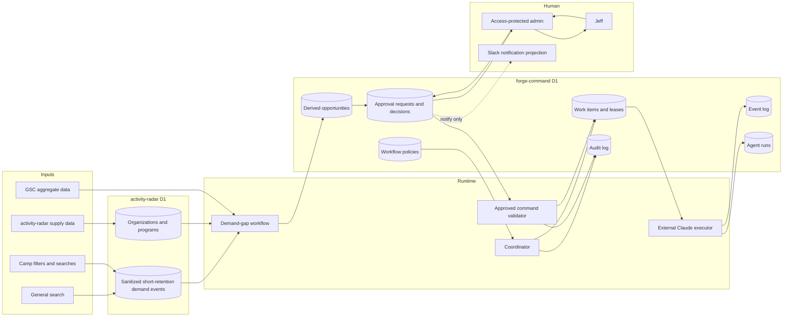

# Plan: Agent operating substrate and first demand-intelligence loop

**Plan ID:** 012
**Author:** Codex
**Date:** 2026-07-16
**Status:** Local default-off implementation exists; staging/prod migration, secrets, runtime activation, and shadow evidence remain unapproved

## Objective

Build the smallest production-grade operating substrate that can safely support an agent-heavy Parent Coach Desk: authoritative task and approval state, enforced dispatch controls, structured event and run records, privacy-bounded demand capture, and one closed demand-to-opportunity-to-human-approval-to-outcome loop.

This plan reconciles the attached AI discussion with repository evidence. It adopts the intelligence-layer thesis, but does not build the proposed seventeen-department organization or a fleet of speculative agents before the shared controls and first useful loop are proven.

## 2026-07-17 implementation-status correction

The original status and current-state snapshot above are historical planning
evidence, not the current release state. The actual shared Forge Command
repository now contains a local, default-off implementation of the Phase 2
durable runtime, the protected runtime API/admin surface, report-only demand
aggregation/opportunity contracts, and supporting migrations. Its local test
suite and Worker dry run pass. The runtime configuration keeps legacy dispatch
disabled and the new runtime API absent unless an exact enablement flag is set.

None of that proves activation: the canonical-runtime and demand migrations are
not approved for production, no executor credential/grant or runtime-enable
flag has been provisioned, no staging shadow run has completed, and no live
workflow, notification, approval or demand action is authorized by this local
implementation. Gates 0 through 5 below therefore remain binding. Consult the
current repository Git state, `coordination/CURRENT_STATE.md`, and release
evidence rather than treating the historical "worktree is clean" statement as
current.

## Tier

Tier 3. This spans production Worker configuration, authentication, secrets, Cloudflare D1 schemas, scheduled work, agent dispatch, observability, privacy and retention policy, administrative approvals, and production data. It also replaces prompt-level safety expectations with centrally enforced operational controls.

## Business outcome

Jeff receives one evidence-backed, deduplicated recommendation answering a concrete question such as “which repeated parent search has no adequate PCD result, and what should we do about it?” The recommendation can be approved or rejected in a protected interface, but nothing publishes or sends automatically.

The broader groundwork outcome is that an agent can no longer be considered operational merely because a prompt and registry row exist. A running agent must be dispatched through an enabled policy, log its lifecycle, produce typed output, and stop safely when its lease, approval, or configuration is invalid.

## Current-state evidence

- **Confirmed live, 2026-07-16:** local `main`, cached `origin/main`, and GitHub `refs/heads/main` all point to `726584c7c169245fefe9fc23c6c6b726f99c117e`; the worktree is clean.
- **Confirmed live, 2026-07-16:** production Worker `parent-coach-desk` is active at 100% on version `92516f62-b891-4903-94e1-204a972ee2ae`.
- **Confirmed live, 2026-07-16:** Cloudflare Access intercepts anonymous `/admin/` and `/api/admin/editorial` requests. **Verified in code and by focused tests:** Worker authentication verifies the Access JWT signature, issuer, audience, validity window, and email allowlist.
- **Confirmed live, 2026-07-16:** production has `DB` (`activity-radar`), `FORGE_DB` (`forge-command`), `PHOTOS`, `SESSION`, and `ASSETS` bindings. Production secret names are only `BULK_IMPORT_TOKEN`, `CRON_KEY`, and `GITHUB_TOKEN`.
- **Verified in code and confirmed live:** `POST /api/agent-runs` requires `AGENT_RUNS_TOKEN`; because that secret is absent, the deployed route cannot currently accept agent runs.
- **Verified in code and confirmed live:** Slack and email libraries/routes exist, but the live production Worker lacks the Slack and email configuration names those paths require.
- **Confirmed live, 2026-07-16:** `agent_registry` contains Nora, Ed, Frida, Hal, Ranger, Vera, and Sunny. Only Nora and Vera have persona-specific PCD run rows; Ed, Frida, Hal, Ranger, and Sunny have none. Vera's two recorded runs are both failures.
- **Confirmed live, 2026-07-16:** `parent-coach-playbook-cron` is active at version `9af6e107-1a51-402f-9748-884326ca1445`; `activityradar-enrichment` is active at version `4c4d52b6-0ed3-475b-9708-5d5f53cc87e5`.
- **Verified in code:** both the live Cloudflare cron Worker and `.github/workflows/camps-sweep-cron.yml` are configured to call the same production camps-sweep endpoint. The GitHub workflow's enabled state is **Not verified**.
- **Verified in code:** the cron Worker also fires a Pages deploy hook daily even though production now runs on Workers. **Confirmed live:** the Pages rollback project remains available at deployment `3ee0e373-04ef-4540-90ac-b8f41e8ebec5`.
- **Verified in code and by tests:** the site already records general-site searches through `POST /api/search-event`, including raw query, result count, optional collection/sport/age, referrer, user agent, and timestamp. The camp directory has additional filters but does not emit an equivalent structured demand event.
- **Verified in code:** `PCD-AI-OS/` explicitly describes its event bus, unified Approval Queue, intelligence store, seventeen departments, and proposed sub-agents as design-only.
- **Verified by tests, 2026-07-16:** 86 focused tests covering agent runs, Access authentication, editorial publication, Slack actions, and email passed.
- **Documented in `coordination/CURRENT_STATE.md`, verified 2026-07-15:** one isolated D1 restore proof succeeded; the additional separate-day recovery proofs required before scheduling backup automation remain incomplete.

## Approved architectural decisions

Jeff approved the core architecture direction on 2026-07-16. Plan 013 records the product-level release sequence and establishes Forge Command as the canonical shared runtime.

1. **D1 is authoritative; Slack and Notion are projections.** `forge-command` holds task, event, approval, agent-policy, and opportunity state. A Slack message or Notion row may mirror a record but can never override it.
2. **Protected admin is the approval authority.** Slack may notify and deep-link. Slack buttons may be added later only if their action updates the same D1 approval record through the protected, audited command service.
3. **Leads are personas; workflows are runtime units.** Nora, Ed, Frida, Hal, Ranger, Vera, and Sunny remain human-facing owners. Schedulable keys use scoped workflow identities such as `pcd-demand-weekly-gap-review`, not the persona name alone.
4. **No direct agent-to-agent calls.** Producers write typed events and durable work items. Consumers claim work through the coordinator. This prevents prompt chains from becoming an invisible distributed system.
5. **Dispatch-time policy is mandatory.** Maintenance mode, enabled/paused state, action class, concurrency, lease, and approval requirements are checked centrally before work is issued. Prompt self-checking remains defense in depth, not the kill switch.
6. **The first intelligence product is aggregate demand-gap detection.** It consumes on-site search and coverage data, produces a recommendation, and stops at human approval. It does not personalize a visitor, publish content, contact a camp, or change production directory data.
7. **Activity data and operating data remain separated.** `activity-radar` stays authoritative for organizations/programs and current search telemetry. `forge-command` stores operational state and derived opportunities. Cross-database correlation occurs in a bounded Worker job that reads aggregates and writes only derived records.
8. **The current A/B/C/D matrix is mapped to Analyze/Draft/Stage/Act and R1/R2/R3, then retired as a separate policy source.** One canonical machine-readable action policy governs runtime behavior.
9. **No standalone intelligence monetization in this phase.** Intelligence is used internally to improve distribution and product decisions. External intelligence products require a later plan with privacy, legal, pricing, and customer-validation evidence.
10. **Forge Command is the canonical shared runtime.** Implement this substrate by extending and hardening `Outputs/Forge Command/src`; do not create a PCD-local coordinator or a third runtime. Inventory reusable modules from `Outputs/Field & Forge Ventures/agent-runtime` and port them deliberately.
11. **Public directory is the initial customer release.** Camp-owner identity/claims and paid camp products are near-term follow-on increments governed by Plan 013, not blockers for the first public-directory readiness gate.
12. **Agent expansion is capacity-driven but gate-bound.** New workflows may be added as bandwidth permits only after their shared controls exist and they pass the existence, scope, observability, and value tests in Plan 013.

## Scope

### Workstream A: operational truth and configuration repair

- Make agent run ingestion operational in staging, then production, with explicit secret and binding verification.
- Add structured Workers observability to the production site Worker and enrichment Worker.
- Resolve the duplicate camps-sweep scheduler and decide whether the Pages rollback is frozen or warm.
- Record deployed prompt version and schedule identity for every external Claude workflow without copying secrets into Git.
- Define one machine-readable maintenance-mode and agent-policy source.

### Workstream B: durable coordinator substrate

- Add versioned `forge-command` migrations for workflow definitions, work items, events, approvals, and audit records.
- Add a bounded coordinator Worker or Workflow responsible for schedule-to-work conversion, dispatch policy, leases, retries, idempotency, and dead-letter state.
- Define typed event envelopes and workflow contracts.
- Preserve external Claude/Cowork as a reasoning executor initially; it receives leased work and reports results through authenticated endpoints.

### Workstream C: privacy-bounded demand capture

- Unify general-site search and camp-directory search/filter signals into a versioned demand-event contract.
- Capture zero-result and low-result searches as the highest-priority signal.
- Add explicit minimization, redaction, retention, sampling, bot filtering, and deletion rules.
- Do not create stable visitor profiles in this plan.

### Workstream D: protected Approval Queue

- Add an Access-protected admin queue backed by D1.
- Support view, approve, reject-with-reason, expire, and cancel.
- Bind every approval decision to an immutable command payload hash and evidence set.
- Treat Slack as notification only in the first release.

### Workstream E: first closed intelligence loop

- Aggregate demand signals by normalized query, sport, age band, coarse geography, and time window.
- Compare demand with existing content and camp supply coverage.
- Generate deduplicated opportunity cards with evidence, confidence, expected value, effort, and an explicit recommended next action.
- Route cards to Jeff for disposition.
- Record later outcomes so recommendation hit rate can eventually be measured.

## Non-goals

- Do not build all seventeen departments or all proposed intelligence agents.
- Do not create Iris, Max, Remy, Sal, Wes, Locke, Ana, Penny, or Piper as running agents in this plan.
- Do not implement customer-level personalization, cross-device identity, advertising profiles, fingerprinting, or household/child profiles.
- Do not ingest private Facebook groups, private email content, Reddit user identities, or competitor material behind authentication.
- Do not add social posting, newsletter sending, camp outreach, sales outreach, payments, purchases, production publication, autonomous affiliate swaps, or autonomous deletes.
- Do not allow an LLM to emit arbitrary SQL, HTTP requests, or tool calls directly against production.
- Do not migrate `activity-radar` data into `forge-command` wholesale.
- Do not make Notion a transactional system of record.
- Do not replace the existing protected editorial approval flow until the shared queue proves it can represent that flow without weakening its two-click approve/publish distinction.
- Do not enable production queues, cron triggers, secrets, or database migrations without Jeff's explicit deploy-stage approval.

## Files likely affected

Exact paths for a coordinator package are chosen in Step 3; no implementer invents a second root after the plan is approved.

- `coordination/DECISIONS.md`
- `coordination/CURRENT_STATE.md`
- `coordination/PRODUCTION_STAGING_MATRIX.md`
- `coordination/HANDOFF.md`
- `automation/APPROVAL-MATRIX.md`
- `automation/RUN-LOG.md`
- `automation/AGENT-DEPLOYMENTS.md` (new, sanitized deployment registry)
- `automation/contracts/action-policy.schema.json` (new)
- `automation/contracts/event-envelope.schema.json` (new)
- `automation/contracts/workflow-result.schema.json` (new)
- `automation/agents/*/SPEC.md`
- `automation/agents/*/SKILL.md`
- `agents/pcd-deletion-monitor/SKILL.md`
- `migrations-forge-command/001_agent_operating_substrate.sql` (new directory and first migration; exact numbering is local to this database)
- `migrations-forge-command/002_demand_opportunities.sql`
- `migrations/0011_search_event_privacy_and_retention.sql` (note the existing duplicate `0009` prefix; do not reuse it)
- `src/lib/agent-runs.ts`
- `src/lib/agent-policy.ts` (new)
- `src/lib/approvals.ts` (new)
- `src/lib/demand-events.ts` (new)
- `src/pages/api/agent-runs.ts`
- `src/pages/api/agent-work/*` (new authenticated executor API)
- `src/pages/api/admin/approvals/*` (new Access-protected command API)
- `src/pages/api/search-event.ts`
- `src/pages/search.astro`
- `src/pages/camps/index.astro`
- `src/pages/admin/approvals/index.astro` (new)
- `tests/api/agent-runs.test.ts`
- `tests/api/agent-work.test.ts` (new)
- `tests/api/admin-approvals.test.ts` (new)
- `tests/api/search-event.test.ts`
- `tests/lib/agent-policy.test.ts` (new)
- `tests/lib/demand-events.test.ts` (new)
- `worker-coordinator/` or a Cloudflare Workflow package selected in Step 3 (new)
- `worker-cron/`
- `workers-activity-radar/`
- `wrangler.jsonc`
- `wrangler.production.jsonc`
- `.github/workflows/camps-sweep-cron.yml`
- `.github/workflows/ci.yml`

## Step-by-step implementation

Each numbered step is a separate reviewable commit or bounded commit group. Stop at every named gate.

### Phase 0: decisions and live-state freeze

1. Re-verify Git state, production Worker deployment, secret names, Access coverage, active schedules, Pages rollback state, `agent_registry`, and recent `agent_runs`. Record evidence in `CURRENT_STATE.md` with the standard labels.
2. Resolve and record five decisions in `DECISIONS.md`:
   - authoritative approval surface: protected admin;
   - D1 authority with Slack/Notion as projections;
   - persona versus workflow identity;
   - frozen versus warm Pages rollback;
   - external Claude executor retained for the first release.
3. Verify whether the GitHub camps-sweep workflow is enabled. Choose exactly one scheduler. If the Cloudflare cron remains authoritative, disable or delete only the workflow trigger after Jeff approves that external change; retain a manual diagnostic workflow only if it cannot mutate production without a separate approval token.
4. Decide the Pages rollback posture. Recommended default: freeze deployment `3ee0e373...` during the Worker soak and remove the obsolete Pages deploy-hook job from the daily cron. If Jeff chooses warm standby, pin and document how a warm build is validated before it becomes the new rollback candidate.
5. Create `automation/AGENT-DEPLOYMENTS.md` containing workflow key, persona owner, scheduler, cadence, deployed prompt source commit, deployed prompt checksum/version, registry key, action class, data access, maintenance behavior, and last live verification date. Do not include tokens, account contents, or secret values.

**Gate 0:** Jeff approves the five architecture decisions and any scheduler/rollback external changes before Phase 1.

### Phase 1: repair the existing operational spine

6. Add explicit `observability` configuration to staging and production Worker configs with a deliberate sampling rate. Add it to the enrichment Worker. Confirm no request bodies, query text, email addresses, tokens, approval evidence, or child/family data are written to logs.
7. Add `AGENT_RUNS_TOKEN` to staging only through an interactive secret path. Add Slack configuration only if Jeff separately approves the destination and app credentials. Never place values in commands, Git, chat, or coordination evidence.
8. Deploy the unchanged application plus configuration to staging. Exercise `/api/agent-runs` with a synthetic workflow identity, not a production persona, and verify start, finish, retry idempotency, failure alert behavior, and registry touch.
9. Add a server-side `workflow_policies` lookup to run ingestion. Reject unknown workflows, mismatched venture, disabled workflows, payloads over limits, and invalid state transitions. Do not rely on the caller-supplied `agent` string as authorization.
10. Split credentials by trust boundary before production: one token or service credential for external Claude executors, separate Slack verification credentials, and no reuse of `CRON_KEY`, `GITHUB_TOKEN`, or admin identity.
11. Update each real deployed workflow prompt from its Git source and record the deployed checksum. Start with one read-only workflow. Confirm the external scheduler actually honors paused state and maintenance mode before wiring the next.
12. Add production secrets only after staging evidence passes and Jeff approves. Deploy, then run one read-only production canary that creates only an `agent_runs` record.

**Gate 1:** Jeff approves production secret changes, production deployment, and the single canary run.

### Phase 2: durable work and event substrate

13. Create `migrations-forge-command/` because operational schemas belong to `forge-command`, not the existing `activity-radar` migration series. Add a README mapping each migration to its database and prohibiting cross-application.
14. Add the following tables through migration `001_agent_operating_substrate.sql`:
   - `workflow_definitions` for stable workflow identity and version;
   - `workflow_policies` for enable state, action/risk class, maintenance rule, concurrency, timeout, retry cap, and required approval type;
   - `work_items` for durable units of work, idempotency key, priority, lease, attempt count, and terminal status;
   - `event_log` for immutable typed events with producer, subject, trace id, schema version, payload reference, and timestamp;
   - `approval_requests` and `approval_decisions` for authoritative human decisions;
   - `audit_log` for immutable command and control changes;
   - `dead_letters` for exhausted or malformed work.
15. Use foreign keys where D1 supports the intended relationship, `CHECK` constraints for state enums, unique constraints on idempotency keys, and indexes for ready work, expiring leases, pending approvals, event type/time, and trace lookup.
16. Define JSON Schemas for the event envelope, executor result, action policy, evidence reference, and approval command. Validate at every HTTP boundary. Unknown schema versions fail closed into dead-letter state.
17. Implement the coordinator as a separate Worker/Workflow package. Before code starts, compare Cloudflare Queues plus a coordinator Worker against Cloudflare Workflows for durable execution. Choose one in an ADR based on retries, step durability, observability, and operational complexity, not novelty.
18. Coordinator responsibilities are limited to: materialize schedules, enforce global and workflow policy, create work, lease work, reclaim expired leases, cap attempts, route terminal failures, and emit events. It does not perform editorial judgment or generate content.
19. Add authenticated executor endpoints:
   - claim one eligible work item;
   - heartbeat/renew its lease within a hard cap;
   - complete with typed output and evidence references;
   - fail with bounded error metadata;
   - abandon on shutdown.
20. Bind the authenticated executor to its allowed workflow IDs. A credential for a read-only demand workflow cannot claim publication, email, D1-mutation, or compliance work.
21. Run the coordinator in staging shadow mode. It creates work and records what it would dispatch, but external schedules continue to run unchanged. Compare expected versus actual runs for at least seven days, including one failure and one maintenance/paused-policy case.

**Gate 2:** Jeff approves the `forge-command` migration on a non-production database, then separately approves production migration and shadow-mode deployment. Shadow mode cannot invoke a production mutation tool.

### Phase 3: privacy-bounded demand events

22. Write a demand-data specification before changing collection. Required fields: event type, normalized query or filter bucket, result-count band, content surface, sport taxonomy value, coarse age band, coarse geography, device class, timestamp bucket, source schema version, and bot/sampling flags.
23. Explicitly prohibit IP storage, precise coordinates, full ZIP plus stable identifier, cookies for intelligence, fingerprinting, raw email/referrer parameters, names, child attributes, roster data, health data, school/team identity, and cross-venture identity joins.
24. Replace raw referrer storage with an allowlisted internal route category or registrable-domain category. Replace full user agent with a derived device class. Do not persist the original strings.
25. Add query sanitization before storage: Unicode normalization, whitespace folding, maximum length, email/phone/URL redaction, obvious name/identifier suppression, control-character removal, and bot/noise rejection. Store the sanitized query only for a short raw-signal window.
26. Set proposed retention pending legal/privacy approval:
   - sanitized free-text demand events: 90 days;
   - non-identifying daily aggregates: 25 months to support seasonal comparison;
   - rejected/redacted payload content: never stored;
   - operational audit records: 25 months unless an obligation requires longer;
   - approval decisions: retained with the change they authorized.
27. Add migration `0011_search_event_privacy_and_retention.sql` to support schema version, event type, normalized dimensions, redaction flags, and retention indexes. Do not apply it remotely in the implementation branch.
28. Update `/api/search-event` and the general search page to emit the new contract. Keep the browser call non-blocking; endpoint failure must never break search.
29. Add equivalent aggregate events to camp search/filter interactions. Never transmit precise browser geolocation. Convert location to an already-selected city/metro or coarse distance band in the browser or server before logging.
30. Add abuse controls: request-size cap, accepted-origin check, per-IP rate limiting through a Cloudflare binding without storing IP in D1, bot heuristics, sampling, and cardinality caps.
31. Add a scheduled retention job that deletes only expired telemetry rows by indexed timestamp in bounded batches. Classify it under D-001 and prove it against non-production data before production scheduling.
32. Update public privacy/disclosure language only after Jeff and legal review approve the exact collection and retention policy. The code must not deploy ahead of the notice when notice is required.

**Gate 3:** Jeff approves the data specification, retention periods, disclosure copy, D1 migration, and production instrumentation deployment separately.

### Phase 4: unified protected Approval Queue

33. Implement D1 repository functions for approval creation, immutable payload hashing, evidence attachment, status transition, expiry, cancellation, and decision recording. A decision never edits the proposed command in place.
34. Add `/admin/approvals/` and `/api/admin/approvals/*` behind the same Access application, JWT verification, allowlist, and same-origin protections as existing admin routes.
35. Display: source workflow/version, action class, risk class, evidence, confidence, expected value, exact command description, affected resources, expiry, rollback statement, and whether a fresh preview is required.
36. Require a rejection reason code plus optional note. Record approver identity from the verified Access JWT. Do not accept an approver identity from the request body.
37. Approval writes `approved`; it does not execute. A separate command consumer may execute only if the payload hash, policy, workflow version, approval scope, approver, and expiry still match.
38. Keep publication two-stage: editorial approval and publication remain distinct decisions. The unified queue may link to them, but cannot collapse them.
39. Add Slack notification as a projection only after the D1 queue works. Messages contain no PII or sensitive evidence, only a summary and protected deep link. Failure to notify does not lose or approve the card.
40. Add queue aging and expiry. Expiry is fail-closed: no action executes, and the source workflow must create a new card against fresh evidence.

**Gate 4:** Jeff approves the admin UX and decision semantics before production deployment. Slack wiring requires a separate secret/configuration approval.

### Phase 5: first closed demand-gap loop

41. Add `002_demand_opportunities.sql` in `migrations-forge-command/` with:
   - `demand_aggregates` for daily normalized counts and result bands;
   - `opportunities` for hypothesis, consumer, evidence, confidence, expected value, effort, status, dedupe key, and freshness window;
   - `opportunity_outcomes` for approved action reference, measurement window, predicted value, actual value, and outcome disposition.
42. Implement a deterministic aggregate extractor that reads only the fields needed from `activity-radar.search_events`, produces k-anonymous/cohort-safe aggregate buckets, and writes no raw events to `forge-command`.
43. Define minimum surfacing thresholds. Initial recommendation: at least five qualifying events across at least three distinct days, no single high-cardinality geography bucket, and confidence capped by data volume and freshness. Final thresholds are tuned against shadow data before production.
44. Implement deterministic gap candidates first:
   - repeated zero-result general search with no matching content registry entry;
   - repeated low/zero-result camp search for a supported sport/metro/age band;
   - high-demand content query whose existing page is stale or absent.
45. Use an LLM only after deterministic candidate creation, to draft a plain-language hypothesis and recommended next action from the attached evidence. It may not invent volume, competition, expected clicks, or supply counts.
46. Validate every cited metric and route after generation. Any mismatch rejects the draft to dead-letter/review state rather than surfacing a misleading card.
47. Deduplicate by normalized problem key and freshness window. A recurring signal updates evidence and count on the same open opportunity; it does not create daily approval spam.
48. Route opportunity cards to the protected Approval Queue as Analyze or Draft. The only allowed approved result in this phase is creation of a bounded work item such as “prepare an editorial brief” or “prepare a coverage research report.” It cannot publish, message, or mutate directory records.
49. Record Jeff's approve/reject reason and the downstream artifact. Add an outcome measurement placeholder, but do not claim recommendation hit rate until measurement windows have actually elapsed.
50. Run for four weeks in report-only mode. Review false positives, duplicate rate, privacy redactions, card acceptance, approval burden, and whether any approved card produced a useful artifact.

**Gate 5:** Jeff approves promotion from shadow/report-only to creating Draft-class work. No Act-class promotion is included in this plan.

### Phase 6: consolidation and controlled expansion

51. After the first loop meets acceptance criteria, migrate one existing read-only workflow at a time onto the coordinator. Recommended order: Nora weekly SEO review, Hal link-health summary, Ed freshness audit, Frida newsletter draft, then Ranger read-only data-quality review.
52. Keep Vera outside ordinary CANARY pause semantics, but bring her dispatch liveness under an independent heartbeat/escalation monitor so “still scheduled but failing” is visible without relying on Vera to report herself.
53. Do not migrate Ranger's autonomous enrichment write until D-001 recovery evidence, bounded change ledger, field-level provenance, and rollback criteria are complete.
54. Reconcile `PCD-OPERATING-MANUAL.md`, `PCD-AI-OS/`, `automation/`, and coordination documents. Mark superseded current-state claims clearly; keep north-star designs separate from operating truth.
55. At the four-week review, decide whether the next loop is SEO remediation, camp supply-gap research, or affiliate link remediation based on measured value. Do not select the next agent from the org-chart menu alone.

## Testing strategy

### Schema and contract tests

- Apply every new migration to a fresh local D1 and an isolated remote non-production D1 before production approval.
- Verify constraints, indexes, idempotency uniqueness, allowed transitions, lease reclaim, approval immutability, and bounded deletion.
- Validate all example and fixture envelopes against the checked-in JSON Schemas.
- Fuzz malformed, oversized, missing-version, unknown-event, and wrong-workflow payloads.

### Unit tests

- Policy evaluation across active, paused, maintenance, expired approval, wrong action class, concurrency cap, retry cap, and Vera exemption cases.
- Demand normalization, redaction, bot filtering, sampling, result-count bands, coarse geography, and query deduplication.
- Opportunity threshold, confidence cap, dedupe, freshness expiry, and weakest-evidence confidence propagation.
- Payload hashing and approval transition rules.

### Integration tests

- Executor claim, lease heartbeat, completion, retry, lease expiry, dead-letter, and credential-to-workflow authorization.
- Event-to-work materialization with duplicate delivery.
- Approval creation through decision through command validation without executing an external action.
- Search instrumentation failure while the user-facing search remains successful.
- Slack projection failure while the D1 approval remains pending and visible.
- Coordinator unavailable while public site and admin reads remain healthy.

### Security tests

- Access JWT verification and allowlist tests remain required.
- Same-origin/CSRF protection on every admin decision endpoint.
- Replay tests for executor tokens and approval commands.
- Attempted credential escalation from read-only workflow to publish/mutation work.
- Log-capture tests confirming secrets, query text, emails, and approval evidence do not appear in structured logs.
- Public telemetry abuse tests: cross-origin, oversized body, high rate, invalid taxonomy, and injection-shaped input.

### Staging and shadow validation

- Seven-day coordinator shadow comparison before live dispatch.
- Demand instrumentation shadow/sample validation against manual aggregate queries.
- Four-week report-only opportunity evaluation before Draft-class work creation.
- Synthetic failure and silent-workflow tests; never trigger a production mutation to prove failure handling.

### Required commands

- `npm test`
- `npm run check`
- `npx tsc --noEmit -p tsconfig.verify.json`
- `npx tsc --noEmit -p worker-cron/tsconfig.json`
- coordinator package type check and tests
- `npm run build`
- production-config `wrangler deploy --dry-run`
- `npm audit --audit-level=high`
- migration validation scripts against fresh local databases

Every command, exit code, and meaningful result is recorded in the handoff. A passing focused suite never substitutes for the full release suite before deployment.

## Acceptance criteria

### Operational substrate

- Every enabled migrated workflow has a stable workflow key, version, persona owner, policy, credential scope, and deployment checksum.
- Unknown or paused workflows cannot create or claim work.
- Maintenance mode is enforced before dispatch and covered by tests.
- Duplicate schedule/event delivery creates no duplicate work or approval.
- Leases expire and are reclaimed; exhausted work reaches dead-letter state with an alertable record.
- A workflow run produces traceable work, event, run, and audit records joined by a trace id.

### Approval safety

- Every approval occurs behind Access and same-origin checks.
- Approval identity comes only from the verified Access JWT.
- An approval cannot execute a changed, expired, or differently versioned command.
- Approval, publication, email, payment, deletion, and production-data mutation remain distinct action types.
- Slack outage cannot approve, reject, delete, or lose an approval request.

### Demand privacy

- No stored demand row contains IP address, precise coordinates, full user agent, raw referrer URL, email address, phone number, or stable visitor identifier.
- Query redaction and size limits are tested.
- Raw sanitized events expire under the approved retention policy; aggregate retention is documented and enforced.
- Search remains usable when telemetry is unavailable.
- Public disclosure matches actual collection before production instrumentation is enabled.

### First intelligence loop

- Every surfaced opportunity links to reproducible aggregate evidence.
- No opportunity is surfaced below its approved recurrence and privacy thresholds.
- Duplicate opportunity rate is below 5% during the report-only evaluation.
- At least 80% of surfaced metrics reproduce exactly from deterministic queries during manual sampling.
- Every LLM-written claim is either backed by an attached metric/source or rejected before surfacing.
- Jeff can approve, reject with reason, or allow expiry without any external action firing.
- After four weeks, the loop has produced at least one useful approved Draft-class artifact or it is stopped and reconsidered under the existence test.

### Release quality

- Full tests, type checks, build, audit, dry run, and migration validation exit 0 on the release commit.
- Production deployment occurs only after distinct migration, secret, and deploy approvals.
- `coordination/CURRENT_STATE.md` distinguishes confirmed live state from intended design after each release.

## Human approval gates

1. Approval of this Tier 3 plan and the nine proposed architectural decisions.
2. Approval to change or disable either camps-sweep scheduler.
3. Approval of frozen versus warm Pages rollback behavior and any deploy-hook change.
4. Approval to create non-production Cloudflare Queue/Workflow/coordinator resources.
5. Approval to create or apply any `forge-command` or `activity-radar` migration remotely.
6. Approval to add or change every secret, service credential, Access application destination, or Slack configuration.
7. Approval of demand fields, retention periods, privacy/disclosure copy, and production telemetry.
8. Approval of every staging and production deployment.
9. Approval before the coordinator dispatches a real external Claude task rather than shadowing it.
10. Approval before the opportunity loop creates Draft-class downstream work.
11. A new Tier 3 plan before any Act-class autonomy, publishing, outbound message, payment, purchase, deletion, or autonomous production-data mutation is added.
12. Approval to merge and push the implementation branch.

## Open questions

1. Should the Pages rollback deployment be frozen, as recommended, or maintained as a tested warm standby?
2. Is the GitHub camps-sweep workflow enabled, and which scheduler should remain authoritative?
3. Can external Claude/Cowork tasks authenticate to a claim/complete API and preserve a stable workflow identity, or must the coordinator initially use a different executor adapter?
4. Should the coordinator use Cloudflare Queues plus a Worker or Cloudflare Workflows? The ADR in Step 17 resolves this from current documentation and a staging spike.
5. Is 90 days acceptable for sanitized raw search text, or should the initial retention be shorter?
6. Is 25 months acceptable for anonymous daily aggregates to support two seasonal comparisons?
7. Which coarse geography is acceptable for demand: state, metro, or city where the user explicitly selected that city? Precise browser-derived geography is excluded.
8. Should Notion receive approval projections at all in the first release, or wait until Slack/admin consistency is proven?
9. Which workflow is the first real external-executor canary? Recommended: Nora's read-only weekly SEO review.
10. Does Jeff want a hard daily approval-card cap in addition to prioritization and deduplication? Recommended initial cap: three new non-urgent cards per day.

## Dependencies

- Continued Cloudflare Access coverage for all admin and approval paths.
- A non-production `forge-command` test database or isolated equivalent.
- Secure interactive management of Worker secrets and service credentials.
- Confirmed access to the authoritative external Claude/Cowork schedule definitions.
- Current Cloudflare documentation for Queues, Workflows, D1 constraints, rate limiting, and Workers observability at implementation time.
- D-001 recovery requirements for any autonomous D1 cleanup or mutation.
- Jeff's decisions on scheduler ownership, rollback posture, retention, and approval surface.

## Architecture and data flow

The coordinator is operational plumbing, not the intelligence brain. Intelligence workflows read bounded inputs and write typed outputs. The command validator is the only bridge from approval state back to executable work, and in this plan its approved actions stop at creation of Draft-class work.

## Data model or migration changes

### `forge-command`

Use a new migration directory because the existing `migrations/` directory targets `activity-radar`. The implementation must document database ownership at the directory root so a future operator cannot apply the wrong migration to production.

Core state machines:

- `work_items`: `queued -> leased -> succeeded | failed_retryable -> queued | dead_letter | cancelled`.
- `approval_requests`: `pending -> approved | rejected | expired | cancelled`.
- `opportunities`: `candidate -> surfaced -> approved | rejected | expired -> acted -> measured`.

Terminal states are immutable except for adding outcome/audit records. Retrying creates a new attempt record or increments a bounded attempt field; it never erases failure history.

Payloads larger than a conservative D1 limit are stored in an R2 evidence bucket under a content-addressed key. D1 stores the hash, media type, size, redaction class, and R2 key. This plan does not reuse the public photo bucket for operational evidence.

### `activity-radar`

Migration `0011` evolves search telemetry for privacy and retention. It must not collide with the existing duplicate `0009` prefixes. No organization or program schema change is required for the first loop.

No generated SQL may be applied without review. Production and staging bindings point at production data today, so migration rehearsal requires an isolated database rather than the staging application binding.

## Security and privacy requirements

- Preserve the existing Pre-Launch Security Gate and Website Build Standard; do not duplicate their rules into a new governance source.
- Cloudflare Access must protect every approval page, preview, decision API, and evidence URL.
- Executor authentication is machine-to-machine and scoped to workflow IDs and action classes. It is not an admin identity.
- Store secrets only through Cloudflare secret mechanisms. Never place secret values in D1, R2 evidence, logs, Slack, Notion, Git, command arguments, or coordination files.
- Apply least privilege: the demand workflow receives read access to approved aggregates and write access to opportunities only. It receives no publication, email, GitHub, R2-photo, or directory-mutation capability.
- Treat free-text queries as potentially sensitive even without an account. Redact before persistence and keep short retention.
- Do not store child, family, player, recruit, roster, health, school, or household data in the intelligence layer.
- Do not infer protected or sensitive traits from searches.
- Evidence shown in Slack contains no sensitive data. Protected admin fetches sensitive operational evidence only after authorization.
- Approval commands are content-addressed. Any mutation after approval invalidates the approval.
- Rate-limit public telemetry and authenticated executor endpoints separately.
- Emit non-leaking error responses; detailed errors go only to bounded structured logs and audit records.

## Failure modes

| Failure | Containment | User/operator effect |
|---|---|---|
| Telemetry endpoint unavailable | Browser call remains non-blocking | Search works; intelligence has a visible data gap |
| Duplicate event delivery | Idempotency key/unique constraint | One work item/card, duplicate recorded as deduped |
| Coordinator unavailable | Public app remains independent | No new work dispatched; stale heartbeat alert |
| Executor dies mid-run | Lease expires and bounded retry occurs | Work delayed; attempt preserved |
| Repeated executor failure | Dead-letter after cap | No infinite cost loop; Jeff sees one incident |
| Policy/maintenance service unavailable | Fail closed at dispatch | No new work; public site unaffected |
| Slack unavailable | D1 approval remains authoritative | No notification, queue still visible in admin |
| Notion unavailable/drifts | Projection marked stale | No control-state loss |
| Approval expires | Command validator refuses execution | New evidence/card required |
| Approval payload changes | Hash mismatch blocks command | Tampering/stale work cannot execute |
| LLM invents a metric | Deterministic evidence validation rejects card | Candidate dead-lettered or reviewed |
| High-cardinality query contains PII | Redaction or rejection before insert | Event dropped/redacted and counted |
| Bot flood | Rate limit, bot classification, sampling | Aggregate protected; alert on unusual drop rate |
| Retention job fails | Raw data remains longer than intended | Compliance alert; job paused for diagnosis, no unbounded retries |
| Cross-database read fails | No opportunity generated | Stale-input marker; no inference from partial data |
| D1 migration fails | Stop before application deploy | Old app remains active; rollback migration rehearsed separately |
| Access misconfiguration | Deployment gate fails | Approval UI is not attached or deployment is rolled back |

## Edge cases

- A query can include an email, phone, URL, child's name, school, or medical condition even when the UI never asks for it.
- “No results” may mean client-side registry failure, typo, bot traffic, or unsupported filters rather than genuine demand.
- Multiple synonymous searches must normalize without collapsing meaning across different sports or locations.
- One person repeatedly searching must not manufacture an opportunity; recurrence thresholds span days and aggregate cohorts rather than tracking a visitor.
- A camp search with zero results may be caused by an overly narrow age/date combination. Cards must show which constraint caused the empty set.
- Geography explicitly selected by a user differs from browser geolocation. Only the former may become an aggregate dimension in this phase.
- An approval can become stale when content, supply, price, or workflow version changes after Jeff reads it.
- A workflow can be active while its executor schedule is disabled, or paused in D1 while its external schedule still runs. Liveness compares both sides.
- Vera must not be silently paused, but repeated Vera failures must still produce an independent incident outside Vera's own execution path.
- Clock skew affects leases, expiry, and scheduled windows. Server-side UTC is canonical; display converts to local time.
- Cloudflare Queue delivery is at-least-once; every consumer must be idempotent.
- Partial Slack/Notion projection success cannot change authoritative approval status.
- The existing `search_events` table may contain legacy fields outside the new retention contract; migration and cleanup require an explicit disposition.

## Observability

Structured logs and traces use `trace_id`, `workflow_id`, `workflow_version`, `work_id`, `attempt`, `event_type`, `status`, `duration_ms`, and bounded error code. They do not include raw query text, payload bodies, tokens, emails, evidence content, or approval notes.

Required health signals:

- schedule expected versus work materialized;
- ready-work age and lease-expiry count;
- success/failure/dead-letter rate by workflow/version;
- unknown/unauthorized executor attempts;
- paused or maintenance-blocked dispatch count;
- approval queue depth, age, expiry, and rejection reason distribution;
- telemetry accepted, redacted, rejected, rate-limited, and bot-classified counts;
- opportunity candidates, surfaced, deduplicated, approved, rejected, and expired;
- stale source windows;
- Slack/Notion projection lag;
- D1/R2 errors and retention-job completion.

Barnabus receives a compact exception summary, not raw logs: silent workflows, dead letters, aging approvals, privacy rejection spikes, and stale inputs. A health monitor independent of each workflow checks expected heartbeats so the monitored agent is not solely responsible for announcing its own death.

## Deployment plan

1. Implement on a dedicated branch/worktree after plan approval.
2. Validate schemas and coordinator locally.
3. Provision isolated non-production D1/Queue/Workflow resources only after approval.
4. Deploy staging configuration and executor canary.
5. Run seven-day coordinator shadow mode.
6. Apply production operational migration only after its own approval and backup/export evidence.
7. Deploy production coordinator in shadow mode with no mutation-capable work.
8. Deploy demand schema/instrumentation only after privacy and disclosure approval.
9. Run four-week report-only demand-gap evaluation.
10. Promote only the approved Draft-class work creation path.
11. Re-verify Access, bindings, secret names, schedules, registry, logs, and rollback after every deployment.

Neither Codex nor Claude deploys, migrates production data, changes secrets, disables workflows, or alters schedules without the specific gate above being approved at execution time.

## Rollback plan

### Application and coordinator

- Roll back Workers to the recorded pre-phase version.
- Disable coordinator dispatch through a centrally enforced policy flag while leaving read-only inspection available.
- Remove or pause Queue consumers without deleting queued messages until disposition is reviewed.
- External Claude schedules remain unchanged during shadow mode, so coordinator rollback does not remove the existing operating path.

### Demand instrumentation

- Roll back the site Worker to stop new event writes.
- Leave added nullable columns/tables in place initially; code rollback must not depend on a destructive down migration.
- Delete newly collected telemetry only through a reviewed bounded cleanup statement if the privacy decision requires it.

### Operational D1

- Export the non-production/production operational database before migration when approved.
- Prefer forward-fix migrations. Down migrations are rehearsed against an isolated restored database and used only when they preserve audit and approval history.
- No rollback may erase approval decisions, audit records, or evidence of failed work merely to make a dashboard clean.

### Autonomous writes

This plan introduces no new autonomous parent-facing, outbound, destructive, or production-directory write. The retention cleanup is the only autonomous deletion candidate and cannot be scheduled until D-001 classification, bounded-batch proof, non-production rollback exercise, and Jeff approval are recorded.
