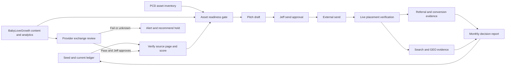

# Plan: Useful Backlink Earning and BabyLoveGrowth Governance

---

**Plan ID:** 022
**Author:** Codex, Strategic Software Architect and Senior Code Reviewer
**Date:** 2026-08-03
**Status:** Awaiting Jeff

## Objective

Extend Parent Coach Desk's existing SEO and outreach assets into a complete, evidence-backed backlink operating system that can earn relevant links, connect those links to useful reader journeys, govern BabyLoveGrowth content and exchange behavior, and later be adapted to other Field & Forge products.

## Tier

**Tier 3.** The first execution wave is documentation and ledger reconciliation, but the complete destination affects editorial lifecycle, provider behavior, approval boundaries, analytics, automation, protected administration, and potentially the `pcd-ops` data model.

## Business outcome

Parents discover useful PCD tools and guidance through trusted organizations and communities. Jeff receives a scored, reviewable pipeline instead of an undifferentiated directory list. The business can prove which independent referring domains are live, which send qualified users, which destinations benefit, and whether BabyLoveGrowth placements meet the same standards as manually earned links.

## Current-state evidence

No `CURRENT_STATE.md` exists in this checkout, so the plan cannot cite the template's preferred current-state authority. The following evidence was freshly verified on 2026-08-03 and must be rechecked before implementation:

- **Verified in repository:** `reports/seo/outreach/targets.json` has 20 records with documented lifecycle state.
- **Documented from a live GSC browser check; not re-performed by Codex:** `reports/seo/outreach/link-earning-2026-08-03.md` reports seven external links from predecessor domain `parentcoachplaybook.com`, not independently earned third-party links.
- **Verified in repository:** two current outreach drafts exist and three governing-body/nonprofit targets remain researched.
- **Verified in repository:** `automation/agents/nora/` owns SEO and distribution research/drafting and forbids sends.
- **Verified in repository:** `ORGANIC-SEARCH-AUDIT.md` and `SEO-OS-ARCHITECTURE.md` name backlinks as a binding authority constraint and already propose URL, snapshot, and change governance.
- **Verified in repository:** BabyLoveGrowth content arrives through `/api/integrations/babylovegrowth/articles`; provider-origin content and deployment controls already exist.
- **Verified in repository:** `strategy/ARTICLE-REFRESH-STANDARD.md` prohibits provider generation-credit links.
- **Verified in repository:** `migrations-pcd-ops/` currently has two `0029` prefixes (`admin_action_receipts` and `external_article_receipts`). Do not allocate a new migration number until the ledger is reconciled.
- **Verified worktree state:** `main` is ahead 14 and behind 5 with unrelated modified/deleted files. Preserve them; do not reset, clean, stage, or absorb them.
- **Confirmed from current public documentation:** BabyLoveGrowth describes a credit-based automatic link exchange in which giving links earns credits and receiving links spends them.
- **Confirmed from current Google documentation:** excessive link exchanges and automated link creation are examples of link spam.
- **Not verified:** current production/provider configuration, live exchange placements, current GSC export, analytics events, author-reveal decision, and exact deployment SHA.

## Scope

- shared useful-backlink standard and PCD-specific strategy;
- structured opportunity seed and canonical-ledger reconciliation;
- target scoring, risk vetoes, lifecycle, approvals, and verification;
- asset inventory and new linkable-asset briefs;
- BabyLoveGrowth content, Reddit-discovery, analytics, and backlink-exchange boundaries;
- independent link verification and relationship-attribute capture;
- referral, conversion, search, and AI-visibility measurement;
- read-only admin/operator visibility;
- portfolio adaptation packet;
- test, rollout, recovery, and handoff evidence.

## Non-goals

- sending outreach or community posts;
- claiming profiles or creating third-party accounts;
- buying links, credits, placements, subscriptions, advertorials, or reviews;
- turning on, turning off, or changing BabyLoveGrowth provider settings;
- publishing, deploying, merging, pushing, or changing production data;
- creating a Google Business Profile without verified eligibility;
- inserting PCD into Wikipedia or independent wikis;
- changing the established 32-topic BabyLoveGrowth queue without Jeff approval;
- changing the author-reveal decision or date;
- adding promotional SightSmash bridges before linked features are ready;
- touching any MedConfRadar confidential core surface.

## Files likely affected

### Existing authority to reconcile

- `strategy/BACKLINK-EARNING-STANDARD.md`
- `strategy/PARENT-COACH-DESK-BACKLINK-STRATEGY.md`
- `strategy/BACKLINK-EXECUTION-PLAN.md`
- `strategy/backlink-opportunity-seed.csv`
- `reports/seo/outreach/targets.json`
- `reports/seo/outreach/link-earning-*.md`
- `automation/agents/nora/SKILL.md`
- `automation/agents/nora/SPEC.md`
- `SEO-OS-ARCHITECTURE.md`
- `ORGANIC-SEARCH-AUDIT.md`
- `strategy/EDITORIAL-CONTENT-LIFECYCLE.md`
- `strategy/ARTICLE-REFRESH-STANDARD.md`
- `EDITORIAL_STANDARDS.md`
- `LINKS.md`

### Likely implementation additions

- `scripts/validate-backlink-targets.mjs`
- `scripts/build-backlink-report.mjs`
- `scripts/import-backlink-provider-export.mjs`
- `scripts/check-backlink-placement.mjs`
- `src/lib/backlink-governance.ts`
- `src/pages/admin/seo/backlinks.astro` or the existing SEO/admin surface chosen after route reconciliation
- `src/pages/api/admin/seo/backlinks/*` only if protected mutations are later approved
- `reports/seo/outreach/provider-imports/`
- `reports/seo/outreach/verification/`
- `reports/seo/outreach/monthly/`
- one or more `migrations-pcd-ops/` files only after the current duplicate `0029` state and the unimplemented SEO OS `0030` to `0032` proposal are reconciled
- focused unit and integration tests under the repository's existing test layout

Do not create a second current outreach ledger. `targets.json` remains canonical until an approved migration and cutover receipt declare otherwise.

## Step-by-step implementation

### Phase 0 — Safe baseline and authority reconciliation

1. Re-run `git status --short --branch` and capture exact SHA. Stop if any implementation file overlaps unexplained user work.
2. Read the current strategy, ledger, Nora instructions, SEO architecture, editorial lifecycle, approval matrix, and production runbook.
3. Add a short `CURRENT_STATE.md` only if Jeff approves establishing that missing authority; otherwise record fresh state in the plan handoff without inventing a competing source.
4. Validate the opportunity seed's CSV structure, unique IDs, URLs, decisions, and existing-ledger mappings.
5. Parse `targets.json` and produce a dry-run reconciliation report: existing only, seed only, matching, conflicts, dead, and duplicate-domain records.
6. Resolve taxonomy conflicts before any write. Preserve existing record IDs and notes.
7. Export current Search Console external links. Label predecessor, portfolio, provider-network, independent, suspicious, and unknown domains separately.
8. Export BabyLoveGrowth links received and given. If the product cannot export the required fields, capture that as a provider-control failure rather than scraping private dashboard state into the repository.
9. Make no provider or production mutation in this phase.

**Commit boundary:** documentation, validator, and dry-run reports only.

### Phase 1 — Canonical file-backed pipeline

10. Define a versioned target schema in `src/lib/backlink-governance.ts` or a dedicated schema module. Required fields come from the shared standard.
11. Extend statuses without silently remapping existing `researched`, `drafted`, `sent`, `landed`, `declined`, and `dead` values. Provide an explicit compatibility map.
12. Add work ownership and placement-classification fields. Work ownership fields from `strategy/BACKLINK-EXECUTION-PLAN.md` are `work_bucket`, `next_action`, `next_actor`, `reviewer`, `human_minutes_estimate`, `blocked_by`, `later_trigger`, `recheck_on`, and `spam_reason`. Placement fields are `independent_domain`, `placement_method`, `link_attribute`, `provider`, `provider_class`, `independence_class`, `destination_role`, `qualified_score`, `risk_veto`, and verification timestamps.
13. Build a validator that fails on duplicate IDs, invalid status transitions, missing destination assets for pitch-ready rows, `landed` without a live source URL, `independently_verified` without a timestamp and evidence reference, Automatic rows containing gated actions, Human Needed rows without an exact action, Later rows without a trigger/date, and Spam rows without a reason.
14. Build a deterministic report generator with counts by work bucket, status, lane, independence class, score band, destination, and provider.
15. Keep contact PII out of the public repository. Store only public professional contacts or a reference to an approved private system.
16. Update Nora's instructions to use the shared scoring/risk gate, never send, flag provider-network placements separately, and hand Jeff one compact Human Needed queue.
17. Add package scripts for validation and report freshness only after naming and CI-runtime review.

**Commit boundary:** schema, validator, reports, focused tests, and Nora instruction update.

### Phase 2 — Destination and asset readiness

18. Inventory existing candidate assets and classify each as `ready`, `needs_editorial_review`, `needs_source_refresh`, `needs_accessibility`, `needs_methodology`, or `not_pitchable`.
19. For the cost calculator, record methodology, input assumptions, dates, limitations, accessible output, and stable citation URL.
20. For safety content, rerun the primary-source, clinical-boundary, broken-link, and fact-date checks before outreach.
21. For the scripts library, create a stable overview page or asset bundle if the current route graph does not give resource managers one durable destination.
22. Create briefs for the Family Cost Index, Parent Pulse, conversation cards, safety matrix, first-season kit, and rules-change digest. Do not draft all assets at once; select the first two by target coverage and execution effort.
23. For each approved BabyLoveGrowth topic, assign one destination role and an asset relationship. Reject content that merely summarizes existing search results.
24. Add post-publish verification requirements for canonical, HTTP status, structured data, accessible rendering, citations, internal links, and indexability.

**Commit boundary:** asset inventory and the first thin end-to-end asset, including tests and evidence.

### Phase 3 — Active provider monitoring and later hold decision

25. Normalize the BabyLoveGrowth export without changing provider state.
26. Detect exact and domain-level reciprocal pairs, repeated anchors, repeated templates, unrelated niches, paid-credit placements, and sensitive-article insertions.
27. Score all observed placements. Manually review at least 20 or all when fewer exist.
28. Verify whether outbound placements from PCD are editable and removable through the current integration; do not assume dashboard controls exist.
29. Record Jeff's 2026-08-03 decision as `active_monitored`; do not count provider-network placements as independently earned links.
30. Define allowed topic clusters, excluded collections, review sample, stop conditions, and removal procedure while use continues. Additional credit purchases remain separately gated.
31. Independently verify every pilot link live. Provider dashboards are not acceptance evidence.
32. If safe controls are unavailable or the observed sample fails the standard, produce a `hold_recommended` report with the exact owner action required in the provider UI. Do not silently disable or alter the provider.

**Human gate:** Current monitored use is approved. Jeff chooses any later restriction, hold, disablement, subscription change, or credit purchase.

### Phase 4 — First 25 PCD targets

33. Reverify the five current governing-body/nonprofit targets and find a named contact or official submission path.
34. Score and verify the Tacoma/Washington school, parks, PTA, library, parent-media, and community targets from the seed.
35. Match one exact live asset to each target. Records without an asset become `asset_gap`, not pitch-ready.
36. Draft in batches of five. Each draft names the source-page gap, exact destination, credibility, and optional next step in under 150 words.
37. Run voice, evidence, privacy, and link-risk review on each batch.
38. Present Jeff with the batch, source URLs, destination URLs, scores, risk flags, and send order.
39. After explicit send approval, Jeff sends or authorizes the approved channel. Record send evidence without exposing private correspondence.
40. Verify landed links independently and record relationship attributes and destination behavior.

**Commit boundary:** one five-target batch and its verification report at a time.

### Phase 5 — Referral and GEO distribution

41. Create truthful organization/product/profile copy with one canonical description and product-specific variants.
42. Claim profiles only after Jeff approves the account, identity, and public information.
43. Use Medium's import flow only after the original PCD article is live; verify the canonical points back to PCD.
44. Use Substack and other platforms for distinct excerpts or commentary unless canonical behavior is verified.
45. Prepare Pinterest assets for proven PCD resources using the existing distribution pattern and approved UTM conventions.
46. Treat Reddit and Quora as community participation. Answer fully on-platform and include a link only when rules and reader value support it.
47. Create Qwoted, Featured, or Source of Sources response drafts only where Jeff's credentials match. Paid plans require a separate purchase decision.
48. Capture brand mentions without links and evaluate polite link reclamation only when a link would genuinely help readers.

### Phase 6 — Data persistence and admin surface

49. Keep the file-backed ledger until the workflow has at least two successful human-reviewed cycles. Do not prematurely move unstable fields into D1.
50. Reconcile the duplicate `0029` migration names and the proposed SEO OS migrations before choosing a new sequence.
51. If D1 persistence is still justified, design separate `backlink_targets`, `backlink_placements`, and append-only `backlink_events` tables or prove why existing tables can represent them without semantic distortion.
52. Use immutable stable IDs, explicit enums, timestamps, source refs, redacted contacts, and indexes for status/due verification.
53. Write populated-upgrade, fresh-replay, rollback/recovery, duplicate-import, and invalid-transition tests before migration acceptance.
54. Add a protected read-only admin view first: pipeline counts, qualified independent domains, provider-network links, lost links, asset gaps, approvals, and verification due.
55. Add protected mutations only if they materially reduce errors and carry idempotency, authorization, validation, audit receipts, and CSRF protections.

### Phase 7 — Portfolio adaptation

56. After PCD has two successful cycles and at least five independently verified qualified domains, create a blank product-adaptation template from the shared standard.
57. For SightSmash, define its distinct audience, product destinations, beta readiness, and exact feature links. Do not copy PCD's identity or editorial pitches.
58. Reuse taxonomy, validators, scoring, reports, and evidence shape where compatible.
59. Keep product ledgers and analytics separate. Portfolio cross-links are classified as portfolio links, never independent endorsements.
60. Document which parts are shared Forge OS and which remain product-owned.

## Testing strategy

### Static and unit tests

- CSV and JSON parse successfully with UTF-8 and stable line endings.
- IDs and exact source/destination pairs are unique.
- every decision/status value belongs to the defined enum;
- transition tests cover all allowed and forbidden lifecycle moves;
- score tests cover boundary values and risk veto precedence;
- a `landed` or `independently_verified` record without evidence fails;
- predecessor, portfolio, provider-network, and independent domains remain distinct;
- contact fields reject secrets and disallowed PII;
- report generation is deterministic for a fixed as-of date;
- provider import is idempotent and does not overwrite human decisions;
- reciprocal-pair detection handles subdomains, canonical domains, and redirects;
- anchor analysis normalizes case and whitespace without erasing meaningful differences.

### Integration tests

- exact live-link verification follows safe redirects, limits response size/time, and distinguishes 200, redirect, auth wall, 404, timeout, robots block, and rendered-link absence;
- provider export import handles missing columns, duplicates, removals, and malformed URLs without partial writes;
- protected admin routes reject unauthenticated and unauthorized users;
- approved read paths return redacted records;
- any mutation path is idempotent and writes an audit receipt;
- referral parameters do not change canonical URLs or leak sensitive data;
- BabyLoveGrowth-origin content still passes the existing publish classifier and editorial checks;
- external links added to sensitive content fail unless reviewed and source-appropriate.

### Browser and accessibility tests

- admin pipeline is keyboard navigable, correctly labeled, responsive, and usable at 200% zoom;
- tables have captions/headers and a small-screen alternative;
- status is not color-only;
- linkable assets expose accessible HTML equivalents for data and downloads;
- canonical, title, structured data, and source links are correct on representative live/staging pages;
- community/profile destinations resolve to the intended public PCD page.

### Operational tests

- simulate removed and redirected backlinks and prove the report changes state without deleting history;
- simulate a provider import with an irrelevant reciprocal cluster and prove alert plus `hold_recommended` behavior without an automatic provider mutation;
- prove an outreach batch cannot move to `sent` without approval evidence;
- prove a provider dashboard claim alone cannot move a placement to independently verified;
- prove monthly reconciliation can be rerun without duplicate records;
- if D1 is introduced, replay from fresh and populated databases and demonstrate recovery from a pre-migration backup.

### Existing gates to run in proportion to changed scope

- focused new unit/integration tests;
- `npm.cmd run check:built-links` when public destinations change;
- `npm.cmd run check:article-refresh-content -- --all` or the repository's current equivalent when article content changes;
- `npm.cmd run check` for code or route changes;
- `npm.cmd run ci:release` only for an actual release candidate;
- `git diff --check` for every phase.

## Acceptance criteria

- the shared and PCD-specific strategy files are approved and cross-referenced;
- the seed contains at least 100 named opportunities and every row has a decision and verification state;
- the existing 20 targets reconcile without lost IDs, statuses, notes, or pitch references;
- a deterministic validator rejects duplicate, incomplete, invalid-transition, and unverified-landed records;
- Search Console links are classified by independence rather than reported as one raw total;
- BabyLoveGrowth given and received links are exported and reviewed, or the provider's inability to export is recorded as a failed gate;
- Jeff's `active_monitored` decision is recorded and provider-network links remain separate from independent links;
- the first five approved targets each have a verified source page, exact live destination, score, named contact/path, and reviewed pitch;
- no outreach is sent without approval evidence;
- landed links are independently verified and referral/search evidence remains separate from provider claims;
- at least one existing asset completes the thin journey: ready asset -> target -> approved pitch -> sent -> response -> live verification -> measurement;
- admin and automation work, if built, passes authorization, privacy, accessibility, idempotency, recovery, and exact-SHA release gates;
- the final handoff distinguishes local completion, production state, provider state, outreach state, and live link evidence.

## Human approval gates

1. Approve this Plan 022 and the two strategy documents.
2. Approve whether to establish a repository `CURRENT_STATE.md`.
3. Approve the first two new linkable assets.
4. Approve public author identity and reveal timing where relevant.
5. Approve each account/profile claim and public identity disclosure.
6. Approve each outreach batch before send.
7. Approve each community post that mentions or links PCD until a separate trusted operating rule exists.
8. Approve the BabyLoveGrowth exchange decision and any provider setting change.
9. Approve any purchase, subscription, add-on, or backlink credit.
10. Approve migration numbering and any D1 migration after recovery evidence.
11. Approve merge, staging deploy, production deploy, and production database change.
12. Approve the first adaptation to another portfolio product.

## Open questions

1. Is the November author reveal still approved, and is the public author one person or two?
2. Can the BabyLoveGrowth dashboard export both given and received links with exact placement details, including anchors and relationship attributes?
3. Which first asset should lead: the cost calculator methodology package or the parent-coach conversation card pack?
4. Does Jeff want PCD positioned as a software product on launch directories now, or should Product Hunt and SaaS directories wait for a stronger interactive-tool milestone?
5. Which first-party conversion should define backlink success before SightSmash beta: newsletter signup, tool completion, printable download, or return visit?

---

## Dependencies

- stable access to the canonical PCD checkout without concurrent write contention;
- current Search Console access/export;
- BabyLoveGrowth dashboard access and export capability;
- approved public identity and profile information;
- analytics event inventory and UTM convention;
- current editorial/safety source verification;
- link-verification network access;
- protected admin and deployment infrastructure if later phases proceed;
- migration-ledger reconciliation before any new D1 migration.

## Architecture and data flow

Authority boundaries:

- repository files own strategy, seed, drafts, and local evidence;
- Search Console owns its sampled link discovery data, not the complete backlink truth;
- first-party analytics owns referral and conversion events;
- BabyLoveGrowth owns its provider-reported content, link, and LLM metrics;
- independent HTTP/page inspection proves a link is live;
- Jeff owns sends, accounts, purchases, provider settings, publication, deployment, and production changes.

## Data model or migration changes

No migration is required for Phases 0 through 5. Start file-backed and prove the lifecycle.

If Phase 6 is approved, the data design should include:

- `backlink_targets`: one current row per opportunity;
- `backlink_placements`: one row per exact source URL and destination URL observation;
- `backlink_events`: append-only status and verification history;
- optional redacted contact references, not private message content;
- indexes for status, priority, verification due, domain, destination, and provider;
- uniqueness on normalized source/destination pairs without collapsing distinct placements;
- check constraints for enums and score bounds;
- foreign-key behavior that preserves placement evidence if a target is deferred.

Migration numbering is blocked on reconciliation: `migrations-pcd-ops/` currently has duplicate `0029` prefixes and `SEO-OS-ARCHITECTURE.md` reserves proposed but unimplemented `0030` to `0032` concepts. Do not guess the next number.

## Security and privacy requirements

- no provider tokens, emails, private correspondence, dashboard cookies, or account IDs in reports;
- public professional contact information only, with opt-out and suppression handling;
- all admin routes behind the current Access and application authorization layers;
- mutations require CSRF protection, input validation, idempotency, and audit receipts;
- outbound HTTP verification uses SSRF defenses, protocol allowlists, DNS/IP checks, redirect limits, response-size/time limits, and no credential forwarding;
- provider exports are untrusted input and must be parsed without formula injection or HTML execution;
- no child-identifying or health-sensitive data in surveys, linkable assets, analytics, or outreach;
- UTM parameters must not carry personal or sensitive information;
- sensitive editorial categories require their existing human review gates.

## Failure modes

| Failure | Behavior | Evidence |
|---|---|---|
| Provider cannot export exact placements | Current use is flagged high risk and a hold is recommended; no automatic provider change occurs | provider-control report |
| Link verifier times out or is blocked | status becomes unknown/recheck due, not removed | verification record |
| Link disappears | retain history, mark removed, queue one recovery decision | event and monthly report |
| Redirect changes domain or destination | flag for manual review; do not assume equivalence | final URL and chain |
| Irrelevant or reciprocal cluster appears | stop provider/campaign lane and escalate | risk alert and sample |
| Destination becomes inaccurate or non-indexable | pause pitches and mark asset not pitchable | asset readiness report |
| Outreach record lacks approval | transition to sent is rejected | validator or API denial |
| Provider reports a link but page lacks it | keep provider-reported and independently verified states separate | discrepancy report |
| Metrics disagree | report each source and uncertainty; do not average incompatible counts | monthly reconciliation |
| Concurrent repo edits overlap | stop without staging or overwriting user work | status and handoff |

## Edge cases

- multiple links from one source page to one destination;
- one domain with many subdomains or a hosted-user-content platform;
- links inside JavaScript, PDFs, images, redirects, or canonicalized duplicates;
- `nofollow`, `ugc`, `sponsored`, and combined relationship values;
- brand mention without link;
- predecessor-domain and portfolio-domain links;
- legitimate partnership pages that happen to link both ways;
- a source changes ownership or becomes low quality after placement;
- an article is syndicated with a correct canonical but still appears as another link;
- URL parameters and fragments that should not create duplicate placements;
- non-English and country-specific provider-network placements;
- paywalls, consent walls, bot protection, and logged-in community links;
- a pitched resource changes route or is consolidated;
- author reveal remains false while profile opportunities require a named expert;
- one target fits multiple assets or one asset fits multiple source pages.

## Observability

- weekly qualified-domain and loss report;
- provider-network placement and discrepancy report;
- verification-due queue with aging;
- asset-gap queue;
- approvals waiting on Jeff;
- source-page and destination HTTP/canonical health;
- referral, engagement, signup, tool-use, and downstream journey events;
- destination-specific Search Console movement;
- monitored AI prompt mentions with source URLs and observed dates;
- alert on first independent qualified domain, suspicious cluster, lost P0 link, validator failure, or stale scheduled run.

## Deployment plan

1. No deployment for documentation and seed files.
2. Implement and validate file-backed tooling on a reviewed branch or clean worktree.
3. Merge only after current dirty-tree ownership and behind/ahead state are reconciled by Jeff/Claude.
4. For source/admin changes, deploy to staging through the repository's current protected workflow.
5. Verify exact SHA, authentication, representative imports, report generation, and accessibility.
6. Obtain protected production approval from Jeff.
7. Deploy exact reviewed artifacts.
8. Run production smoke checks and store release evidence.
9. Provider setting changes and outreach sends remain separate owner actions and separate evidence gates.

Neither Codex nor Nora deploys under this plan.

## Rollback plan

- Documentation and seed changes: revert only the Plan 022 files in a clean reviewed commit; do not reset unrelated work.
- File-backed ledger: retain a timestamped pre-migration copy; validator and report changes can be reverted without deleting target history.
- Provider import: append observations or replace only generated import artifacts; never overwrite human decisions.
- Admin/source release: redeploy the prior exact artifact and verify protected routes.
- Provider pilot: use the documented provider removal/disable path after Jeff approval; record which outbound and inbound placements remain live because provider disablement may not remove historical links.
- D1 migration: take and verify a backup, prove populated rollback/recovery, and retain append-only event evidence. A scripted but unproved restore is insufficient.
- Outreach cannot be rolled back after sending. Corrections or withdrawal requests require Jeff approval and must be handled honestly.
- Earned third-party links are controlled by their publishers. PCD can request correction/removal but cannot guarantee it.
